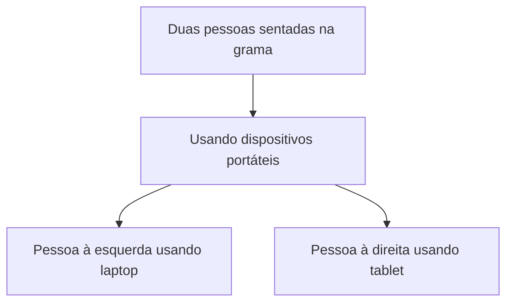
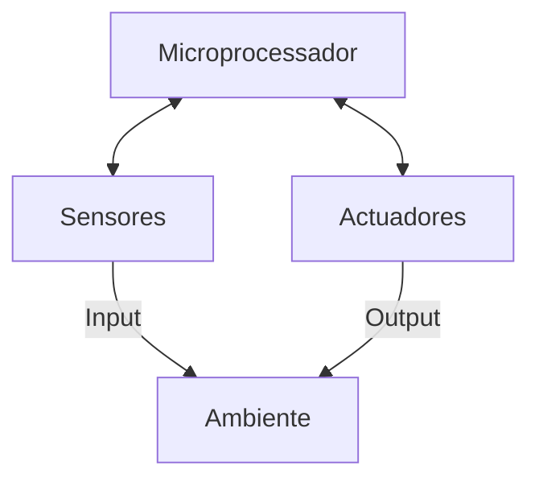
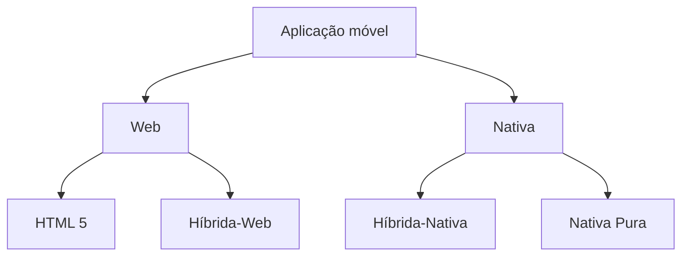
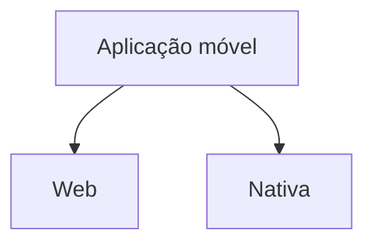
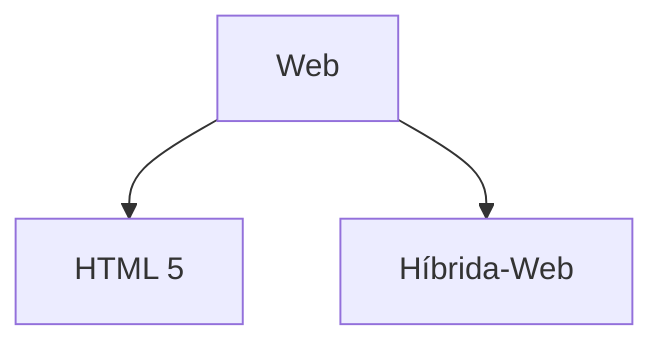
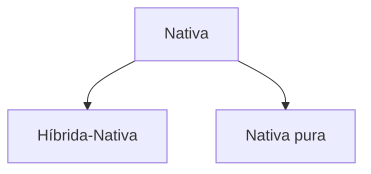
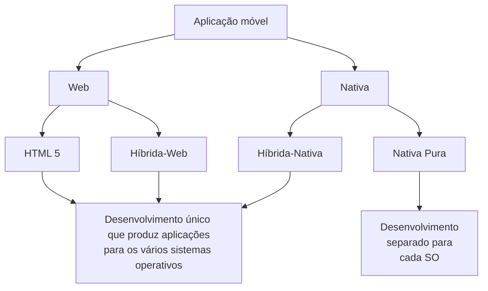
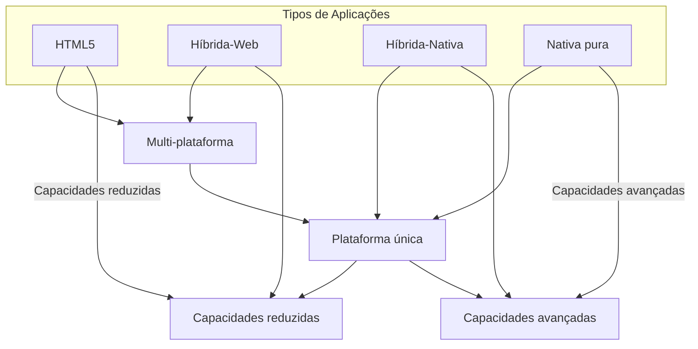

# Computação móvel

[A simple line drawing of two figures sitting on grass. One figure is seen from behind using a laptop-like device. The other figure is facing forward using a tablet-like device.]

Ano?

---
# Computação móvel

Dynabook, idealizado por Alan Kay em 1968

---
# Computação Móvel

CPUs que podem mudar de posição geográfica.

- ~~Electrodomésticos~~
- ~~Controlo de reactor nuclear~~
- Telemóveis!
- Relógios digitais!
- ...?

---
# Computação Móvel

No âmbito desta disciplina, vamos focar-nos em Computação Móvel programável

- Sistemas para os quais é possível desenvolver aplicações que estendam o seu comportamento típico (smartphones, smartwatches, smartglasses,...)

---
# Computação Móvel

## Características

- Anda junto ao utilizador (enquanto ele se move)
- Permite acesso a dados e serviços em qualquer lado e em qualquer momento
- Capaz de capturar dados do ambiente no qual o utilizador se encontra (contexto)
- Por vezes, é capaz de alterar o ambiente no qual o utilizador se encontra

---
# Computação móvel

---
# Computação Móvel

---
# Computação Móvel

## Tendências tecnológicas

- Miniaturização
- Redes sem fios (Wireless)

---
# Sistemas Pervasivos/Ubíquos

## Tendências tecnológicas

- (Ainda mais) miniaturização
- Sofisticação dos sensores (ex: Galvanic Skin Response)

---
# Evolução

| Período             | Tipo de Computação                  | Descrição |
| ------------------- | ----------------------------------- | --------- |
| 1. Mainframe        | 1 computador para muitas pessoas    |           |
| 2. PC               | 1 computador para cada pessoa       |           |
| 3. Sistemas ubíquos | Muitos computadores para uma pessoa |           |

The graph shows the evolution of computing from 1940 to 2005:

- Mainframes: Represented by a blue line, showing a peak around 1970-1975 and then declining.
- PCs: Represented by a pink line, showing rapid growth starting from about 1975 and peaking around 2000.
- Ubiquitous Computing: Represented by a green line, showing exponential growth starting from about 1995.

The y-axis represents "Sales per Year ($Bn)" and ranges from 0 to 18.

---
# Evolução

|      | Desktop PC | Portable PC               | 2-in-1 | Tablet   | Smartphone           | Wearables |
| ---- | ---------- | ------------------------- | ------ | -------- | -------------------- | --------- |
| 2020 | ■■         | ■■■■■■■■■■■■■■■■■■        | ■      | ■■■■■■   | ■■■■■■■■■■■■■■■■■■■■ | ■■■■      |
| 2019 | ■■         | ■■■■■■■■■■■■■■■■■         | ■      | ■■■■■    | ■■■■■■■■■■■■■■■■■■■■ | ■■■■      |
| 2018 | ■■         | ■■■■■■■■■■■■■■■■■■        | ■      | ■■■■■■   | ■■■■■■■■■■■■■■■■■■   | ■■■       |
| 2017 | ■■         | ■■■■■■■■■■■■■■■■■■■       | ■      | ■■■■■■■  | ■■■■■■■■■■■■■■■■     | ■■■       |
| 2016 | ■■         | ■■■■■■■■■■■■■■■■■■■■■     | ■      | ■■■■■■■■ | ■■■■■■■■■■■■■■       | ■■        |
| 2015 | ■■         | ■■■■■■■■■■■■■■■■■■■■■■■   |        | ■■■■■■■■ | ■■■■■■■■■■■■         | ■■        |
| 2014 | ■■         | ■■■■■■■■■■■■■■■■■■■■■■■■■ |        | ■■■■■■■  | ■■■■■■■■■■           | ■         |
| 2013 | ■■■        | ■■■■■■■■■■■■■■■■■■■■■     |        |          |                      |           |
| 2012 | ■■■        | ■■■■■■■■■■■■■■■■■         |        |          |                      |           |
| 2011 | ■■■        | ■■■■■■■■■■■■■■■           |        |          |                      |           |
| 2010 | ■■■        | ■■■■■■■■■■■■■■            |        |          |                      |           |

7.000.000-

6.000.000-

5.000.000-

4.000.000-

3.000.000-

2.000.000-

1.000.000-

0-

Vendas de Equipamentos de Computação em Portugal - fonte: IDC

---
# Computação Móvel

A computação móvel resolve problemas que os sistemas "tradicionais" (PCs) não conseguem resolver

---
# Computação Móvel

## M-PESA

Telemóveis onde a rede de ATMs não chega (Quénia, Tanzânia)

Em 2023, 59% PIB do Quénia passou por esta aplicação
(fonte: https://www.wbs.ac.uk/news/how-mpesa-cornered-the-market)

Custo extremamente elevado da solução "tradicional": construir uma rede de ATMs

---
# Computação Móvel

## Android Earthquake Alerts

Utilizar telemóveis onde os sensores de movimento sísmico não chegam

[Satellite image of a coastal area with green patches indicating sensor coverage]

Custo extremamente elevado da solução "tradicional": alargar a rede de sismógrafos

| 9:30                                      |                              | 56% |
| ----------------------------------------- | ---------------------------- | --- |
| Earthquake                                |                              |     |
| Estimated magnitude 6.1 20 miles away |                              |     |
| Drop                                      | \[Icon of a person dropping] |     |
| Cover                                     | \[Icon of a person covering] |     |
| Hold                                      | \[Icon of a person holding]  |     |
| Android Earthquake Alerts System          |                              |     |
| Tap for next step                         |                              |     |

https://crisisresponse.google/android-alerts/

---
# Computação Móvel

## MobilePoser

Captura o movimento total do corpo apenas com:
- Smartphone
- Smartwatch
- Ear buds

[A imagem mostra uma pessoa em um ambiente interno, aparentemente demonstrando o uso do sistema MobilePoser. O indivíduo está em pé, inclinado para frente, em um espaço que parece ser um escritório ou laboratório com móveis e equipamentos eletrônicos visíveis.]

https://news.northwestern.edu/stories/2024/10/app-performs-motion-capture-with-a-smartphone

Custo elevado e pouca practicidade da solução "tradicional":
espalhar sensores pelo corpo

---
# Arquitetura de aplicações móveis

The image displays four different smartphone models, each representing a distinct mobile operating system and user interface design:

1. At the top: An iPhone, showing the iOS interface with its characteristic app grid layout.

2. Second from top: A BlackBerry device, displaying the BlackBerry 10 OS interface with its hub-centric design.

3. Third from top: A Nokia Lumia smartphone, showcasing the Windows Phone interface with its distinctive live tile design in a vibrant red color scheme.

4. At the bottom: An Android smartphone, exhibiting the typical Android home screen with app icons and widgets on a yellow background.

This visual comparison illustrates the diversity in mobile application architectures and user interface designs across major mobile platforms.

---
# Arquitetura de aplicações móveis

---
# Arquitetura de aplicações móveis

- **Web** - Baseada em HTML e Javascript, é executada dentro de uma WebView e tem acesso limitado às funcionalidades do telemóvel
- **Nativa** - É descarregada (downloaded) para o telemóvel, corre diretamente no sistema operativo e tem acesso a todas as funcionalidades do telemóvel

---
# Arquitetura de aplicações móveis

- **HTML 5** - Baseada em HTML e Javascript standard, usa exatamente a mesma tecnologia que é usada em sites para serem vistos em PCs

- **Híbrida-Web** - Usa frameworks Javascript especialmente desenvolvidas para Mobile de forma a tirar mais partido deste ambiente e conseguir uma aparência mais próxima das aplicações nativas. Correm dentro de uma Webview (exemplos: Phonegap, Ionic).

---
# Arquitetura de aplicações móveis

- **Híbrida-Nativa** - Usa linguagens intermédias (ex: C#, Javascript, Dart) que depois são compiladas para a linguagem nativa de cada sistema operativo (ex: Xamarin, React Native, Titanium, Flutter).
- **Nativa pura** - Usa a framework oficial de cada sistema operativo (iOS SDK, Android SDK)

---
# Arquitetura de aplicações móveis

| Abordagem      | Principal vantagem | Principal desvantagem |
| -------------- | ------------------ | --------------------- |
| HTML 5         |                    |                       |
| Híbrida-Web    |                    |                       |
| Híbrida-Nativa |                    |                       |
| Nativa         |                    |                       |

---
# Arquitetura de aplicações móveis

| Abordagem      | Principal vantagem                       | Principal desvantagem |
| -------------- | ---------------------------------------- | --------------------- |
| HTML 5         | A mesma aplicação serve para PC e Mobile | Aparência não-nativa  |
| Híbrida-Web    |                                          |                       |
| Híbrida-Nativa |                                          |                       |
| Nativa         |                                          |                       |

---
# Arquitetura de aplicações móveis

| Abordagem      | Principal vantagem                       | Principal desvantagem |
| -------------- | ---------------------------------------- | --------------------- |
| HTML 5         | A mesma aplicação serve para PC e Mobile | Aparência não-nativa  |
| Híbrida-Web    | Facilidade de atualizações               | Pouca fluidez         |
| Híbrida-Nativa |                                          |                       |
| Nativa         |                                          |                       |

---
# Arquitetura de aplicações móveis

| Abordagem      | Principal vantagem                       | Principal desvantagem                    |
| -------------- | ---------------------------------------- | ---------------------------------------- |
| HTML 5         | A mesma aplicação serve para PC e Mobile | Aparência não-nativa                     |
| Híbrida-Web    | Facilidade de atualizações               | Pouca fluidez                            |
| Híbrida-Nativa | Rapidez de desenvolvimento               | Dependência de uma framework não oficial |
| Nativa         |                                          |                                          |

---
# Arquitetura de aplicações móveis

| Abordagem      | Principal vantagem                       | Principal desvantagem                                                             |
| -------------- | ---------------------------------------- | --------------------------------------------------------------------------------- |
| HTML 5         | A mesma aplicação serve para PC e Mobile | Aparência não-nativa                                                              |
| Híbrida-Web    | Facilidade de atualizações               | Pouca fluidez                                                                     |
| Híbrida-Nativa | Rapidez de desenvolvimento               | Dependência de uma framework não oficial                                          |
| Nativa         | Fluidez e aparência nativa               | Esforço de desenvolvimento (principalmente se aplicação for multi-plataforma) |

---
# Multi-plataforma

Desenvolver a mesma applicação para vários sistemas operativos, temos duas hipóteses:

---
# Arquitetura de aplicações móveis

Este diagrama ilustra a arquitetura de aplicações móveis, mostrando diferentes tipos de aplicações e suas características em termos de capacidades e compatibilidade com plataformas.

- No eixo vertical, temos a distinção entre "Plataforma única" e "Multi-plataforma".
- No eixo horizontal, temos um espectro de "Capacidades reduzidas" à esquerda para "Capacidades avançadas" à direita.

Os tipos de aplicações móveis apresentados são:

1. HTML5: Posicionado mais à esquerda, indicando capacidades mais reduzidas e compatibilidade multi-plataforma.
2. Híbrida-Web: Situada próxima ao centro, mas ainda tendendo para capacidades reduzidas e multi-plataforma.
3. Híbrida-Nativa: Localizada mais à direita, sugerindo capacidades mais avançadas e compatibilidade com plataforma única.
4. Nativa pura: Posicionada no extremo direito, indicando as capacidades mais avançadas e foco em plataforma única.

Este diagrama ajuda a visualizar as trade-offs entre a capacidade de funcionar em múltiplas plataformas e as capacidades avançadas oferecidas por cada tipo de aplicação móvel.

