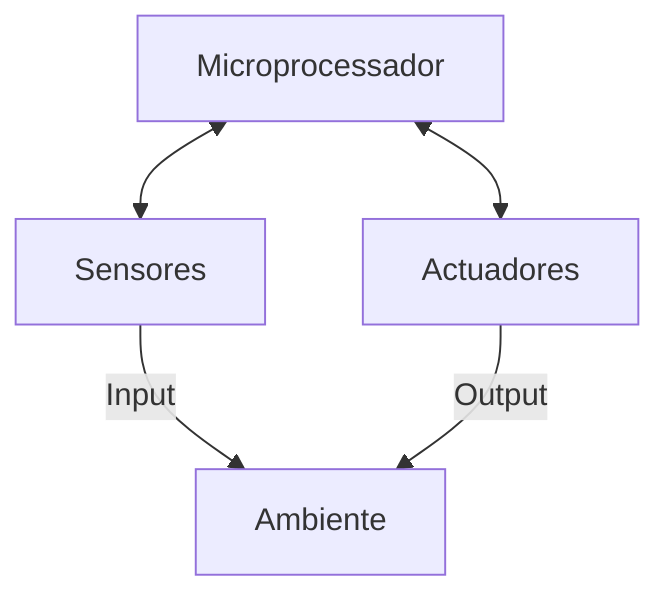
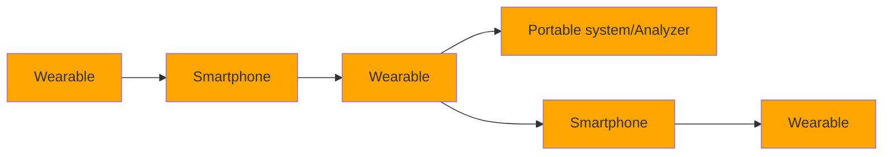
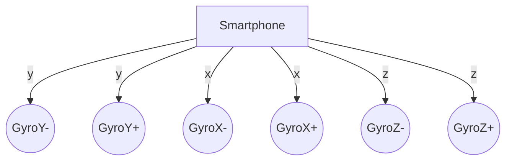
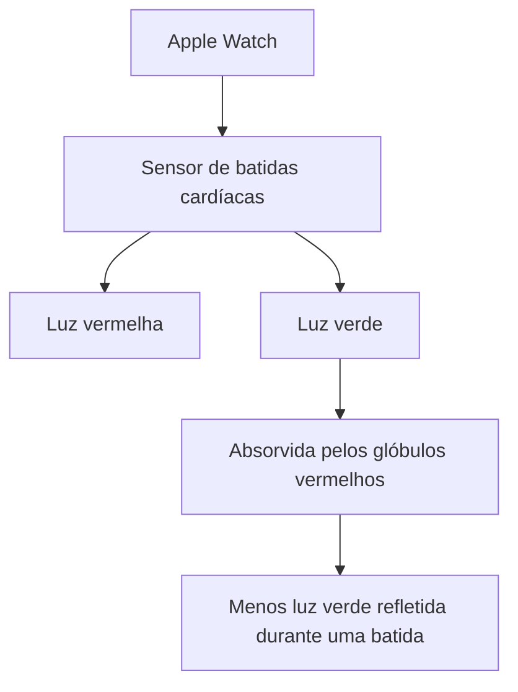
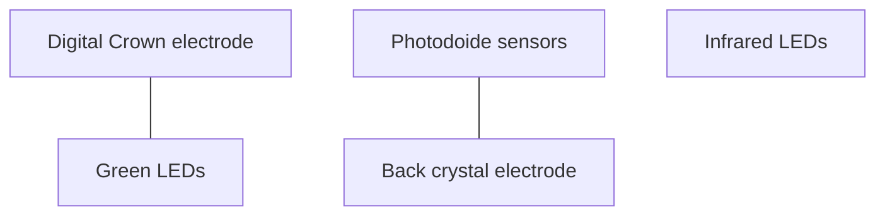
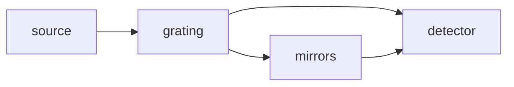

The image depicts a futuristic cyberpunk scene with the following elements:

- A person in the foreground, shown from the side, wearing what appears to be cybernetic enhancements or armor on their arm and upper body. They have short dark hair and are looking off to the side.

- The background shows a sprawling futuristic cityscape with tall buildings, neon lights, and holographic displays, giving a sense of a high-tech urban environment.

- The overall color palette is dominated by cool blues and teals, creating a moody, technological atmosphere.

- In the top right corner, there's a text overlay in a beige box that reads "Sensores" which means "Sensors" in English.

The image evokes themes of human augmentation, advanced technology, and a dystopian or high-tech future setting. It appears to be concept art or promotional material for a science fiction work, possibly a video game or film.
---
# Projeto (parte 2)

Hospital icon

Enunciado será disponibilizado no dia 13, por volta das 11h30.

Mesmas funcionalidades mas:
- Dados obtidos da API do Servidor
- Gravação dos dados em BD local para permitir offline
- Geo-localização
- Inclusão de informação dos tempos de espera


---
# Projeto (parte 2)

Há funcionalidades marcadas como obrigatórias
- Caso não sejam implementadas, têm nota zero

App SNS Hospitais

App SNS Hospitais


---
# Geo-localização

Para compensar a aula que não foi dada nos dias 28/29 Abril, a matéria de geo-localização será disponibilizado em vídeo, no Moodle.

Há quiz sobre esta matéria para fazer até Domingo!

...além do quiz sobre sensores (matéria de hoje)


---
# Avaliação contínua
(componente teórica)

## Participação - 5%
quizzes/exercícios feitos após a aula no Moodle
- A nota final é calculada a partir do número de exercícios submetidos dentro do prazo
- (não interessa se acertam ou não)

## Apresentação individual - 25%
- Análise de uma aplicação móvel
- Pequena apresentação dos resultados (5 min) gravada em vídeo

## Frequência completa presencial (toda a matéria) - 70%
(nota mínima: 8)


---
# Apresentação individual

## 1 - Escolher uma app para analisar

Tem que ser única e satisfazer alguns requisitos - haverá um formulário para inscrição e uma lista pública das inscrições

Podem-se começar a inscrever a partir do momento em que o enunciado seja publicado (13 Maio ao meio dia)


---
# Apresentação individual

## 2 - Análise da app em diversas vertentes

Problema, usabilidade, conectividade, sensores, modelo de negócio, etc.

Deverão elaborar uma apresentação (powerpoint ou similar) com os resultados dessa análise. Devem usar screenshots da app e outras imagens que achem relevantes.


---
# Apresentação individual

## 3 - Gravação de um vídeo com a apresentação

Deverão gravar um vídeo com a apresentação (duração entre 4 e 6 minutos) e fazer upload para o youtube ("unlisted").

No final submetem o link no Moodle.

Prazo: 25 de Maio às 23h59


---
# Sensores




---
# Sensores

Recolhem informação do ambiente e convertem-na para formato digital, de modo a ser passível de ser usada pelas aplicações

The image illustrates this concept with two visual elements:

1. A person speaking into a megaphone, representing the collection of environmental information (in this case, sound).

2. A graph showing sound pressure over time, representing the digital format of the collected information.

The graph displays:

| Axis   | Label                      | Range        |
| ------ | -------------------------- | ------------ |
| Y-axis | Sound Pressure (arbitrary) | 1.5 to 3.5   |
| X-axis | Time (s)                   | 0.00 to 0.05 |


The graph shows a repeating pattern of sound pressure fluctuations over the 0.05-second time span, likely representing the digitized sound waves from the person speaking into the megaphone.


---
# Evolução dos sensores



| System Size | 15 cm³ | 60 cm³ | 100 cm³ |
|-------------|--------|--------|---------|

EXAMPLE Feature 2017

EXAMPLE MCU Body 2021

EXAMPLE Apple Phone 2007

EXAMPLE Feature 2022

EXAMPLE Body Feature 2025

Number of sensors


---
# Evolução dos sensores

| 2007                                                | 2014                                                                                                                                        | 2021                                                                                                                                               |
| --------------------------------------------------- | ------------------------------------------------------------------------------------------------------------------------------------------- | -------------------------------------------------------------------------------------------------------------------------------------------------- |
| * Accelerometer
* Proximity
* ALS
* GS
* Microphone | - iSensor
- RGB
- LuxManager
- GeoSensor
- HRM
- Fingerprint
- Magnetometer
- Gyroscope
- Accelerometer
- Proximity
- ALS
- GS
- Microphone | * iSensor
* RGB
* LuxManager
* GeoSensor
* HRM
* Fingerprint
* Magnetometer
* Gyroscope
* Accelerometer
* Proximity
* ALS
* (1x3D) GS
* Microphone |
| 5 sensores                                          | 12 sensores                                                                                                                                 | 19 sensores                                                                                                                                        |
| iPhone Edge                                         | Samsung S5/iPhone 6 - 2014                                                                                                                  | Galaxy S12/iPhone 9/9+ - 2021                                                                                                                      |


---
# Evolução dos sensores

## Sensor growth in smartphones

| Year  | Model     | Sensors                                                                                                                                                                                               |
| ----- | --------- | ----------------------------------------------------------------------------------------------------------------------------------------------------------------------------------------------------- |
| 2010  | Galaxy S1 | - Ambient Light<br/>- Accelerometer<br/>- Magnetometer                                                                                                                                                |
| 2011  | Galaxy S2 | - Ambient Light<br/>- Accelerometer<br/>- Magnetometer<br/>- Gyroscope<br/>- Proximity                                                                                                                |
| 2012  | Galaxy S3 | - Ambient Light<br/>- Accelerometer<br/>- Magnetometer<br/>- Gyroscope<br/>- Proximity<br/>- Pressure<br/>- RGB                                                                                       |
| 2013  | Galaxy S4 | - Ambient Light<br/>- Accelerometer<br/>- Magnetometer<br/>- Gyroscope<br/>- Proximity<br/>- Pressure<br/>- RGB<br/>- Temperature<br/>- Humidity<br/>- Hall Effect                                    |
| 2014  | Galaxy S5 | - Ambient Light<br/>- Accelerometer<br/>- Magnetometer<br/>- Gyroscope<br/>- Proximity<br/>- Pressure<br/>- RGB<br/>- Temperature<br/>- Humidity<br/>- Hall Effect<br/>- Heart Rate<br/>- Fingerprint |
| 2015+ |           |                                                                                                                                                                                                       |


---
# Microfone

Normalmente usado para fazer chamadas, pode ser ativado pelas aplicações.


---
# Microfone

## Aplicações

- Medidor do nível de ruído (para fins ambientais, sítios populares, etc.)
- Shazam
- Awareness (mistura o som ambiente com a música que se está a ouvir de forma a que quando alguém fala connosco nós percebemos)
- Siri/Google Now
- Audio QR - https://vedify.in/is-audio-the-future-of-digital-payment-systems-google-tez-and-aqr-audio-qr-63cf3c0aaaa7


---
# Microfone

| !Amazon Echo device<br/>**amazon echo** | Will it rain tomorrow?         | Set an alarm for eight a.m.             |
| ----------------------------------------------------------------- | ------------------------------ | --------------------------------------- |
|                                                                   | Play music by Bruno Mars       | How many teaspoons are in a tablespoon? |
|                                                                   | Add gelato to my shopping list | Wikipedia: Abraham Lincoln              |
|                                                                   | When is Thanksgiving?          | Play my "dinner party" playlist         |
| What's the weather in Los Angeles this weekend?                   |                                |                                         |
| Add "make hotel reservations" to my to-do list                    |                                |                                         |


---
# Câmera

Os smartphones incluem câmara fotográfica atrás e à frente


---
# Câmera

## Aplicações

- a cada x minutos tira uma foto
- tradutor automático de texto (word lens)
- ocr
- barcode/qrcode scanner
- importar business cards
- detetor de movimentos (intrusão, etc.)
- realidade aumentada
- ...


---
# Acelerómetro

Acelerómetro

Mede a aceleração (3D) do dispositivo relativamente à gravidade da Terra, ou seja, a força que algo dentro do dispositivo faz contra as paredes do dispositivo.

```mermaid
graph LR
    A[Smartphone] --> B((+Y))
    A --> C((-Y))
    A --> D((-X))
    A --> E((+X))
    A --> F((-Z))
    A --> G((+Z))
```

O diagrama mostra um smartphone com setas indicando os eixos tridimensionais (X, Y, Z) em suas direções positivas e negativas, ilustrando como o acelerômetro mede a aceleração em três dimensões.


---
# Acelerómetro

## Aplicações

- Orientar o display do dispositivo (portrait/landscape)
- Levantar para ligar o écran (smartwatches, android 7.1+, iOS 10+)
- Pedómetro
- Jogos
- Música (abanar para saltar para a próxima música)
- Bump (abana dois dispositivos ao mesmo tempo para os "acoplar" de forma segura)
- Qualidade do sono


---
# Acelerómetro

## Aplicações

- Saltar à corda (Jump Rope)
- Fotografia noturna (Night Camera)
- Scroll automático (InstaPaper Pro)
- Desenhar no espaço (AirPaint)

| **JUMP ROPE WORKOUT**     |         |
| ------------------------- | ------- |
| Enter your current weight |         |
| Weight                    | 70.0 Kg |
| lbs                       | Kg      |
| 30 min                    |         |
| **START JUMP**            |         |


---
# Acelerómetro

## Aplicações

• Playermaker - Monitorização de treino de futebol

[Two images side by side: 
Left image shows a soccer cleat on grass with a small black device attached.
Right image shows a smartphone displaying the Playermaker app interface with training statistics.]

https://www.playermaker.com/


---
# Acelerómetro

Two smartphone screens showing accelerometer data

## App4SHM

- Monitorização da "saúde" das pontes, através da sua vibração
- Desenvolvido por alunos de Eng. Informática em parceria com Eng. Civil

https://www.app4shm.com/


---
# Giroscópio

## Giroscópio

Mede a rotação do dispositivo em relação ao seu próprio eixo




---
# Giroscópio

## Aplicações
- Jogos (FPS, Carros)
- Realidade aumentada

GYROSCOPE CONTROL

4 x 4 GYRO CLINOMETER

|       ROLLING      |   PITCHING   | | | |
| :----------------: | :----------: |---|---|---|
|     13<br/>ROLL    | 12<br/>PITCH | | | |
| ? \| 4x4 \| ⊕ \| ☼ |              |


---
# Sensor de Proximidade

![An image showing a smartphone with a red glow near the top, indicating the proximity sensor, next to a silhouette of a person's head]

Normalmente colocado na zona onde a orelha encosta ao telemóvel. É constituído por um led e um detetor de luz infravermelha (deteta quando a luz bate num obstáculo próximo).

Mais recentemente, passaram a usar-se sensores capacitivos, que medem a perturbação no campo eletromagnético para detetar proximidade (consome menos energia)

Usado para desligar o touch screen e o écran quando se está a falar ao telemóvel.


---
# Sensor de Proximidade

## Aplicações
- Contador de flexões (cara aproxima-se do telemóvel)
- Wave Control - play/stop quando se passa a mão por cima do telemóvel


---
# Sensor de Luminosidade

Mede o nível de brilho na luz ambiente.
Normalmente utilizado para ajustar
automaticamente o brilho do écran ao
ambiente em que se está (mais escuro/
menos escuro)

Importante para reduzir o consumo de
bateria.


---
# Sensor de Luminosidade

## Aplicações

- Detector de luz para cegos (emite som mais alto se houver muita luminosidade)
- Ajuda a tirar fotografias (ajuste do nível de exposição, abertura do diafragma, etc.)


---
# Magnetómetro

Deteta campos magnéticos


---
# Magnetómetro

## Aplicações
- Bússola
- Detetor de metais
- Detetor de canalizações

https://itunes.apple.com/pt/app/metal-detector-pro-magnetic-field-finder/id966179136?l=en&mt=8

FIND
ALL
THE
PIPES
AND
WIRES:

129

Metal Detector PRO


---
# Barómetro

(iPhone 6S+, Xperia Active, Galaxy S3+, Galaxy Note, ...)

Permite medir a altitude, com base na pressão atmosférica. Usado normalmente para aumentar a precisão do GPS.

## Aplicações
- Previsão meteorológica


---
# Barómetro

| 1 Main St, Anytown, USA                                                                             |               |          |         |            |
| --------------------------------------------------------------------------------------------------- | ------------- | -------- | ------- | ---------- |
| **SUBMIT A WEATHER REPORT**                                                                         |               |          |         |            |
| Tell us what's happening at this location.                                                          |               |          |         |            |
| Partly Cloudy                                                                                       | Mostly Cloudy | Overcast | Drizzle | Light Rain |
| \[ ] Lightning? \[ ] Fog?                                                                           |               |          |         |            |
| SUBMIT                                                                                              |               |          |         |            |
| **ENLIST YOUR PHONE**                                                                               |               |          |         |            |
| Your phone's pressure sensor can help us dramatically improve our hyperlocal forecasts. Learn More. |               |          |         |            |
| \[x] Send Pressure Data Periodically                                                                |               |          |         |            |
| CLOSE                                                                                               |               |          |         |            |


---
# Termómetro

Mede a temperatura do corpo (smart watch).

Apple Watch Series 8 (*) | Samsung Galaxy Watch 5
------------------------ | -------------------------

(*) termómetro não acessível a programas de terceiros

## Aplicações (além da óbvia)
• ????


---
# Leitor de impressão digital

(Galaxy S6+, iPhone 5+, Huawey P20, ...)

Encostando o dedo, consegue ler a impressão digital. Normalmente é utilizado para desbloquear o smartphone de forma mais segura.

## Aplicações
- Tudo o que envolva autenticação (substitui pins/passwords)

[An image of a smartphone screen showing a fingerprint recognition interface with the text "Place Your Finger" and a large fingerprint icon. A hand is holding the device, with a finger positioned on the home button.]


---
# Monitor de batidas cardíacas

(Galaxy S5+, Galaxy Note, ...)

LED ilumina os glóbulos vermelhos que circulam nas capilaridades do dedo e um sensor consegue capturar a velocidade a que se movem esses glóbulos, inferindo a pulsação (cada batida corresponde a uma aceleração dos glóbulos).

## Aplicações
- desportivas
- stress
---
# Monitor de batidas cardíacas

Apple Watch faz o mesmo no pulso, mas além de luz vermelha também pode usar luz verde, que é absorvida pelos glóbulos vermelhos (ou seja, menos luz verde refletida durante uma batida)



A imagem mostra um diagrama esquemático da parte traseira de um Apple Watch, destacando os componentes relacionados ao monitoramento de batidas cardíacas:

1. Photodiode sensors (Sensores de fotodiodo) - localizados no centro do dispositivo
2. Digital Crown electrode (Eletrodo da Coroa Digital) - no lado esquerdo
3. Green LEDs (LEDs verdes) - à esquerda do centro
4. Infrared LEDs (LEDs infravermelhos) - à direita do centro
5. Back crystal electrode (Eletrodo do cristal traseiro) - no lado direito

O diagrama ilustra como esses componentes estão dispostos na parte traseira do relógio, formando o sistema de monitoramento cardíaco do Apple Watch.

Pedro Alves 2025
---
# Apple Watch

## Cardiogram

- Desenvolvido em parceria com a Universidade de California
- Usando o Apple Watch, consegue detectar arritmias sintomáticas de ataque cardíaco com 97% precisão
  (estudo envolvendo 6158 participantes)
- Utiliza mecanismos de Inteligência Artificial (nomeadamente redes neuronais) para identificar padrões rítmicos

https://techcrunch.com/2017/05/11/apples-watch-can-detect-an-abnormal-heart-rhythm-with-97-accuracy-ucsf-study-says/


---
# Monitor de batidas cardíacas

(Externo)

Tinke

Inner Balance


---
# Eletrocardiograma (ECG)

(Apple Watch 4+, Samsung Galaxy Watch 4+, ...)

Regista a atividade elétrica do coração através de elétrodos na "Digital Crown" e na parte de trás do relógio (em contacto com a pele). Estes elétrodos detetam alterações na corrente elétrica que resultam das contrações musculares do coração. Quando se coloca o dedo na "Digital Crown", cria-se um circuito fechado entre o coração e os dois braços.

A imagem mostra um smartwatch exibindo uma leitura de ECG com as seguintes informações:
- 102 BPM
- 23 sec
- Note: Apple Watch never checks for heart attacks.

A imagem também inclui um diagrama esquemático da parte traseira de um smartwatch, mostrando os seguintes componentes:



Mais info: https://support.apple.com/en-us/HT204666#sensors


---
# Eletrocardiograma (ECG)

## Aplicações
- Prevenção/detecção precoce de ataques cardíacos, embolias pulmonares, desmaios, etc.


---
# Oxímetro

(Apple Watch 6, Samsung Galaxy Watch 3, vários smartwatches desportivos)

Regista a percentagem de oxigénio nas glóbulos vermelhos. Idealmente deveria ser 95-100%.

Usa uma técnica similar ao monitor de batidas cardíacas só que em vez de medir a velocidade dos glóbulos mede a sua côr (quanto mais escuro menos oxigénio)

[Image of an Apple Watch showing "Blood O₂" screen with "3sec" countdown]

[Image of a smartwatch back with sensor labeled "Blood oxygen sensor and optical heart sensor"]

https://support.apple.com/en-us/HT211027


---
# Galvanic Skin Response

(não existe em smartphone/smartwatch)

Mede a corrente elétrica que circula na pele, condicionado pelo nível de suor. O nível de suor permite medir o grau de nervosismo/excitação de um indíviduo. Utilizado em polígrafos.

## Aplicações
- Nível de ansiedade/nervosismo
- ???


---
# Espectrómetro

(não disponível em smartphones)

Mede as propriedades da luz reflectida numa certa superfície. Com base nessas propriedades, é possível identificar a composição molecular do material



| Spectral Workbench by Public Lab                                                                                                                                                                                                                                                                                                                                                                                                                                                                                                                                                                                                                                                                                                                                                                                                                                                                                                                                                                                                                                                                                                      | Spectral Workbench by Public Lab | Spectral Workbench by Public Lab | Spectral Workbench by Public Lab | Spectral Workbench by Public Lab | Spectral Workbench by Public Lab | Spectral Workbench by Public Lab |
| ------------------------------------------------------------------------------------------------------------------------------------------------------------------------------------------------------------------------------------------------------------------------------------------------------------------------------------------------------------------------------------------------------------------------------------------------------------------------------------------------------------------------------------------------------------------------------------------------------------------------------------------------------------------------------------------------------------------------------------------------------------------------------------------------------------------------------------------------------------------------------------------------------------------------------------------------------------------------------------------------------------------------------------------------------------------------------------------------------------------------------------- | -------------------------------- | -------------------------------- | -------------------------------- | -------------------------------- | -------------------------------- | -------------------------------- |
|                                                                                                                                                                                                                                                                                                                                                                                                                                                                                                                                                                                                                                                                                                                                                                                                                                                                                                                                                                                                                                                                                                                                       |                                  |                                  |                                  |                                  |                                  |                                  |
| !Spectral graph |                                  |                                  |                                  |                                  |                                  |                                  |
| Calibrate                                                                                                                                                                                                                                                                                                                                                                                                                                                                                                                                                                                                                                                                                                                                                                                                                                                                                                                                                                                                                                                                                                                             | Embed                            | Add to set                       | Compare                          |                                  |                                  |                                  |


---
# Espectrómetro

## Aplicações

- Avaliar a qualidade da carne/peixe/vegetais
- Medir o índice de gordura corporal
- Diagnosticar cancro da pele
- Identificar qual o comprimido apontando apenas para a respectiva cápsula


---
# Espectrómetro

| **SCiO Corn Moisture Analyzer - Scanner + 1-Year subscription**<br/>$2,200.00<br/><https://shop.consumerphysics.com/collections/corn-analyzer> | mega crystal - <https://www.youtube.com/watch?v=z7qREIRffnw> |
| ---------------------------------------------------------------------------------------------------------------------------------------------- | ------------------------------------------------------------ |


---
# LIDAR

LIDAR - Light Detection and Ranging

Parecido com o Radar mas usa feixes de luz para construir um mapa 3D dos obstáculos à nossa volta. Possivelmente será o sensor mais importante nos Veículos Autónomos.

[Image of a colorful 3D LIDAR point cloud showing an indoor or urban environment]

[Image of vehicles on a road with colored lanes, one vehicle emitting a blue semicircle representing LIDAR detection]


---
# LIDAR

Disponível no iPhone 12+ Pro, iPad Pro

Lidar scanner


---
# LIDAR

## Aplicações

- Medições 3D
- Planeamento espacial

| Bathroom | Closet      |
| -------- | ----------- |
| 45 sf    | 38 sf       |
| Kitchen  | Living Room |
| 206 sf   | 168 sf      |


Mais info: https://blog.halide.cam/lidar-peek-into-the-future-with-ipad-pro-11d38910e9f8


---
# Sensores

Maioria das apps não usam sensores ou usam apenas um (GPS)!

Ao usar vários sensores, obtém-se informação mais rica - resolvem-se velhos problemas de formas diferentes


---
# Melhorar a geo-localização

![An aerial map showing GPS tracking paths. Green dots represent "Apenas GPS" (GPS only), while blue dots represent "GPS + Sensores" (GPS + Sensors). The blue path appears more accurate, following roads more closely.]

Verde - Apenas GPS, Azul - GPS + Sensores

Combinar GPS com:
- Acelerómetro
- Giroscópio
- Magnetómetro

https://www.youtube.com/watch?v=OEvycEMoLUg (25:40)


---
# Sensores

## VibN (2010)

Permite saber os sítios mais "vibrantes" de uma cidade - sítios onde há muitas pessoas a capturar muito ruído

Combina GPS com Microfone


---
# Sensores

## Layar
(2013 - descontinuada)

Enriquece os sítios reais que aparecem no écran com informação virtual (realidade aumentada)

Combina GPS com Câmera e Giroscópio

[The image shows a hand holding a smartphone in front of a cityscape. The smartphone's screen displays the camera view of buildings with augmented reality information overlaid.]


---
# Sensores

## Slopes
(2013)

Registo percursos de ski

Combina GPS com Acelerómetro e Giroscópio para obter um registo 3D de um percurso de ski, com informações de inclinação (em graus), distância, etc.

| !2D View09:41< 2DOverview Analyze Vitals42.6 MPH 842 FT 1.1 MItop speed vertical distance24.3 MPH 6M 58savg speed total time10:30 11:00 11:32 3 4 5 | !3D View09:41< 3D2250Overview Analyze Vitals8,985 FT 13.8 MPHaltitude speed\[Graph showing altitude over time]11:004 |
| ------------------------------------------------------------------------------------------------------------------------------------------------------------------------------ | ----------------------------------------------------------------------------------------------------------------------------------------------- |


---
# Sensores

## Google Maps timeline (2016)

- Regista todas as deslocações incluindo o meio de locomoção (a pé, de bicicleta, de carro, de transportes, etc.)
- Combina GPS com Acelerómetro e Giroscópio

A imagem mostra uma captura de tela do Google Maps Timeline, exibindo um mapa com rotas coloridas e uma linha do tempo abaixo. O mapa apresenta ruas e pontos de interesse de uma área urbana, com linhas azuis e laranjas indicando diferentes trajetos.

Fonte: https://globalnews.ca/news/2746703/google-maps-timeline-why-a-little-known-google-feature-tracked-me-for-months/


---
# Sensores

## Pokemon Go
(2016)

Enriquece os sítios reais que aparecem no écran com personagens de um jogo

Combina GPS com Câmera e Giroscópio


---
# Sensores

## Android Earthquake Detection
(2020)

Combina Acelerómetro com GPS

[Two smartphone screens are displayed side by side]

Left screen:
```
Google Fi

12:30
Mon, Aug 8

△ Google - ShakeAlert® now
Earthquake nearby
Expect shaking. Estimated magnitude 3.1 about 16
miles away.
```

Right screen:
```
12:30

△
Earthquake
Estimated magnitude 6.1
16 miles away

Drop [icon]

Cover [icon]

Hold [icon]

Google alert powered by ShakeAlert®

Tap for next steps
```

https://arstechnica.com/gadgets/2020/08/android-is-now-the-worlds-largest-earthquake-detection-network/


---
# Sensores

## Sky Guide

| HAPTIC ENGINE                    | ACCELEROMETER                                                  | MAGNETOMETER                                     | GPS                                         |
| -------------------------------- | -------------------------------------------------------------- | ------------------------------------------------ | ------------------------------------------- |
| ```
FRI
8  11:46

64°
      
``` | ```
9:01
SKY GUIDE

Iridium Flare
2m 42s

More Info
      
``` | ```
Iridium 72  9:01

Flare in 1m 49s
      
``` | ```
Iridium 72  9:02

[Map view]
      
``` |
| light tap on the wrist           | lift arm to view                                               | which direction to look                          | from where you are                          |


---
# Sensores

Apple Watch Series 8 deteta acidentes de carro e emite um sinal de emergência
Para detetar o acidente, usa:

- Acelerómetro
- Giroscópio
- GPS
- Barómetro
- Microfone

```
9:41                 5G

It looks like you've
been in a crash.

iPhone will trigger Emergency SOS if
you don't respond.

SOS     Emergency Call
        
        Cancel
```

```
Close       9:41
It looks like you've
been in a crash.

SOS EMERGENCY
    CALL

    Cancel

Apple Watch will trigger
```


---
# Sensores - Android

| Sensor                     | Type                 | Description                                                                                                                                                                                                                                                                                          | Common Uses                                          |
| -------------------------- | -------------------- | ---------------------------------------------------------------------------------------------------------------------------------------------------------------------------------------------------------------------------------------------------------------------------------------------------- | ---------------------------------------------------- |
| TYPE\_ACCELEROMETER        | Hardware             | Measures the acceleration force in m/s² that is applied to a device on all three physical axes (x, y, and z), including the force of gravity.                                                                                                                                                        | Motion detection (shake, tilt, etc.)                 |
| TYPE\_AMBIENT\_TEMPERATURE | Hardware             | Measures the ambient room temperature in degrees Celsius (°C). See note below.                                                                                                                                                                                                                       | Monitoring air temperatures                          |
| TYPE\_GRAVITY              | Software or Hardware | Measures the force of gravity in m/s² that is applied to a device on all three physical axes (x, y, z).                                                                                                                                                                                              | Motion detection (shake, tilt, etc.)                 |
| TYPE\_GYROSCOPE            | Hardware             | Measures a device's rate of rotation in rad/s around each of the three physical axes (x, y, and z).                                                                                                                                                                                                  | Rotation detection (spin, turn, etc.)                |
| TYPE\_LIGHT                | Hardware             | Measures the ambient light level (illumination) in lx.                                                                                                                                                                                                                                               | Controlling screen brightness                        |
| TYPE\_LINEAR\_ACCELERATION | Software or Hardware | Measures the acceleration force in m/s² that is applied to a device on all three physical axes (x, y, and z), excluding the force of gravity.                                                                                                                                                        | Monitoring acceleration along a single axis          |
| TYPE\_MAGNETIC\_FIELD      | Hardware             | Measures the ambient geomagnetic field for all three physical axes (x, y, z) in μT.                                                                                                                                                                                                                  | Creating a compass                                   |
| TYPE\_ORIENTATION          | Software             | Measures degrees of rotation that a device makes around all three physical axes (x, y, z). As of API level 3 you can obtain the inclination matrix and rotation matrix for a device by using the gravity sensor and the geomagnetic field sensor in conjunction with the getRotationMatrix() method. | Determining device position                          |
| TYPE\_PRESSURE             | Hardware             | Measures the ambient air pressure in hPa or mbar.                                                                                                                                                                                                                                                    | Monitoring air pressure changes                      |
| TYPE\_PROXIMITY            | Hardware             | Measures the proximity of an object in cm relative to the view screen of a device. This sensor is typically used to determine whether a handset is being held up to a person's ear.                                                                                                                  | Phone position during a call                         |
| TYPE\_RELATIVE\_HUMIDITY   | Hardware             | Measures the relative ambient humidity in percent (%).                                                                                                                                                                                                                                               | Monitoring dewpoint, absolute, and relative humidity |
| TYPE\_ROTATION\_VECTOR     | Software or Hardware | Measures the orientation of a device by providing the three elements of the device's rotation vector.                                                                                                                                                                                                | Motion detection and rotation detection              |
| TYPE\_TEMPERATURE          | Hardware             | Measures the temperature of the device in degrees Celsius (°C). This sensor implementation varies across devices and this sensor was replaced with the TYPE\_AMBIENT\_TEMPERATURE sensor in API Level 14                                                                                             | Monitoring temperatures                              |


https://developer.android.com/guide/topics/sensors/sensors_overview


---
# Exercício (em grupo)

Imaginem apps que usem 3 ou mais sensores

- Acelerómetro
- Giroscópio
- Barómetro
- Magnetómetro
- Câmera
- LIDAR
- Oxímetro
- GPS
- Termómetro
- Impressão digital
- GSR
- Microfone
- Monitor cardíaco
- Espectrómetro

