# Informações

A cartoon figure is shown sitting at a desk with a "News Today" note. Next to it, the following information is displayed:

Análise de uma app
25 Maio 23h59

A red label states: "Só para lembrar"


---
# Autonomia

Capacidade que um dispositivo tem de funcionar sem estar ligado à corrente elétrica


---
# Autonomia

Mobilidade só funciona se fôr autónoma no consumo de energia


---
# Autonomia


"We think you're going to end up charging it daily" –
Tim Cook, Apple CEO


---
# Exercício

Imaginem que acordavam no futuro e apercebiam-se que os dispositivos móveis tinham uma autonomia de 1 semana.

O que possibilitava isto?

[An icon representing a group discussion is shown to the right of the title]


---
# Autonomia

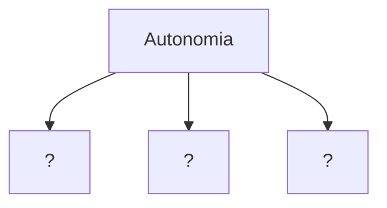


---
# Autonomia

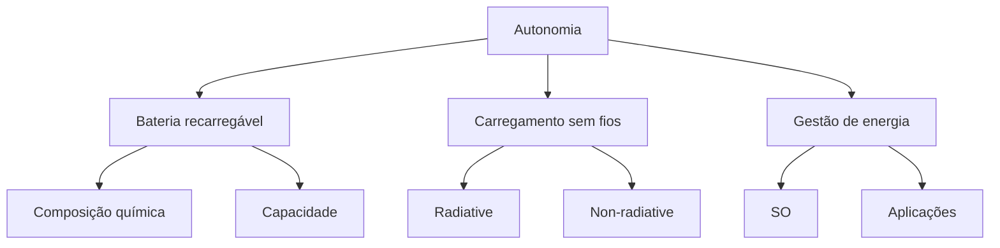


---
# Bateria recarregável

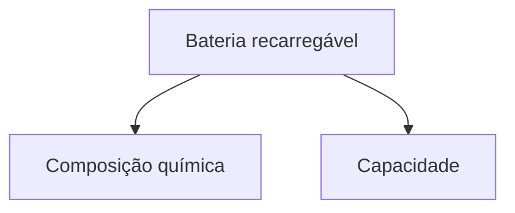


---
# Bateria recarregável

John Goodenough, M. Stanley Whittingham and Akira Yoshino shared the 2019 Nobel Prize in Chemistry for developing lithium-ion batteries, "the hidden workhorses of the mobile era."

Fonte: https://www.quantamagazine.org/chemistry-nobel-goes-to-lithium-battery-innovators-20191009/


---
# Bateria recarregável

Bateria é um dispositivo que faz com que átomos carregados electricamente (iões) se movimentem de um sítio para outro. Quando se movimentam criam corrente elétrica.

Todas as baterias se resumem a 3 componentes:

## Cátodo
(pólo positivo)

## Ânodo
(pólo negativo)

## Electrólito
(líquido através do qual os iões se movimentam)


---
# Bateria recarregável

## Pilhas de lítio

Carregamento faz com que os iões de Lítio se desloquem do Cátodo para o Ânodo

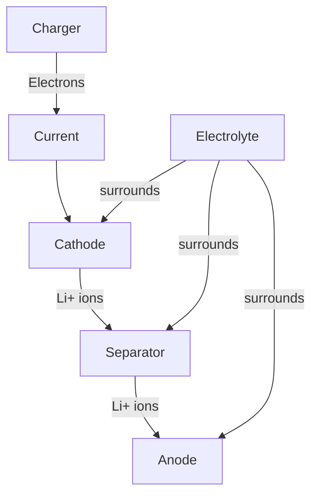

The diagram above represents a Lithium-ion rechargeable battery charge mechanism, with the following components:

- Charger: Provides electrons
- Current: Flow of electrons
- Cathode: Positive electrode
- Anode: Negative electrode
- Separator: Divides cathode and anode
- Electrolyte: (Polymer battery: gel polymer electrolyte) Surrounds the internal components

During charging, lithium ions (Li+) move from the cathode to the anode through the separator, while electrons flow from the charger through the current to the cathode.


---
# Bateria recarregável

## Pilhas de lítio

Utilização (descarregamento) faz com que os iões de Lítio se desloquem do Ânodo para o Cátodo


### Lithium-ion rechargeable battery Discharge mechanism

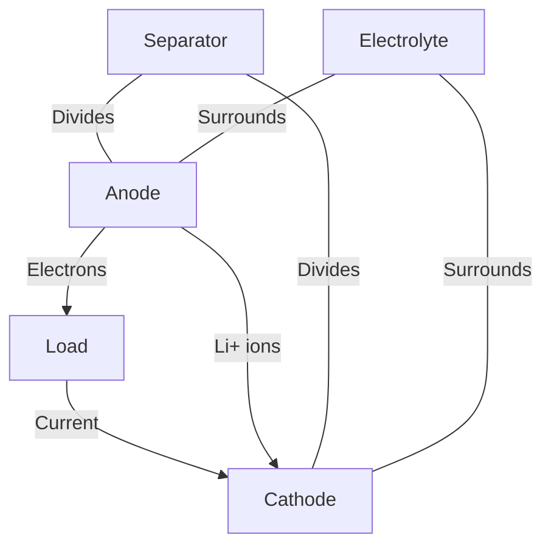

- **Anode**: Source of lithium ions
- **Cathode**: Destination of lithium ions during discharge
- **Separator**: Divides anode and cathode
- **Electrolyte**: (Polymer battery: gel polymer electrolyte)
- **Load**: Represents the device being powered
- **Electrons**: Flow through the external circuit
- **Current**: Flows from cathode to anode through the load


---
# Bateria recarregável

Aquilo que tem evoluído nas baterias (aumentando a sua capacidade e autonomia) é basicamente o material utilizado no Cátodo, Ânodo e Electrólito.

O material condiciona quantos iões cabem na bateria e quão rápido se movimentam


---
# Bateria recarregável

Energy Density ~= Quantidade de energia por kilograma

| Battery-cell energy densities have almost tripled since 2010 | Battery-cell energy densities have almost tripled since 2010 |
| ------------------------------------------------------------ | ------------------------------------------------------------ |
| Cell energy density (Wh/kg)                                  | Cathode chemistry                                            |


| Year           | 2006 | 2008  | 2010  | 2012  | 2014  | 2016  | 2018  | 2020  | 2022 |
| -------------- | ---- | ----- | ----- | ----- | ----- | ----- | ----- | ----- | ---- |
| Energy Density | 0    | \~180 | \~110 | \~220 | \~220 | \~270 | \~300 | \~300 | -    |


Cathode chemistry:
- LCO
- LMO
- LMO/LNO
- NCA
- NCA+
- NMC (111)
- NMC (622)
- NMC (811)

Source: BNEF, company reports

BloombergNEF

fonte: https://cleantechnica.com/2020/02/19/bloombergnef-lithium-ion-battery-cell-densities-have-almost-tripled-since-2010/


---
# Bateria recarregável

Ainda que se descubram novos materiais, dificilmente iremos termos um grande avanço (> 100%) na autonomia das baterias

| Year | HDD     | CPU     | Battery |
| ---- | ------- | ------- | ------- |
| 1990 | 1       | 1       | 1       |
| 1995 | \~7     | \~10    | \~1.5   |
| 2000 | \~100   | \~100   | \~2     |
| 2005 | \~15000 | \~10000 | \~3.5   |


The graph shows the relative performance improvements of HDD, CPU, and Battery from 1990 to 2005. The y-axis is on a logarithmic scale from 1 to 100000, representing the relative performance improvement. HDD and CPU show significant improvements over time, while Battery improvements are much more modest.


---
# Bateria recarregável

Algumas hipóteses de evolução:

- Baterias de Estado Sólido - Usam um eletrólito sólido, mais estável e menos sujeito a fugas térmicas.
  - Densidade energética até 2x maior
  - Tempos de carregamento muito inferiores
  - Atualmente é inviável economicamente (materiais muito caros)


---
# Bateria recarregável

Algumas hipóteses de evolução:

- **Baterias de Estado Sólido** - Usam um eletrólito sólido, mais estável e menos sujeito a fugas térmicas.
  - Densidade energética até 2x maior
  - Tempos de carregamento muito inferiores
  - Atualmente é inviável economicamente (materiais muito caros)

- **Prata-Zinco** - As baterias de Prata-Zinco têm uma capacidade 40% superior às baterias de Lítio mas têm problemas por resolver no recarregamento


---
# Bateria recarregável

Algumas hipóteses de evolução:

- **Baterias de Estado Sólido** - Usam um eletrólito sólido, mais estável e menos sujeito a fugas térmicas.
  - Densidade energética até 2x maior
  - Tempos de carregamento muito inferiores
  - Atualmente é inviável economicamente (materiais muito caros)

- **Prata-Zinco** - As baterias de Prata-Zinco têm uma capacidade 40% superior às baterias de Lítio mas têm problemas por resolver no recarregamento

- **Célula a combustível (Hidrogéneo)** - Produzem corrente contínua pelo combustão eletroquímica a frio de um combustível, geralmente hidrogéneo. Podem alimentar um smartphone durante uma semana, mas não são recarregáveis (ou melhor, carregam-se colocando mais combustível como os carros)


---
# Baterias

## Capacidade

Geralmente medida em mAh (miliamperes hora). Se uma bateria tem uma capacidade 1200 mAh e o aparelho consome em média 200 mAh, então vai durar 6 horas.


---
# Baterias

Tipicamente, a capacidade é proporcional à dimensão

| Pilha | Capacidade (mAh) | Dimensão (mm) |
| ----- | ---------------- | ------------- |
| AAA   | 1200             | 10,5 x 44,5   |
| AA    | 2700             | 14,5 x 50,5   |
| C     | 8000             | 26,5 x 50     |
| D     | 12000            | 34,2 x 61,5   |


---
# Baterias

| Modelo            | Tamanho da Tela | Capacidade da Bateria | Duração da Bateria |
| ----------------- | --------------- | --------------------- | ------------------ |
| iPhone 16 Pro Max | 6.9"            | 4685 mAh              | 8h30               |
| iPhone 16 Pro     | 6.3"            | 3582 mAh              | 6h35               |


A imagem mostra duas mãos segurando dois modelos diferentes de iPhone: o iPhone 16 Pro Max (à esquerda) e o iPhone 16 Pro (à direita). O iPhone 16 Pro Max tem uma cor mais clara, possivelmente branca ou prata, enquanto o iPhone 16 Pro tem uma cor mais escura, possivelmente azul ou cinza.

Fonte: Gsmarena, Phonearena


---
# Baterias

| Modelo                   | Tamanho da Tela | Capacidade da Bateria | Duração |
| ------------------------ | --------------- | --------------------- | ------- |
| Samsung Galaxy S25 Ultra | 6.9"            | 5000 mAh              | 8h      |
| Samsung Galaxy S25+      | 6.7"            | 4900 mAh              | 7h36    |
| Samsung Galaxy S25       | 6.2"            | 4000 mAh              | 7h06    |


A imagem mostra três smartphones da linha Samsung Galaxy S25 lado a lado, com informações sobre suas baterias. Da esquerda para a direita, são apresentados o S25 Ultra (cinza), o S25+ (azul escuro) e o S25 (branco).

Fonte: Gsmarena, Phonearena


---
# Baterias

![Three smartphones of different sizes and colors with multiple camera lenses]

O aumento da capacidade implica normalmente um aumento da dimensão, reduzindo a sua utilidade em computação móvel


---
# Autonomia

Em alternativa (ou complemento) às baterias recarregáveis, temos o carregamento sem fios

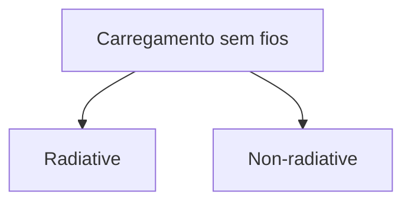


---
# Carregamento sem fios

Poder carregar os aparelhos sem ter que os ligar à corrente (idealmente em movimento)

| Design                                                                                                                                                                                                                                                                                                                                                                                                                                                                                                                                                                                                                                                                                                                                                                                                                                                                                  |
| --------------------------------------------------------------------------------------------------------------------------------------------------------------------------------------------------------------------------------------------------------------------------------------------------------------------------------------------------------------------------------------------------------------------------------------------------------------------------------------------------------------------------------------------------------------------------------------------------------------------------------------------------------------------------------------------------------------------------------------------------------------------------------------------------------------------------------------------------------------------------------------- |
| ### Ikea: estes móveis carregam telemóveis e tabletsNova coleção da marca sueca integra carregadores sem fios para "smartphones" e "tablets". Mesas-de-cabeceira, secretárias e candeeiros devem chegar às lojas portuguesas em AbrilTexto de P3 • 03/03/2015 - 16:26No Mobile World Congress, no último domingo, a Ikea lançou a sua nova ideia: uma linha de mobília que pode carregar dispositivos móveis, sem fios.É a primeira linha de mobiliário da conhecida marca sueca que oferece a possibilidade de se carregarem dispositivos móveis sem serem necessários fios. A ideia foi apelidada de "Home Smart" e vai integrar a popular "Qi wireless charging technology". Qualquer um poderá, assim, através da mobília, carregar um dispositivo de forma rápida. O dirigente da empresa, Menno Treffers, considera que "é um dispositivo barato e simples para os consumidores." |


---
# Carregamento sem fios

Vantagens do carregamento sem fios:


---
# Carregamento sem fios

Vantagens do carregamento sem fios:

- Mais fácil de utilizar (não há cabos enrolados nem tem que se andar à procura da entrada do cabo, etc.)


---
# Carregamento sem fios

Vantagens do carregamento sem fios:

- Mais fácil de utilizar (não há cabos enrolados nem tem que se andar à procura da entrada do cabo, etc.)
- O dispositivo é mais durável e resistente pois não precisa de entradas ("buracos") através dos quais podem entrar água e poeiras


---
# Carregamento sem fios

Vantagens do carregamento sem fios:

- Mais fácil de utilizar (não há cabos enrolados nem tem que se andar à procura da entrada do cabo, etc.)
- O dispositivo é mais durável e resistente pois não precisa de entradas ("buracos") através dos quais podem entrar água e poeiras
- Automaticamente normalizado - Uma vez que não são necessários cabos que muitas vezes são específicos de certos aparelhos (ex: iPhone), qualquer aparelho pode beneficiar deste carregamento


---
# Carregamento sem fios

Vantagens do carregamento sem fios:

- Mais fácil de utilizar (não há cabos enrolados nem tem que se andar à procura da entrada do cabo, etc.)
- O dispositivo é mais durável e resistente pois não precisa de entradas ("buracos") através dos quais podem entrar água e poeiras
- Automaticamente normalizado - Uma vez que não são necessários cabos que muitas vezes são específicos de certos aparelhos (ex: iPhone), qualquer aparelho pode beneficiar deste carregamento
- Compatível com miniaturização - Sensores que se colem à roupa ou se implantem no corpo terão sempre que ser carregados sem fio


---
# Carregamento sem fios

Como funciona o carregamento sem fios?

Há duas grandes técnicas:

- **Radiative** - Usa ondas eletro-magnéticas (rádio-frequência ou micro-ondas) como meio transmissor de energia.

- **Non-radiative** - Transmite energia através do acoplamento magnético de duas bobines (inductive coupling ou magnetic ressonance coupling).


---
# Carregamento sem fios

## Radiative

Usa ondas eletro-magnéticas (rádio-frequência ou micro-ondas) como meio transmissor de energia.

De forma a não causar problemas de saúde, a energia transmitida tem que ser muito reduzida (< 10mW), embora possa percorrer grandes distâncias (alguns kms)

Poucas soluções usando esta tecnologia.

Exemplo: Energous Wattup - Carrega aparelhos auditivos


---
# Carregamento sem fios

A black wireless charging device with the logo "qi" and "BEEpower" on it

## Non-radiative

Transmite energia através do acoplamento magnético de duas bobines (inductive coupling ou magnetic ressonance coupling).

Não causa problemas de saúde mas as bobines têm que estar muito próximas (alguns cms), pois o seu afastamento reduz drasticamente a eficiência da transmissão. Pode, no entanto, transmitir quantidades consideráveis de energia.

É a solução mais utilizada, tendo já um standard adoptado pelos principais fabricantes: Qi


---
# Carregamento sem fios

Inductive coupling

A bobina de transmissão induz corrente (através do ar) na bobina de recepção

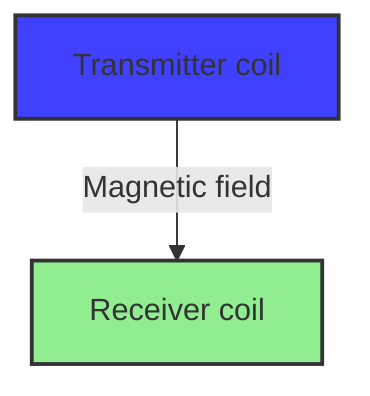


---
# Carregamento sem fios

## Opção 1 - Tight coupling

- Diâmetro das duas bobinas é igual
- A distância entre bobinas é muito inferior ao diâmetro das bobinas
- Eficiente, pouco desperdício de energia eletro-magnética
- Implica alinhamento das bobinas

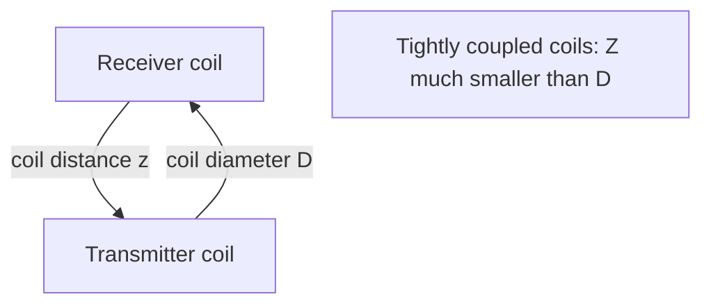

The diagram illustrates two coils (receiver and transmitter) in a tight coupling configuration. The coil distance (z) between them is much smaller than the coil diameter (D), which is consistent with the description in the bullet points.


---
# Carregamento sem fios

## Opção 2 - Loose coupling

- Diâmetro das duas bobinas é diferente
ou
- A distância entre bobinas é similar ao diâmetro das bobinas
- Pouco eficiente
- Não exige tanto alinhamento entre bobinas

![Diagram showing loose coupling in wireless charging]

The image illustrates the concept of loose coupling in wireless charging with two diagrams:

1. Top diagram:
   - Shows two coils of different diameters
   - Labels: "receiver coil diameter D2" (smaller coil), "transmitter coil diameter D1" (larger coil)
   - Magnetic field lines are shown emanating from both coils

2. Bottom diagram:
   - Shows two coils of similar diameter separated by a distance
   - Label: "coil distance z"
   - Magnetic field lines are shown emanating from both coils

Both diagrams are labeled "loosely coupled coils" and demonstrate that D2 is much smaller than D1 in the top diagram, while Z is similar to D in the bottom diagram.


---
# Carregamento sem fios

## Opção 3 - Magnetic ressonance coupling

- Equivalente à opção 2 mas as bobinas operam na mesma frequência
- Não exige tanto alinhamento entre bobinas
- Ultrapassa obstáculos
- Permite um emissor para vários receptores
- Mais eficiente - as bobines podem estar mais afastadas
- Problema - nesta opção, as bobines são demasiado grandes para caberem num smartphone

![Diagrama mostrando o princípio de funcionamento do magnetic ressonance coupling. O diagrama mostra quatro elementos numerados: (1) uma bobina emissora, (2) uma superfície de carregamento, (3) um dispositivo receptor, e (4) uma bobina receptora com uma lâmpada acesa. Linhas curvas azuis e amarelas representam o campo magnético entre as bobinas.]


---
# Carregamento sem fios

Graph showing efficiency vs distance for wireless charging technologies

The graph illustrates the relationship between efficiency and distance for various wireless charging technologies:

| Technology | Efficiency at 2m | Notes |
|------------|------------------|-------|
| Inductive coupling to Resonant Inductive Coupling | ~0.95 | Highest efficiency at short distances |
| Unknown (red line) | ~0.55 | |
| Unknown (blue line) | ~0.97 | |
| Team from MIT | 0.40 | Wirelessly power a 60W light bulb at 2 meters |

Key points:
- Kurs, Moffat and Soljačić found that powering two devices at once led to higher efficiency than one device alone.
- A team from MIT wirelessly powered a 60W light bulb with 40% efficiency at a distance of 2 meters.

The graph shows a general trend of decreasing efficiency as distance increases, with different technologies represented by different colored lines. The dotted line extends further, suggesting a "VISION" for future improvements in long-distance wireless charging efficiency.


---
# Carregamento sem fios

Prevê-se uma evolução semelhante ao Wifi
- Primeiro em casa
- Depois, nos cafés e outros sítios públicos
- Atenção: Ao contrário do Wifi, há custos a contabilizar

Battery charging interface showing 50% charge

| The last Full Cycle Charge:     | N/A       |
| ------------------------------- | --------- |
| Remaining time:                 | 01:39:04  |
| Status:                         | ON        |
| Wireless Hotspot Detected:      |           |
| NUS Hspot                       | Excellent |
| McD Hspot                       | Average   |
| Estimated cost for full charge: | $0.10     |
| Amount in account:              | $10.32    |
| Top-up account                  |           |
| Share power mode                |           |


---
# Carregamento sem fios

A maioria dos dispositivos já estão preparados para carregamento por indução

[A imagem mostra uma mão segurando um smartphone próximo a um carregador sem fio vertical. O smartphone exibe uma tela colorida e o carregador tem a inscrição "ST CHARGE". Uma seta azul indica o movimento de colocar o telefone no carregador.]


---
# Carregamento sem fios

O carregamento sem fios é especialmente atrativo para veículos elétricos pois podem acomodar bobines maiores
(ex: Mercedes S550e)

Bobine
↑
[An arrow points to the area in front of a white car labeled "WIRELESS CHARGING", parked next to a blue-lit house-shaped charging station with solar panels on the roof]

Pedro Alves 2025
---
# Carregamento sem fios

Existem empresas a trabalhar em formas alternativas de carregamento sem fios mas sem grandes certezas

- uBeam - usa ultrasons
- wiTricity - usa campos magnéticos ressonantes

Principal desafio:
- Aumentar a distância entre o emissor e o receptor, sem causar danos nas pessoas envolvidas


---
# Carregamento sem fios

## Xiaomi's Mi Air Charge

- Radiative
- Permite carregar vários dispositivos em simultâneo
- Até 5 metros de alcance
- Ainda em fase de prototipagem

fonte: https://umatechnology.org/xiaomis-mi-air-charge-can-wirelessly-charge-devices-over-the-air/


---
# Gestão de energia

Se uma bateria tem uma capacidade 1200 mAh e o aparelho consome em média 200 mAh, então vai durar 6 horas.

Se quiser que dure mais de 6 horas tenho duas opções:

- Aumentar a capacidade (e consequentemente o tamanho)
- ???


---
# Gestão de energia

Se uma bateria tem uma capacidade 1200 mAh e o aparelho consome em média 200 mAh, então vai durar 6 horas.

Se quiser que dure mais de 6 horas tenho duas opções:

- Aumentar a capacidade (e consequentemente o tamanho)
- Reduzir o consumo


---
# Gestão de energia

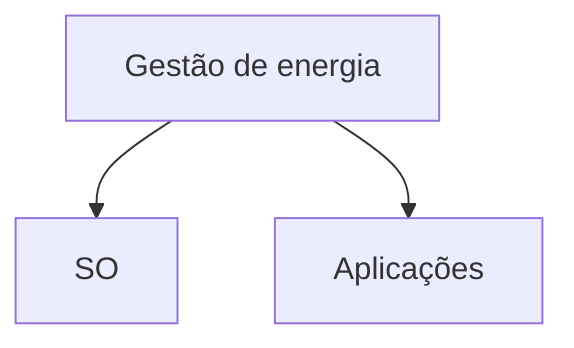


---
# Consumo de Bateria

Para perceber o consumo de bateria, temos que considerar 3 cenários:

- **Suspended** - O telemóvel está bloqueado, écran desligado, mantém o nível de atividade mínimo para receber chamadas e notificações. Este é o cenário mais comum.

- **Idle** - Telemóvel desbloqueado, écran ativo no home screen, sem aplicações a correr. Este cenário permite medir a contribuição do S.O. para o consumo.

- **Active** - Igual ao Idle mas com aplicações a correr. Este cenário permite medir se uma certa aplicação consome muita bateria


---
# Consumo de Bateria (suspended)

| Component | Power (mW) |
| --------- | ---------- |
| GSM       | 31         |
| CPU       | 13         |
| RAM       | 3          |
| WiFi      | 7          |
| Graphics  | 9          |
| Audio     | 4          |
| Rest      | 2          |


No cenário "suspended", o principal consumidor é a rede GSM pois o telemóvel tem que estar pronto a receber chamadas


---
# Consumo de Bateria (idle)

| Component | Power (mW) |
| --------- | ---------- |
| GSM       | 59         |
| CPU       | 38         |
| RAM       | 7          |
| WiFi      | 6          |
| Graphics  | 83         |
| LCD       | 48         |
| Audio     | 28         |
| Rest      | 1          |


Distribuição do consumo de bateria pelos vários componentes com o telemóvel activo mas sem estar a correr aplicações


---
# Consumo de Bateria (active)

| Power (mW) | WiFi      | WiFi | WiFi | WiFi | WiFi     | WiFi | GPRS | GPRS | GPRS | GPRS | GPRS     | GPRS |      |
| ---------- | --------- | ---- | ---- | ---- | -------- | ---- | ---- | ---- | ---- | ---- | -------- | ---- | ---- |
| 450        |           |      |      |      |          |      |      |      |      |      |          |      |      |
| 400        |           |      |      |      |          |      |      |      |      |      |          |      |      |
| 350        |           |      |      |      |          |      |      |      |      |      |          |      |      |
| 300        |           |      |      |      |          |      |      |      |      |      |          |      |      |
| 250        |           |      |      |      |          |      |      |      |      |      |          |      |      |
| 200        |           |      |      |      |          |      |      |      |      |      |          |      |      |
| 150        |           |      |      |      |          |      |      |      |      |      |          |      |      |
| 100        |           |      |      |      |          |      |      |      |      |      |          |      |      |
| 50         |           |      |      |      |          |      |      |      |      |      |          |      |      |
| 0          | Backlight | GSM  | CPU  | WiFi | Graphics | LCD  | Rest | GSM  | CPU  | WiFi | Graphics | LCD  | Rest |


Legend:
- 0%: Black
- 33%: Dark gray
- 67%: Light gray
- 100%: White

Rede celular → (Arrow pointing to GSM under GPRS)

Abrir a aplicação de email, receber 5 emails e responder a 2 emails


---
# Consumo de Bateria

Principais consumidores de bateria:

- Écran
- Comunicação via rede celular
  (chamadas, 3G/4G)


---
# Consumo de Bateria (Écran)

| Brightness level | Power (mW) |
| ---------------- | ---------- |
| 0                | \~5        |
| 50               | \~15       |
| 100              | \~50       |
| 150              | \~100      |
| 200              | \~200      |
| 250              | \~400      |


Evolução do consumo de bateria com o aumento do brilho


---
# Consumo de Bateria (écran)

Como reduzir o consumo de bateria devido ao écran:


---
# Consumo de Bateria (écran)

Como reduzir o consumo de bateria devido ao écran:
- Sensores de proximidade


---
# Consumo de Bateria (écran)

Como reduzir o consumo de bateria devido ao écran:
- Sensores de proximidade
- Sensores de luz ambiente


---
# Consumo de Bateria (écran)

Como reduzir o consumo de bateria devido ao écran:
- Sensores de proximidade
- Sensores de luz ambiente
- Esquemas de côr "claro-sobre-escuro"

[The image contains two smartphones displaying settings menus, one with a light theme and one with a dark theme.]


---
# Consumo de Bateria (rede)

Como reduzir o consumo da rede:
- Offline/Online


---
# Consumo de Bateria (rede)

Como reduzir o consumo da rede:
- Offline/Online
- Poucas comunicações grandes em vez de muitas comunicações pequenas (acumular pacotes pequenos num pacote grande antes de enviar)

De cada vez que se inicia as comunicações de rede, há um consumo acrescido de bateria

Network activity and overhead graph

Legend:
- Blue: Network activity
- Red: Overhead


---
# Consumo de Bateria

Utilização de sensores tem um efeito muito reduzido no consumo de bateria (cerca de 6%)

| Sensor        | Power (mW) |
| ------------- | ---------- |
| Accelerometer | 5 ± 2.3    |
| Gyroscope     | 30 ± 1.3   |
| Light         | 3 ± 1.7    |
| Magnetometer  | 12 ± 0.6   |
| Barometer     | 1 ± 0.7    |
| Proximity     | 7 ± 2.2    |


Consumo médio total em idle: 580 mW


---
# Consumo de Bateria (SO)

Quer Android quer iOS tentam reduzir o consumo de bateria de forma inteligente, principalmente quando está abaixo dos 20%


---
# Consumo de Bateria - Android

Doze Mode (Android 6.0) - Se o aparelho não está a carregar e está parado há algum tempo, com o écran desligado, o SO coloca-o em Doze Mode. Neste momento, as apps deixam de poder aceder à rede nem podem executar operações intensivas CPU, excepto durante as "maintenance windows"

```mermaid
gantt
    title Doze Mode Timeline
    dateFormat X
    axisFormat %s

    section Status
    screen off stationary on battery :active, a1, 0, 100
    Doze :crit, a2, 100, 200
    maintenance window :active, a3, 200, 220
    Doze :crit, a4, 220, 300
    maintenance window :active, a5, 300, 320
    Doze :crit, a6, 320, 400
```

Mais info: https://www.androidpit.com/android-m-release-date-news-features-name


---
# Consumo de Bateria - iOS

Quando a bateria chega aos 20%, o iPhone oferece-se para entrar em modo de baixo consumo (low-power mode):

- Diminui velocidade do CPU
- Desliga efeitos de animação
- Reduz utilização da rede em background
  - Não descarrega mails
  - Não atualiza apps
- Desliga Bluetooth

<div style="background-color: #f0f0f0; padding: 10px; border-radius: 5px;">
<strong>Low Power Mode</strong><br>
Mail fetch, background app refresh, automatic downloads, and some visual effects are reduced or disabled in Low Power Mode.
<br><br>
<div style="text-align: center;">
<span style="margin-right: 20px;">Cancel</span>
<span>Continue</span>
</div>
</div>


---
# Consumo de Bateria - iOS


Em low power mode, ao fim do dia ainda temos 50% de bateria

Low Power Mode

Normal Mode


---
# Consumo de Bateria - Android

A Samsung introduziu nos seus modelos, um modo de poupança de bateria ainda mais agressivo que o "low power mode" do iOS:

- Écran fica com fundo preto
- Apenas 6 apps à escolha do utilizador
- Wifi e Bluetooth desligados
- 3G desligado quando o écran está desligado


---
# Consumo de Bateria

Alguns cuidados que os programadores devem ter de forma a desenvolverem apps que não consumam demasiada bateria


---
# Consumo de Bateria

- Guardar dados localmente para evitar comunicações (conectividade)
- Adiar certas operações até o dispositivo ser carregado (ex: backup para a cloud)
- Agregar operações

De cada vez que se inicia as comunicações de rede, há um consumo acrescido de bateria

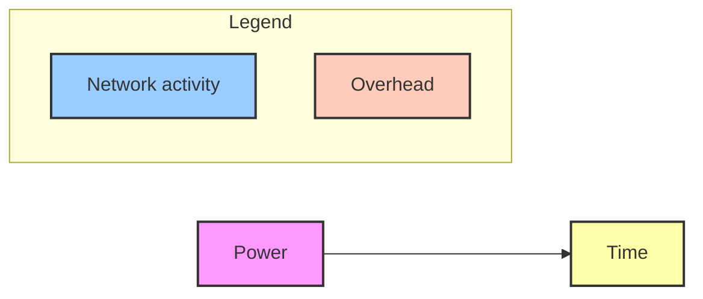

The graph shows power consumption over time, with blue spikes representing network activity and pink areas representing overhead.


---
# Consumo de Bateria

- Evitar monitorizar constantemente a geo-localização

```swift
[self.locationManager allowDeferredLocationUpdatesUntilTraveled:distance timeout:time];
```

Em iOS, é possível indicar qual a distância e/ou tempo entre atualizações da geo-localização


---
# Consumo de Bateria

- Evitar monitorizar constantemente a geo-localização

```kotlin
class FusedLocation private constructor(context: Context) : LocationCallback() {

    private val TIME_BETWEEN_UPDATES = 20 * 1000L  // 20 seconds

    private var locationRequest = LocationRequest.create().apply {
        priority = LocationRequest.PRIORITY_BALANCED_POWER_ACCURACY
        interval = TIME_BETWEEN_UPDATES
    }

    ...
```

Em Android, é possível indicar o tempo entre atualizações da geo-localização, assim como a sua precisão


---
# Consumo de Bateria

## FusedLocation (Android)

Forma como as diferentes prioridades afetam o consumo de bateria e a precisão

| Priority        | Typical location update interval | Battery drain per hour (%) | Accuracy    |
| --------------- | -------------------------------- | -------------------------- | ----------- |
| HIGH\_ACCURACY  | 5 seconds                        | 7.25%                      | \~10 meters |
| BALANCED\_POWER | 20 seconds                       | 0.6%                       | \~40 meters |
| NO\_POWER       | N/A                              | small                      | \~1 mile    |


fonte: https://lembergsolutions.com/blog/fused-location-provider


---
# Consumo de Bateria

- Testar conectividade, antes de fazer pedidos remotos

```java
ConnectivityManager cm =
    (ConnectivityManager)context.getSystemService(Context.CONNECTIVITY_SERVICE);

NetworkInfo activeNetwork = cm.getActiveNetworkInfo();
boolean isConnected = activeNetwork != null &&
                      activeNetwork.isConnectedOrConnecting();

if (isConnected) {
    // make network call
}
```

Exemplo em Android, usando o ConnectivityManager


---
# Consumo de Bateria

- Monitorizar o nível de bateria, e abaixo de um certo valor desligar certos serviços (ex: geo-localização)

```kotlin
val manager = context.getSystemService(Context.BATTERY_SERVICE) as BatteryManager

val currentCapacity = manager.getIntProperty(BatteryManager.BATTERY_PROPERTY_CAPACITY)

if (currentCapacity < 20) { // se a bateria fôr inferior a 20%
    ...
}
```

Nota: Isto pode ser feito de X em X segundos, usando a técnica do postDelayed explicada na aula 6


---
# Consumo de Bateria

Mais info:
[https://developer.android.com/topic/performance/power])(https://developer.android.com/topic/performance/power)


---
# Apps mais consumidoras de bateria

O Android indica não só as apps que mais consomem bateria como a razão pela qual o estão a fazer

A imagem mostra três capturas de tela do menu de bateria em um dispositivo Android, demonstrando como o sistema operacional fornece informações detalhadas sobre o consumo de bateria por aplicativos.

1. A primeira tela mostra o nível de bateria em 63% com uma estimativa de duração restante.

2. A segunda tela exibe um alerta sobre o aplicativo Maps Preview, que está consumindo bateria ao solicitar a localização frequentemente. Uma caixa de diálogo pergunta: "Turn off location?" (Desligar localização?), explicando que o telefone não pode gerenciar a bateria normalmente devido ao uso constante da localização pelo aplicativo.

3. A terceira tela apresenta uma lista de aplicativos e seu uso de bateria desde a última carga completa:

| Aplicativo     | Uso          | Porcentagem |
| -------------- | ------------ | ----------- |
| Maps Preview   | Used for 42m | 31%         |
| Phone          | Used for 40m | 9%          |
| Chrome         | Used for 17m | 3%          |
| Duo            | Used for 3m  | 2%          |
| Photos         | Used for 6m  | 2%          |
| Voice calls    | 43m          | 1%          |
| Hangouts       | Used for 2m  | 1%          |
| Quora          | Used for 7m  | 1%          |
| Pixel Launcher | Used for 8m  | 1%          |


Esta visualização permite aos usuários identificar quais aplicativos estão consumindo mais bateria e tomar medidas para otimizar o uso, como desligar a localização para apps específicos quando não estiverem em uso.

