```mermaid
graph TD
    A[Aplicação móvel] --> B[Web]
    A --> C[Nativa]
    B --> D[HTML 5]
    B --> E[Híbrida-Web]
    C --> F[Híbrida-Nativa]
    C --> G[Nativa Pura]
```

# Arquitetura de aplicações móveis




---
# HTML5

Aplicações Web (HTML5) têm acesso a mais funcionalidades do que imaginamos!

- Câmera
- Localização
- Acelerómetro
- Compasso
- Contactos
- etc.


---
# HTML5

Aplicações Web (HTML5) têm acesso a mais funcionalidades do que imaginamos!

[https://whatwebcando.today/])(https://whatwebcando.today/)

## FEATURES

YES ✓ Feature available in your current browser
NO ✗ Feature not available in your current browser

Filter

### Seamless Experience

| Feature           | Availability |
| ----------------- | ------------ |
| Offline Mode      | YES ✓        |
| Background Sync   | YES ✓        |
| Inter-App Sharing | NO ✗         |
| Payments          | YES ✓        |
| Credentials       | YES ✓        |


### Surroundings

| Feature       | Availability |
| ------------- | ------------ |
| Bluetooth     | YES ✓        |
| NFC           | NO ✗         |
| USB           | YES ✓        |
| Serial Port   | YES ✓        |
| Ambient Light | NO ✗         |


### Camera & Microphone

| Feature                  | Availability |
| ------------------------ | ------------ |
| Audio & Video Capture    | YES ✓        |
| Advanced Camera Controls | YES ✓        |
| Recording Media          | YES ✓        |
| Real-Time Communication  | YES ✓        |
| Shape Detection          | YES ✓        |


---
# HTML5

Exemplo de utilização de acelerómetro:
[https://yal.cc/r/20/devicemotion])(https://yal.cc/r/20/devicemotion)

| AA                                                                                                                   | yal.cc | ↻ |
| -------------------------------------------------------------------------------------------------------------------- | ------ | - |
| OK!                                                                                                                  |        |   |
| \[An image showing three colored waveforms (red, green, blue) on a dark background, representing accelerometer data] |        |   |


Leitura do acelerómetro é feito por javascript:

```javascript
window.addEventListener("deviceorientation",
    function(event) {
        y = Math.round(event.beta);
        x = Math.round(event.gamma);
    }
)
```

[A QR code is present on the right side of the image]


---
# HTML5

2 problemas:

- O utilizador apercebe-se que está a correr num browser (não muito grave)

- Se não houver conectividade, não executam! (pode ser grave)

[An image of a smartphone displaying a "Check Internet Connection" screen with the following content:

- Header: "Check Internet Connection"
- Button: "CLICK TO CHECK INTERNET CONNECTION"
- Pop-up dialog:
  - Title: "No Internet Connection"
  - Message: "You are offline please check your internet connection"
  - Button: "OK"
- Text at bottom: "No Internet Connection"
- URL: www.viralandroid.com]


---
# Quando usar HTML5?

- Utilizações pontuais
  - Não se justifica instalar uma app
  - Exemplo: Consultar o cartaz de um festival de Verão

- Aplicações simples que não exigem acesso às funcionalidades do SO
  - Exemplo: Conversor de kms para milhas, previsão do tempo, calculadora

- Aplicações cujo ponto de entrada seja normalmente um motor de pesquisa
  - Exemplo: wikipedia

| Chicago, IL                       |   | MAP |
| --------------------------------- | - | --- |
| Flood Warning for Cook, IL        |   |     |
| ☁️ 43°<br/>Mostly Cloudy          |   |     |
| NEXT HOUR                         |   |     |
| Mostly cloudy for the hour.       |   |     |
| NEXT 24 HOURS                     |   |     |
| Partly cloudy later this morning. |   |     |


forecast.io


---
# Mobile Web

Os sites que foram desenhados para desktop não funcionam bem em smartphones

Google dá mais importância aos sites mobile-friendly nos resultados da pesquisa

https://webmasters.googleblog.com/2015/04/rolling-out-mobile-friendly-update.html


---
# Mobile-friendly

[Two smartphone illustrations side by side. The left one has a red circle with an X below it, the right one has a green circle with a checkmark below it. Both show simplified webpage layouts with "Lorem Ipsum Dolor" text.]

- O texto é legível sem necessidade de fazer zoom

- Os botões e outras áreas "clicáveis" têm um espaçamento adequado

- A página evita scroll horizontal


---
# Mobile Web

3 opções para disponibilizar páginas mobile-friendly:

- **Responsive web design** - a página é a mesma mas através de css adapta-se ao tamanho de écran
- **Dynamic serving** - o mesmo url dá páginas diferentes consoante o dispositivo que está a aceder
- **URLs específicos mobile** - caso se aceda ao site com um dispositivo móvel, o browser redirecciona automaticamente para um url mobile (ex: www.techmeme.com -> m.techmeme.com)


---
# Responsive Web Design

Os elementos vão-se ajustando dentro das dimensões do écran

LUCK IS PROBABILITY TAKEN PERSONALLY
LUCK IS PROBABILITY TAKEN PERSONALLY
LUCK IS


---
# Responsive Web Design

Baseia-se em 3 técnicas

- Fluid grid
- Fluid images
- Media queries


---
# Responsive Web Design

## 1. Fluid Grid

The image illustrates the concept of a fluid grid in responsive web design. It shows two devices - a tablet and a smartphone - displaying the same content but with different layouts adapted to their respective screen sizes.

On the tablet (larger device):
- A grid of numbered boxes is shown
- The grid has a 3x3 layout
- Boxes are numbered from 1 to 8
- Red and dark gray colors are used alternately for the boxes

On the smartphone (smaller device):
- The same content is displayed
- The layout is adjusted to a 2x3 grid to fit the narrower screen
- Boxes are numbered from 1 to 6, maintaining the same order as on the tablet

This demonstration showcases how fluid grids allow content to reflow and reorganize based on the available screen space, which is a key principle of responsive web design.


---
# Responsive Web Design

## 2. Fluid Images

The image demonstrates the concept of fluid images in responsive web design using a website called "THE GREAT DISCONTENT" as an example. It shows how the same website layout adapts to different screen sizes while maintaining the proportions of images and text.

The example displays three versions of the website header:

1. A wide layout with a large header image and menu items spread horizontally.
2. A medium-width layout with a slightly smaller header image and menu items still horizontal.
3. A narrow layout, likely for mobile devices, with a smaller header image and potentially a condensed menu (not fully visible in this example).

In all three versions, the website maintains its branding with "THE GREAT DISCONTENT" prominently displayed. The navigation menu includes items such as:

- Magazine
- Digital Features
- Films
- Follow
- Shop

The header image in each version shows the same person, demonstrating how responsive design allows images to scale fluidly across different device sizes while preserving the content and overall design aesthetic.

At the bottom right of the image, there's a small text that reads:


This example effectively illustrates how fluid images and responsive design principles allow web content to adapt seamlessly to various screen sizes and devices.
---
# Responsive Web Design

## 3. Media Queries

```css
@media screen and (max-width: 479px) {
  .main-wrapper { width: 300px; }
}

@media screen and (min-width: 480px) and (max-width: 767px) {
  .main-wrapper { width:460px; }
}

@media screen and (min-width: 768px) and (max-width: 1023px) {
  .main-wrapper { width:760px; }
}

@media screen and (min-width: 1024px) and (max-width: 1177px) {
  .main-wrapper { width:960px; }
}

@media screen and (min-width: 1178px) and (max-width: 1279px) {
  .main-wrapper { width:1150px; }
}
```

CSS varia consoante a dimensão do écran


---
# Responsive Web Design

## Bootstrap (http://getbootstrap.com/)

- Framework css para apoiar no desenvolvimento de sites "responsive", criada em 2011. Atualmente é a framework de referência.
- Open-source, inicialmente desenvolvida por engenheiros do Twitter
- Fluid layout
  ```html
  <div class="row">
    <div class="col-md-8">.col-md-8</div>
    <div class="col-md-4">.col-md-4</div>
  </div>
  ```
- Fluid images
  ```html
  
  ```


---
# Dynamic serving

```mermaid
graph LR
    A[Smartphone] -->|Pedido HTTP<br>(headers: { ... User-Agent... })| C[Servidor Web]
    B[Tablet] -->|Pedido HTTP<br>(headers: { ... User-Agent... })| C
    C -->|switch (userAgent) {<br>    case ... : return html1;<br>    case ... : return html2;<br>    ...<br>}| D[Response]
```

The diagram illustrates the concept of dynamic serving:

1. Two devices (a smartphone and a tablet) are shown on the left side.
2. Both devices send HTTP requests to a web server, including the User-Agent in the headers.
3. The web server, labeled "Servidor Web", processes these requests.
4. The server uses a switch statement to determine the appropriate response based on the userAgent:
   ```
   switch (userAgent) {
       case ... : return html1;
       case ... : return html2;
       ...
   }
   ```
5. Depending on the User-Agent, the server returns different HTML responses (html1, html2, etc.) tailored to the requesting device.

This approach allows the server to serve different content or layouts to different devices, optimizing the user experience for each type of device.


---
# Dynamic serving

| !LIFERAY Enterprise Open Source For Life logo<br/>**Welcome**<br/>liferay.com > Welcome > liferay.com > Manage Pages > Look and Feel<br/>**Manage Pages**<br/>Pages \| *Look and Feel* \| Export / Import<br/>Regular Browsers \| Mobile Devices \| *themes-rules*<br/>If device matches the following criteria:Brand is	ANY ▼	model	ANY ▼&#xA;Operating system is	ANY ▼	version	ANY ▼&#xA;Browser is	ANY ▼	version	ANY ▼&#xA;Pointing method is	ANY ▼	&#xA;Device is tablet	doesn't matter ▼	&#xA;Device has qwerty keyboard	doesn't matter ▼	 |
| --------------------------------------------------------------------------------------------------------------------------------------------------------------------------------------------------------------------------------------------------------------------------------------------------------------------------------------------------------------------------------------------------------------------------------------------------------------------------------------------------------------------------------------------------------------- |---|---|---|---|

      Then apply theme
      <br>
      <em>no theme selected</em>
    </td>
    <td>
      <div style="background-color: #4A90E2; color: white; padding: 10px;">
        O tema a aplicar é<br>
        escolhido consoante um<br>
        conjunto de regras
      </div>
    </td>
  </tr>
</table>


---
# URLs específicos mobile

QR code

| !Browser address bar showing techmeme.com                                                                                                                                                                                                                                                                                                                                                                                                                                                                                                                                                                                                              |                                                                                                                                                                                                                                                                                                                                                                                                                                      | | | | | | | | |
| ---------------------------------------------------------------------------------------------------------------------------------------------------------------------------------------------------------------------------------------------------------------------------------------------------------------------------------------------------------------------------------------------------------------------------------------------------------------------------------------------------------------------------------------------------------------------------------------------------------------------------------------------------------------------- | ------------------------------------------------------------------------------------------------------------------------------------------------------------------------------------------------------------------------------------------------------------------------------------------------------------------------------------------------------------------------------------------------------------------------------------ |---|---|---|---|---|---|---|---|
| **Techmeme**<br/>April 23, 2015, 6:20 PM                                                                                                                                                                                                                                                                                                                                                                                                                                                                                                                                                                                                                               | Search                                                                                                                                                                                                                                                                                                                                                                                                                               | | | | | | | | |
| HOME \| RIVER \| LEADERBOARD \| ABOUT \| SITE NEWS \| SPONSOR \| mg MEDIAGAZER \| m MEMEORANDUM \| O WESMIRCH                                                                                                                                                                                                                                                                                                                                                                                                                                                                                                                                                          |                                                                                                                                                                                                                                                                                                                                                                                                                                      |
| **Top News**<br/>Alex Sherman / Bloomberg Business:<br/>**Sources: Comcast to drop proposed Time Warner Cable takeover deal after FCC staff recommends hearing; announcement as soon as Friday** — Comcast Plans to Drop Time Warner Cable Deal —<br/>Comcast Corp. is planning to walk away from its proposed $45 billion takeover of Time Warner Cable Inc. ...<br/><br/>More: New York Times, Ars Technica, The Verge, Motley Fool, Fortune, CNET, Digital Trends, BuzzFeed, The Register, PC Magazine, Forbes, Gizmodo, GeekWire, Computerworld, TechCrunch, AppleInsider, USA Today, iMore, DSLreports, The Daily Dot, Engadget, BGR, ExtremeTech, VentureBeat... | **Sponsor Posts**<br/>Microsoft:<br/>Students are invited to the Break into Code! challenge — Young students can become technology creators in this first of a new series of contests from Microsoft Imagine. Students can learn to code their first game in about an hour.<br/><br/>Avangate:<br/>Go Beyond Retention — If the solidification of the cloud as the predominant business model for software and services companies... | | | | | | | | |


| !Mobile browser address bar showing www.techmeme.com/m/                                                                                                                                             |      |     |        |      |
| -------------------------------------------------------------------------------------------------------------------------------------------------------------------------------------------------------------------------- | ---- | --- | ------ | ---- |
| **Techmeme** 6:20 PM ET, Apr 23, 2015                                                                                                                                                                                      |      |     |        |      |
| Top                                                                                                                                                                                                                        | More | New | Events | Jobs |
| Alex Sherman / Bloomberg Business:<br/>Sources: Comcast to drop proposed Time Warner Cable takeover deal after FCC staff recommends hearing; announcement as soon as Friday — Comcast Plans to Drop Time Warner Cable Deal |      |     |        |      |
| Microsoft:<br/>Earnings Release FY15 Q3 — Strength in Microsoft Cloud Highlights Q3 Results Increasing usage of Microsoft Azure, Office 365, Bing and Xbox Live contributes to Q3 growth REDMOND ...                       |      |     |        |      |
| Alex Wilhelm / TechCrunch:<br/>Microsoft revenue grew 6% YoY to $21.7B, Surface revenue up 44%, Commercial Cloud revenue up 106%, Office 365 hits 12.4M subscribers —                                                      |      |     |        |      |


5
---
# URLs específicos mobile

| !Facebook icon Search- Pedro Alves
- Friends
- Groups
- Marketplace
- Watch
  * 9 new videos
- Memories
- Saved
- Pages
  * 9 new
- See moreYour shortcuts- Departamento de Informática da Universida...
- Spreadd | 👍 Like   💬 Comment   ↗️ Share My Modern Met ✓ 10h · 🌎 These "humans" are made entirely of bicycle chains. Amazing! \[Image of a sculpture made of bicycle chains] MYMODERNMET.COM Life-Size Sculptures Made of Bicycle Chains Express Powerful Human Emotions 👍❤️😮 256   3 Comments 27 Shares 👍 Like   💬 Comment   ↗️ Share António Raminhos ✓ 20h · 🌎 Impossível carnaval nos anos 80 sem uma destas. E era fixe porque uma pessoa mantinha-se hidratada ao passar parte do tempo com esguichadelas para a garganta com aquele saborzinho a plástico cheio de químicos. Bisnagas de extrema qualidade que passados | Groups Suggested for you \[Image of a festival] BOOM FESTIVAL 2022 (RESCHEDULED 2 28K members · 2 posts Join group Sponsored \[Book cover image] You Hav Seconds T Out --> Qu hookpointb \[Building image] Private Eq Financing, Investing, imperial-on executive-... Your Pages | |
| --------------------------------------------------------------------------------------------------------------------------------------------------------------------------------------------------------------------------------------- | --------------------------------------------------------------------------------------------------------------------------------------------------------------------------------------------------------------------------------------------------------------------------------------------------------------------------------------------------------------------------------------------------------------------------------------------------------------------------------------------------------------------------------------------------------------------------------------------------------------------------- | -------------------------------------------------------------------------------------------------------------------------------------------------------------------------------------------------------------------------------------------------------------------------------- |


https://www.facebook.com/

| \[Mobile Facebook interface] What's on your mind? My Modern Met ✓ 10 hrs These "humans" are made entirely of bicycle chains. Amazing! \[Image of a sculpture made of bicycle chains] MYMODERNMET.COM Life-Size Sculptures Made of Bicycle Chains Express Powerful Human Emotions "We are interlocked and running like parts of a giant machine." 👍❤️😮 257   3 Comments 27 Shares 👍 Like   💬 Comment   ↗️ Share |
| ------------------------------------------------------------------------------------------------------------------------------------------------------------------------------------------------------------------------------------------------------------------------------------------------------------------------------------------------------------------------------------------------------------------ |


https://m.facebook.com/


---
# Mobile Web

- Responsive web design
  - Vantagem: Só tem que manter uma página, independentemente do número de dispositivos
  - Desvantagem: Só permite adaptar a página consoante o tamanho do ecrã (por ex: não permite adaptar para diferentes SOs ou marcas de telemóvel)

- Dynamic serving
  - Vantagem: Permite controlar melhor a página que é mostrada em cada caso
  - Desvantagem: É necessário desenvolver e manter uma página diferente para cada dispositivo

- URLs específicos mobile
  - Vantagem: Podemos escolher o modo em que queremos ver o site
  - Desvantagem: Não há um endereço único de acesso ao site


---
# Arquitetura de aplicações móveis


---
# Híbrida-Web

Aplicações HTML5 funcionam mas os utilizadores preferem instalar apps do que aceder a um link/bookmark

Os utilizadores gostam da experiência de navegar na app store / play store e descarregar aplicações

## Solução Híbrida-Web:
Embrulhar o HTML num app nativa, usando uma WebView


---
# Híbrida-Web

## Browser

```
•••oo altice MEO ⏦   14:59         ⏦ 78% ■
   🔒 linkedin.com                        ↻

🏠 👥 🗨 🔔 💼

🔍 Search for people, jobs, posts, an

[Image of people holding various items]

6 Likes

👍 Like    💬 Comment    ↗️ Share

Ondina Marques, Gonçalo Lages de     •••
Carvalho and 1 other follow GetSmarter

   GetSmarter
   79,530 followers
   Promoted

◀️ ▶️ ↗️ 📚 □
```

## WebView

```
•••oo altice MEO ⏦   14:59         ⏦ 78% ■

👤 🔍 Search                          ⧉ 🗨

[Image of people holding various items]

6 Likes

👍 Like    💬 Comment    ↗️ Share

Ondina Marques, Gonçalo Lages de     •••
Carvalho and 1 other follow GetSmarter

   GetSmarter
   79,530 followers
   Promoted

Learn to successfully integrate AI into your

🏠 👥 ➕ 🔔¹ 💼
```


---
# Híbrida-Web

## WebView em Android

```xml
<FrameLayout xmlns:android="http://schemas.android.com/apk/res/android"
    xmlns:tools="http://schemas.android.com/tools"
    android:id="@+id/container"
    android:layout_width="match_parent"
    android:layout_height="match_parent"
    tools:context=".MainActivity"
    tools:ignore="MergeRootFrame">

    <WebView
        android:id="@+id/activity_main_webview"
        android:layout_width="match_parent"
        android:layout_height="match_parent" />
</FrameLayout>
```

```java
mWebView.loadUrl("file:///android_asset/www/index.html");
```


---
# Híbrida-Web

|                               |                      | Vantagem | Desvantagem |
| ----------------------------- | -------------------- | -------- | ----------- |
| Webview com conteúdos locais  | loadUrl(file://...)  |          |             |
| Webview com conteúdos remotos | loadUrl(http\://...) |          |             |


---
# Híbrida-Web

|                               |                      | Vantagem                                | Desvantagem                        |
| ----------------------------- | -------------------- | --------------------------------------- | ---------------------------------- |
| Webview com conteúdos locais  | loadUrl(file://...)  | Permite executar a aplicação em offline | Não permite actualizações via rede |
| Webview com conteúdos remotos | loadUrl(http\://...) | App sempre actualizada                  | Não permite executar em offline    |


Solução: Usar conteúdos remotos + cache da Webview


---
# Híbrida-Web

Em Android, é possível parametrizar a cache da webview com os seguintes valores

| Constants |                                                                                                                                                         |
| --------- | ------------------------------------------------------------------------------------------------------------------------------------------------------- |
| int       | **LOAD\_CACHE\_ELSE\_NETWORK**<br/>Use cached resources when they are available, even if they have expired.                                             |
| int       | **LOAD\_CACHE\_ONLY**<br/>Don't use the network, load from the cache.                                                                                   |
| int       | **LOAD\_DEFAULT**<br/>Default cache usage mode.                                                                                                         |
| int       | **LOAD\_NORMAL**<br/>This constant was deprecated in API level 17. This value is obsolete, as from<br/>onwards it has the same effect as LOAD\_DEFAULT. |
| int       | **LOAD\_NO\_CACHE**<br/>Don't use the cache, load from the network.                                                                                     |


https://developer.android.com/reference/android/webkit/WebSettings.html


---
# Híbrida-Web

Em iOS, também é possível parametrizar a cache, embora isso seja feito a nível do Request (NSURLRequest)

## Exemplo:

The NSURLRequestReturnCacheDataDontLoad policy allows an application to specify that only data in the cache should be returned. Attempting to create an NSURLSessionTask instance with this cache policy returns nil immediately if the response is not in the local cache. This is similar in function to an "offline" mode and never brings up a network connection.

https://developer.apple.com/library/content/documentation/Cocoa/Conceptual/URLLoadingSystem/Concepts/CachePolicies.html


---
# Híbrida-Web

E se precisar de aceder a funcionalidades não disponíveis em HTML5?

Projecto Cordova
([http://cordova.apache.org/])(http://cordova.apache.org/))

Estende o HTML5 com funcionalidades específicas dos smartphones, acessíveis através de Javascript


---
# Cordova

| Cordova Application                         |   |
| ------------------------------------------- | - |
| Web AppHTML	config.xml&#xA;JS	CSS	Resources |   |

    </td>
    <td bgcolor="#82E0AA">
      Cordova Plugins
      | Accelerometer  | Geolocation |
| -------------- | ----------- |
| Camera         | Media       |
| Device         | Network     |
| Contacts       | Storage     |
| Custom Plugins |             |

    </td>
  </tr>
  <tr>
    <td bgcolor="#82E0AA" colspan="2">HTML Rendering Engine(WebView)</td>
  </tr>
</table>

| Mobile OS | Services | Input    |
| --------- | -------- | -------- |
|           | Sensors  | Graphics |


---
# Híbrida-Web

Em "cima" do projecto Cordova foram desenvolvidas diversas frameworks para auxiliar o desenvolvimento de apps Híbrida-Web

- Ionic (https://ionicframework.com/) - Open-source, integra com Angular ou React, as 2 principais frameworks Javascript

- PhoneGap (http://phonegap.com/) - Atualmente desenvolvido pela Adobe

- Intel XDK - Desenvolvido pela Intel

- ...


---
# Ionic

Ionic logo

- Principal framework híbrida-web
- O desenvolvimento é feito em HTML5 + typescript + sass
- O Javascript é baseado em Angular ou React
- O CSS é baseado em Bootstrap
- Utiliza Cordova para aceder a funcionalidades avançadas dos dispositivos (sensores, etc.)

| Your App          |
| ----------------- |
| Ionic             |
| AngularJS         |
| WebView (Cordova) |
| Native SDK        |


---
# Ionic

## Estrutura da aplicação

- ecran1
  - ecran1.ts
  - ecran1.html
  - ecran1.scss
- ecran2
  - ecran2.ts
  - ecran2.html
  - ecran2.scss

Typescript - Extensão ao Javascript que torna a linguagem mais robusta (tipificada). Compila para Javascript.

SASS - Extensão ao CSS que permite usar mecanismos de programação (variáveis, mixins, etc.). Compila para CSS.


---
# Ionic

## Facilidade de desenvolvimento

Como o Ionic tira partido de tecnologias web muito conhecidas (angular, bootstrap, sass, typescript) é relativamente fácil de aprender para quem costuma desenvolver front-end web.


---
# Ionic

## Facilidade de desenvolvimento

Como o Ionic tira partido de tecnologias web muito conhecidas (angular, bootstrap, sass, typescript) é relativamente fácil de aprender para quem costuma desenvolver front-end web.

Durante o desenvolvimento, a app está acessível através de um webserver para o qual apontamos o nosso emulador/dispositivo. Graças ao mecanismo de live reload, não precisamos de reinstalar a aplicação após cada compilação


---
# Ionic

## Aparência semi-nativa

O Ionic permite que as aplicações tenham um aspecto semi-nativo através da aplicação de modos

- ios - aplicado automaticamente em iphone e ipad
- md (material design) - aplicado automaticamente em android
- wp - aplicado automaticamente em windows


---
# Ionic - Aparência semi-nativa

Sworkit - Aplicação desenvolvida em Ionic
(5M-10M downloads na Play Store, 11K reviews na Appstore)

| iOS                                                                                             | Android                                                                                            |
| ----------------------------------------------------------------------------------------------- | -------------------------------------------------------------------------------------------------- |
| Quiet Apartment WorkoutHow many minutes?7MINUTES-            +BEGIN WORKOUTSET CUSTOM INTERVALS | FULL BODYHow many minutes?5MINUTES-            +CHOOSE A CUSTOM LENGTHBEGIN WORKOUTADVANCED TIMING |


---
# Ionic

## Live updates

Ionic Appflow permite atualizar o aspecto e o comportamento de uma aplicação sem necessidade de publicar um novo binário nas stores

(Pago)

## Compilação na cloud

Ionic Appflow permite compilar os binários na cloud, o que é especialmente útil para programadores com máquinas Windows ou Linux que pretendem compilar para iOS

(Pago)


---
# Algumas apps desenvolvidas em Ionic

## Burger King

![Burger King app screenshot showing a Whopper meal order screen]

The Burger King app displays:
- Takeout location: 1701 SW 8th St
- WHOPPER MEAL options:
  - SMALL MEAL: Small drink and small side included, $6.49
  - MEDIUM MEAL: Medium drink and medium side included, $7.09 (selected)
  - LARGE MEAL: Large drink and large side included
- Bottom navigation: Home, Offers, Order, Reorder, Restaurants

## Market Watch

![Market Watch app screenshot displaying a stock watchlist]

The Market Watch app shows a "My Watchlist" screen with the following stocks:

| SYMBOL                          | PRICE     | CHG %  | CHG     |
| ------------------------------- | --------- | ------ | ------- |
| GM<br/>General Motors Co.       | $31.0000  | 0.42%  | +0.1300 |
| AA<br/>Alcoa Inc                | $10.6600  | -2.44% | -0.2600 |
| VZ<br/>Verizon Communications   | $55.7000  | -0.41% | -0.2300 |
| AAPL<br/>Apple Inc.             | $99.8500  | 0.02%  | +0.0200 |
| SPY<br/>SPDR S\&P 500 ETF Trust | $215.9050 | -0.23% | -0.5042 |


## Untappd

![Untappd app screenshot showing a beer check-in]

The Untappd app displays:
- Activity feed with "FRIENDS", "NEARBY", and "GROUPS" tabs
- A check-in for "Belle Bulle (Cellar Series)" by Põhjala
  - Style: Sour - Fruited Gose
  - Description: "Bottle works even better. Superberries. Mineral. Salty. Vineous. Full of life and lust."
  - Purchased at Põhjala Brewery & Tap Room
  - Rating: 4.30 (out of 5)
  - Options to Comment and Toast
  - "48 minutes ago"
  - "Latti, Ragnar, Beer_o_rama, Rasmus M. and 2 others toasted this"


---
# Progressive Web Apps

Em 2015, a Google lançou o conceito de Progressive Web Apps semelhante ao projecto Cordova mas que não é necessário instalar

- Corre dentro do browser mas em full-screen
- Tem acesso a funcionalidades avançadas através de uma API disponibilizada pela Google:
  - notificações "push"
  - trabalhar em offline
  - acesso ao sistema de ficheiros, etc.
- Basta aceder a um URL para instalar mas depois fica um ícone para a app e arranca em offline tal e qual uma app instalada de forma tradicional
- Usa a sessão que possa já existir no browser

https://connorjclark.github.io/pwa.rocks/
https://web.dev/explore/progressive-web-apps?hl=en
https://medium.com/dev-channel/why-progressive-web-apps-vs-native-is-the-wrong-question-to-ask-fb8555addcbb#.3od1gtt7s


---
# Progressive Web Apps

## Android

[Two side-by-side smartphone screenshots of a game app interface]

Left screenshot:
```
1:50
https://towergame.app

[Game interface showing a colorful tower building with "TOWER GAME" text and a "START" button]

Add Tower Game to Home screen
```

Right screenshot:
```
1:50
https://towergame.app

[Similar game interface with darker colors]

[Pop-up dialog box]
Add to Home screen

Tower Game
towergame.app

[Cancel] [Add]
```

[Red arrow pointing from the left screenshot to the right screenshot]


---
# Progressive Web Apps

## iOS

| !Tower Game app screenAA towergame.app\[Tower Game logo and START button] | !Tower Game optionsTower Game<br/>towergame.app Options >AirDrop Messages Mail NotesCopyAdd to Reading ListAdd BookmarkAdd to FavouritesFind on PageAdd to Home ScreenMarkupPrint | !Add to Home Screen dialogCancel Add to Home Screen AddTower Game<br/>https\://www\.towergame.app/An icon will be added to your Home screen so you can quickly access this website.\[iOS keyboard] |
| ----------------------------------------------------------------------------- | ------------------------------------------------------------------------------------------------------------------------------------------------------------------------------------- | ------------------------------------------------------------------------------------------------------------------------------------------------------------------------------------------------------ |


---
# Progressive Web Apps

https://towergame.app

[QR code image containing the URL https://towergame.app]


---
# Progressive Web Apps

## manifest.json

```json
{
  "name": "HackerWeb",
  "short_name": "HackerWeb",
  "start_url": ".",
  "display": "standalone",
  "background_color": "#fff",
  "description": "A simply readable Hacker News app.",
  "icons": [{
    "src": "images/touch/homescreen48.png",
    "sizes": "48x48",
    "type": "image/png"
  }, {
    "src": "images/touch/homescreen192.png",
    "sizes": "192x192",
    "type": "image/png"
  }]
}
```


---
# Progressive Web Apps

Diversas APIs para acesso a funcionalidades "nativas"

| Web Bluetooth           | Generic Sensors API |
| ----------------------- | ------------------- |
| Web USB                 | Budget API          |
| Web Share               | Wake Lock           |
| Share Target            | Improved Quota      |
| Image Capture           | Foreign Fetch       |
| Media Session           | Shape Detection     |
| getInstalledRelatedApps | Face Detection      |
| Background Fetch        | etc...              |


---
# Progressive Web Apps

## Problema:

- Não é suportado por alguns browsers. Por exemplo, até ao iOS 14, suporte era muito limitado.
- Estima-se que 85% dos utilizadores consigam instalar PWAs
- Mesmo assim, em iOS, acesso aos sensores continua a estar limitado

Mais info: https://firt.dev/


---
# Progressive Web Apps

## Vantagens

A grande vantagem das PWAs relativamente às outras abordagens híbrida-web (já para nem falar do modelo híbrido-nativo e nativo) é que se instalam a partir de um URL/link

- Mais fácil de descobrir (via search engine)
- Mais fácil de partilhar
- (...todas as outras vantagens inerentes à web...)

- Mais recentemente, PWAs também já são instaláveis no desktop

