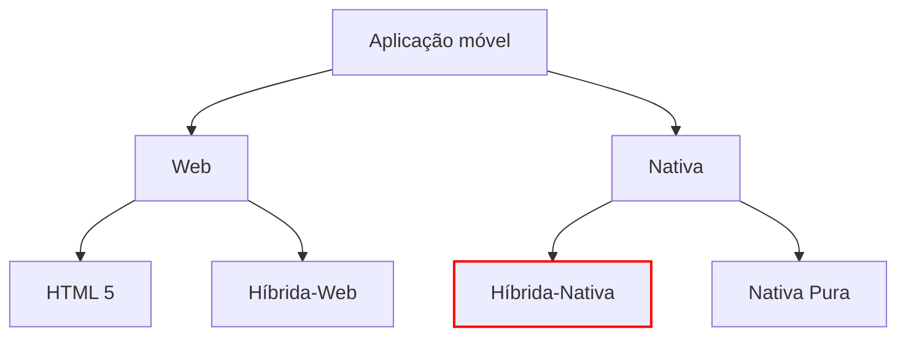
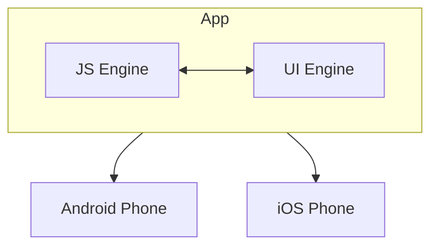
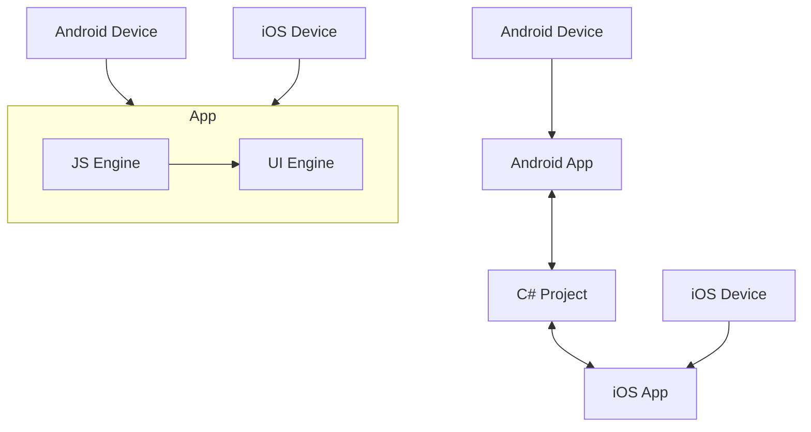
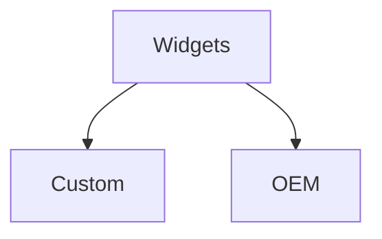
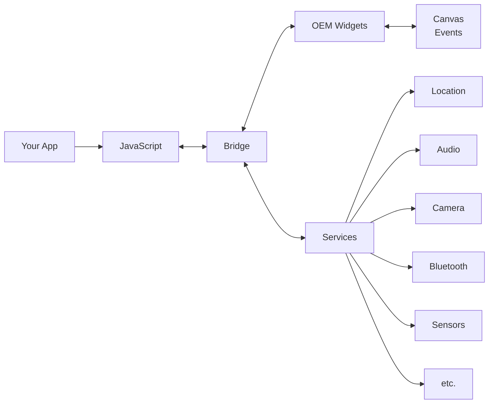
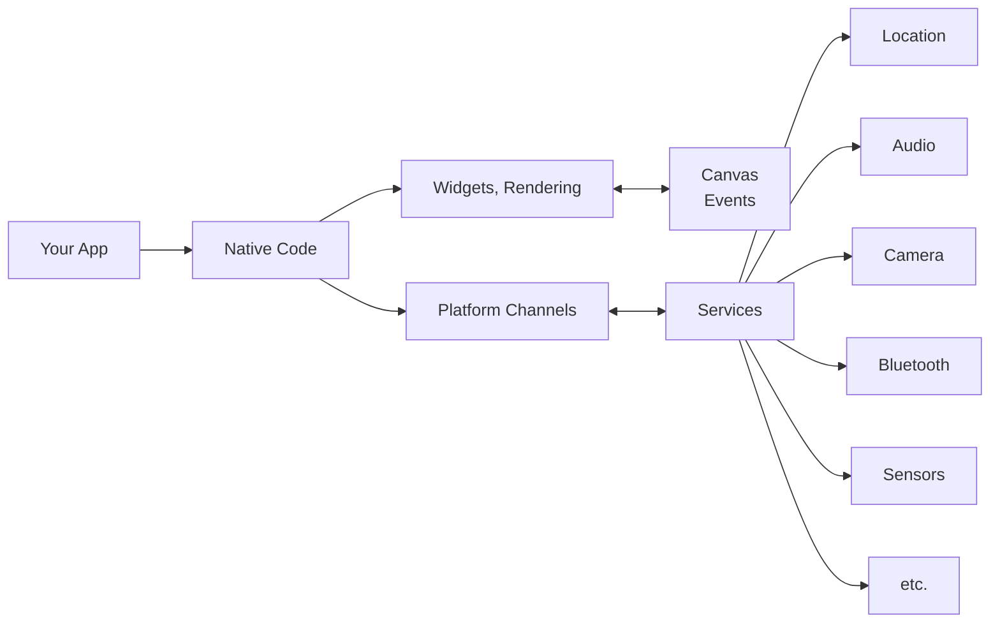

# Híbrido - Nativo


---
# Informações

Na próxima semana não haverá aula teórica (Carnaval), quer para os alunos de dia quer para os alunos do pós-laboral

- Será publicado um vídeo sobre arquitetura de aplicações Android
- Haverá quiz sobre a matéria do vídeo


---
# Arquitetura de aplicações móveis




---
# Híbrida-Nativa

Tal como as aplicações híbridas-web, são aplicações nativas instaláveis através da App store / Play store.

Tal como as aplicações híbridas-web, são desenvolvidas numa única linguagem.


---
# Híbrida-Nativa

Tal como as aplicações híbridas-web, são aplicações nativas instaláveis através da App store / Play store. Tal como as aplicações híbridas-web, são desenvolvidas numa única linguagem.

No entanto, não usam Webviews. Desenham os elementos gráficos de forma nativa, conseguindo uma aparência e fluidez similar às aplicações nativas puras


---
# Híbrida-Nativa

Tal como as aplicações híbridas-web, são aplicações nativas instaláveis através da App store / Play store. Tal como as aplicações híbridas-web, são desenvolvidas numa única linguagem.

No entanto, não usam Webviews. Desenham os elementos gráficos de forma nativa, conseguindo uma aparência e fluidez similar às aplicações nativas puras

Exemplos: Appcelerator Titanium, React Native, Flutter, .NET MAUI (antigo Xamarin), Unity (jogos), Kotlin Multiplatform


---
# Comparação

## Híbrida-Web

[A blue rounded button with the text "CLICK ME"]

HTML
```html
<button value="click me"/>
```

(interpretado pelo browser para
mostrar o botão,
o botão é virtual)


---
# Comparação

## Híbrida-Web

Button with text "CLICK ME"

HTML
```html
<button value="click me"/>
```

(interpretado pelo browser para mostrar o botão, o botão é virtual)

## Híbrida-Nativa

Button with text "CLICK ME!"

React-Native
```jsx
<Button title="click me" />
```

↓

Android/Kotlin
```kotlin
Button("click me")
```

(cria um botão real através do sistema operativo)


---
# Híbrida-Nativa

As aplicações híbridas-nativas usam uma destas duas técnicas:



JS Engine - Faz a ponte entre componentes gráficos Javascript e os componentes gráficos nativos


---
# Híbrida-Nativa

As aplicações híbridas-nativas usam uma destas duas técnicas:



JS Engine - Faz a ponte entre componentes gráficos Javascript e os componentes gráficos nativos

Cross-compiler - Compila uma linguagem comum (Dart, C#) para as várias plataformas


---
# Híbrida-Nativa

## JS Engine (exemplo em React Native)

| ```
5:31
Hello World


Hello world!
      
``` | ```
<ReactNative.Text style={styles.text}>
  Hello World
</ReactNative.Text>
      
``` | ```
Carrier  11:50 PM

Hello World!
      
``` |
| ---------------------------------------------- | --------------------------------------------------------------------------------------- | ---------------------------------------------- |


Esta transformação é feita em
tempo de execução
(runtime)

Android - cria uma TextView

iOS - cria uma UILabel


---
# Híbrida-Nativa

## Cross compiler (exemplo em .NET MAUI)

| ```
<ContentPage>
  <Label Text="Hello, World!"
         FontSize="32"
         HorizontalOptions="Center"/>
</ContentPage>
      
``` |
| -------------------------------------------------------------------------------------------------------------------------------------- |


Android - cria uma TextView

Esta transformação é feita em
tempo de compilação
(compile-time)

iOS - cria uma UILabel


---
# Híbrida-Nativa

## Cross compiler (exemplo em Flutter)

```dart
Widget build(BuildContext context) {
    return MaterialApp(
      title: 'Hello World',
      home: Scaffold(
        body: Center(
          child: Text('Hello World'),
        )),
    );
}
```

Esta transformação é feita em tempo de compilação (compile-time)

Android e iOS - cria um Canvas nativo no qual desenha uma label


---
# Híbrida-Nativa

## JS Engine

- Como a criação do UI é feita durante a execução, poderá ficar mais lenta. Uma vez criado, é similar a uma aplicação nativa
- Permite atualizar a app sem passar pela App store / Play store (code push)
- Desenvolvimento rápido através do mecanismo de live reload
- O binário (apk, ipa) ocupa mais espaço pois inclui o JS Engine

## Cross compiler

- Tudo é feito em compile-time logo o desempenho é similar a uma aplicação nativa
- Atualizações obrigam a publicar uma nova versão da aplicação na respectiva store


---
# Híbrida-Nativa

## JS Engine

- Como a criação do UI é feita durante a execução, poderá ficar mais lenta. Uma vez criado, é similar a uma aplicação nativa
- Permite atualizar a app sem passar pela App store / Play store (code push)
- Desenvolvimento rápido através do mecanismo de live reload
- O binário (apk, ipa) ocupa mais espaço pois inclui o JS Engine

## Cross compiler

- Tudo é feito em compile-time logo o desempenho é similar a uma aplicação nativa
- Atualizações obrigam a publicar uma nova versão da aplicação na respectiva store

**Desvantagem comum: Dependência de uma framework não oficial**


---
# Híbrida-Nativa

Algumas frameworks têm uma abordagem mista:

- Desenvolvimento/develop - Usam um Runtime Engine (equivalente ao JS Engine)
  - Isto permite o famoso "Hot Reload"

- Produção/release - Usam o Cross-Compiler
  - Para evitar problemas de desempenho

Flutter e .NET MAUI têm esta abordagem


---
# Híbrida-Nativa

Algumas frameworks têm uma abordagem mista:

- Desenvolvimento/develop - Usam um Runtime Engine (equivalente ao JS Engine)
  - Isto permite o famoso "Hot Reload"

- Produção/release - Usam o Cross-Compiler
  - Para evitar problemas de desempenho

Devantagem: Não permite atualizações sem passar pela store


---
# Híbrida-Nativa




---
# Híbrida-Nativa

## Custom Widgets

```
CLICK ME
```

| Flutter | Android/Kotlin |
|---------|----------------|
| ElevatedButton(<br>  child: Text("click me"),<br>) | Canvas()<br>drawBitmap(...) |

(cria um botão virtual mas desenha-o através do sistema operativo)


---
# Híbrida-Nativa

## Custom Widgets

| !Blue rounded button with text 'CLICK ME'                      |                                                             |
| ------------------------------------------------------------------ | ----------------------------------------------------------- |
| Flutter                                                            | ```
ElevatedButton(
  child: Text("click me"),
)
      
``` |
| ↓                                                                  |                                                             |
| Android/Kotlin                                                     | ```
Canvas()
drawBitmap(...)
      
```                     |
| (cria um botão virtual mas desenha-o através do sistema operativo) |                                                             |


## OEM Widgets

| !Blue rectangular button with text 'CLICK ME!' |                                            |
| -------------------------------------------------- | ------------------------------------------ |
| React-Native                                       | ```
<Button title="click me" />
      
``` |
| ↓                                                  |                                            |
| Android/Kotlin                                     | ```
Button("click me")
      
```          |
| (cria um botão real através da sistema operativo)  |                                            |


---
# Híbrida-Nativa

## Tabela comparativa

| Custom Widgets                                                                    | OEM Widgets                                            |
| --------------------------------------------------------------------------------- | ------------------------------------------------------ |
| Componentes gráficos desenhados "à mão" pelas frameworks                          | Componentes gráficos nativos do SO                     |
| Pode parecer estranho pois não usa os componentes que o utilizador está habituado | Segue as guidelines oficiais da interface de cada SO   |
| A aparência é a mesma nos vários SOs                                              | A aparência é necessariamente diferente nos vários SOs |
| Requer (alguns) conhecimentos de design                                           | Não requer conhecimentos de design                     |
| Permite que a app tenha um aspecto moderno mesmo em versões antigas do SO         | App está limitada ao aspecto da versão do SO instalado |
| Flutter                                                                           | React Native / .NET MAUI                               |


---
# React Native



# Flutter




---
# Híbrida-Nativa
## Problema da interface única

Com a opção Híbrida-Nativa, conseguem-se écrans com aspecto nativo.
Mas isso traz outros problemas:

```
Back button     Title centered           Title left-aligned
    |                 |                         |
    v                 v                         v
 +--------+      +-----------+             +-----------+
 |  9:41 AM|      | James King|             | James King|
 |<- Back  |      |           |             |           |
 |         |      |jking@fake |             |jking@fake |
 | James   |      |mail.com   |             |mail.com   |
 | King    |      |           |             |           |
 |         |      |           |             |           |
 |         |      |    iOS    |             |  ANDROID  |
 |         |      |           |             |           |
 |         |      |           |             |           |
 |         |      |           |             |           |
 +--------+      +-----------+             +-----------+
                                                 ^
                                                 |
                                            Back button
```


---
# Híbrida-Nativa
## Problema da interface única

| iOS                            | Android                           |
| ------------------------------ | --------------------------------- |
| ```
18:04
< Receita
      
``` | ```
6:05 ⚙ ⏲
< Receita
      
``` |


Por exemplo, em Flutter, existe um widget AppBar que é desenhado de forma diferente consoante o SO (iOS, Android)


---
# Híbrida-Nativa

Para garantir uma aparência coerente com as regras do respectivo SO, acaba-se por desenvolver a interface gráfica de forma específica, aumentando o esforço de desenvolvimento (que supostamente seria uma das vantagens do modelo híbrido-nativo relativamente ao nativo puro)


---
# Híbrida-Nativa

Para garantir uma aparência coerente com as regras do respectivo SO, acaba-se por desenvolver a interface gráfica de forma específica, aumentando o esforço de desenvolvimento (que supostamente seria uma das vantagens do modelo híbrido-nativo relativamente ao nativo puro)

O mote do React Native:
"Learn once, write anywhere"


---
# Híbrida-Nativa
## Problema da interface única

Mas será
realmente
um
problema?

(apps nativas Airbnb)

![Two screenshots of Airbnb app interface on different mobile operating systems]

Los Angeles                     See all >

[Two guide cards showing:
"UNLIKELY MUSIC VENUES" and "ROCK SCENE HANGOUTS"
By Alexis De La Rocha and By Jack Pitney]

Mais info: https://medium.com/flutter/why-flutter-doesnt-use-oem-widgets-94746e812510


---
# Híbrida-Nativa

## Principais frameworks

| Framework                  | Ano início | Empresa   | Linguagem  | Técnica utilizada            | Widgets | Code Push? |
| -------------------------- | ---------- | --------- | ---------- | ---------------------------- | ------- | ---------- |
| Titanium                   | 2008       | Axway     | Javascript | JS Engine                    | OEM     | Não        |
| React Native               | 2015       | Facebook  | Javascript | JS Engine                    | OEM     | Sim        |
| Flutter                    | 2015       | Google    | Dart       | Dart Engine / Cross-compiler | Custom  | Sim (\*\*) |
| .NET MAUI                  | 2022 (\*)  | Microsoft | C#         | Cross-compiler               | OEM     | Não        |
| Kotlin Multiplatform (KMP) | 2023       | Jetbrains | Kotlin     | Cross-compiler               | OEM     | Não        |


(*) Antes disso, a Microsoft oferecia o Xamarin, descontinuado em 2024
(**) Utilizando shorebird.dev (pago)


---
# Apps desenvolvidas em React Native

Facebook app screenshot
Microsoft Teams app screenshot
Amazon app screenshot

## Facebook
The Facebook app screenshot shows the main feed interface with posts from friends, including images and text content. The app features a navigation bar at the top with icons for different sections like home, video, marketplace, and notifications.

## Microsoft Teams
The Microsoft Teams app screenshot displays the chat interface, showing a list of channels and recent conversations. The app has a clean design with a search bar at the top and navigation icons at the bottom.

## Amazon
The Amazon app screenshot presents the main shopping interface, featuring a deal of the day for an Echo device priced at $99.99. Below that, there's a promotional image for a tent, along with other product recommendations and a "Pick up where you left off" section.

https://reactnative.dev/showcase


---
# Apps desenvolvidas em Flutter

| Ebay Motors                                                                                                                                                       | Google Earth                                                                                                             | New York Times                                                                                                                                                                                          |
| ----------------------------------------------------------------------------------------------------------------------------------------------------------------- | ------------------------------------------------------------------------------------------------------------------------ | ------------------------------------------------------------------------------------------------------------------------------------------------------------------------------------------------------- |
| * Interface de busca de carros
* Listagem de veículos com imagens
* Detalhes como ano, modelo e preço
* Funcionalidade de favoritos
* Barra de navegação inferior | - Visualização 3D da Estátua da Liberdade
- Interface limpa com controles mínimos
- Imagem de satélite de alta qualidade | * Layout de feed de notícias
* Artigos com títulos, resumos e imagens
* Categorização de conteúdo (ex: "FROM THE MAGAZINE")
* Funcionalidades de favoritar e compartilhar
* Barra de navegação inferior |


https://flutter.dev/showcase


---
# Tendência plataformas híbrida-nativa

Pesquisas no Google, desde 2020

Google Trends graph showing search interest for Flutter, React Native, .NET Multi-platform, and Kotlin Multiplatform from February 16, 2020 to July 30, 2023

| Plataforma | Tipo |
|------------|------|
| Flutter | Software |
| React Native | Software |
| .NET Multi-platform | Software |
| Kotlin Multiplatform | Search term |

O gráfico mostra as tendências de pesquisa para diferentes plataformas de desenvolvimento híbrido-nativo ao longo do tempo. Flutter (linha azul) mantém consistentemente o maior interesse de pesquisa, seguido por React Native (linha vermelha). .NET Multi-platform e Kotlin Multiplatform (linhas amarela e verde, respectivamente) mostram um interesse de pesquisa significativamente menor e mais estável ao longo do período.

https://trends.google.com/trends/explore?date=today%205-y&q=%2Fg%2F11f03_rzbg,%2Fg%2F11h03gfxy9,%2Fg%2F11mqkqmrcr,Kotlin%20Multiplatform&hl=en


---
# Comparação plataformas híbridas

Cross-platform mobile frameworks used by software developers worldwide from 2019 to 2023

| Framework            | 2019 | 2020 | 2021 | 2022 | 2023 |
| -------------------- | ---- | ---- | ---- | ---- | ---- |
| Flutter              | 30%  | 39%  | 42%  | 46%  | 46%  |
| React Native         | 38%  | 42%  | 38%  | 32%  | 35%  |
| Cordova              | 29%  | 18%  | 16%  | 10%  | 12%  |
| Unity                | 12%  | 11%  | 14%  | 12%  | 10%  |
| Ionic                | 28%  | 18%  | 16%  | 9%   | 8%   |
| Other                | 11%  | 10%  | 9%   | 9%   | 9%   |
| Xamarin              | 26%  | 14%  | 12%  | 10%  | 6%   |
| Kotlin Multiplatform | 2%   | 3%   | 4%   | 5%   | 5%   |
| NativeScript         | 5%   | 5%   | 3%   | 2%   | 2%   |
| PhoneGap             | 11%  | 6%   | 4%   | 2%   | 2%   |
| Apache Flex          | 2%   | 1%   | 1%   | 1%   | 1%   |
| Kendo UI             | 3%   | 2%   | 1%   | 1%   | 1%   |
| Kivy                 | 1%   | 1%   | 1%   | 1%   | 1%   |


Source: JetBrains
© Statista 2024

Additional Information:
Worldwide; 2019 to 2023; 29,269 respondents; software developers

