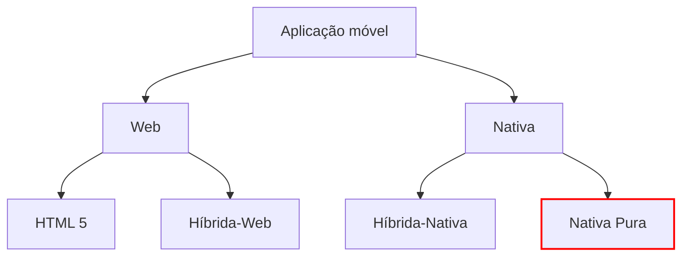
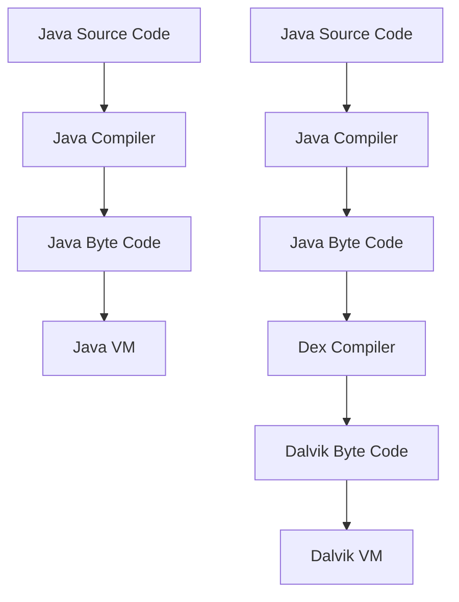
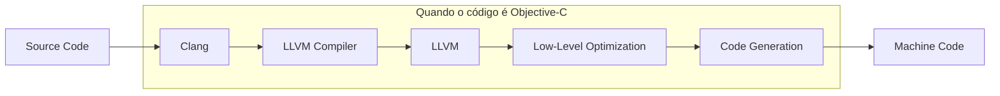
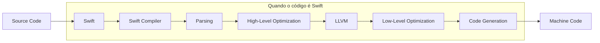

Aplicações nativas
---
# Arquitetura de aplicações móveis

---
# Nativa Pura

Para desenvolver aplicações (nativas), cada sistema operativo tem uma plataforma de desenvolvimento própria

- iOS
  - Objetive-C / Swift
  - iOS SDK / Xcode / MacOS
- Android
  - Java / Kotlin
  - Android SDK / Android Studio / Windows, Mac, Linux

Custo de desenvolvimento duplica

---
# Nativa Pura

## Vantagens

- Flexibilidade máxima: Se não conseguimos desenvolver algo em nativo puro, então garantidamente não o conseguiremos fazer noutro modelo

---
# Nativa Pura

## Vantagens

- Flexibilidade máxima: Se não conseguimos desenvolver algo em nativo puro, então garantidamente não o conseguiremos fazer noutro modelo

- Melhor desempenho: Os outros modelos (mesmo híbrido-nativo) terão sempre desvantagem pois não conseguem o mesmo nível de optimização (compilador, profiling)

---
# Nativa Pura

## Vantagens

- **Flexibilidade máxima:** Se não conseguimos desenvolver algo em nativo puro, então garantidamente não o conseguiremos fazer noutro modelo

- **Melhor desempenho:** Os outros modelos (mesmo híbrido-nativo) terão sempre desvantagem pois não conseguem o mesmo nível de optimização (compilador, profiling)

- **Maior comunidade:** É neste modelo que trabalha a maioria dos programadores de aplicações móveis, logo há mais informação na Internet

---
# Nativa Pura

## Vantagens

- **Flexibilidade máxima:** Se não conseguimos desenvolver algo em nativo puro, então garantidamente não o conseguiremos fazer noutro modelo

- **Melhor desempenho:** Os outros modelos (mesmo híbrido-nativo) terão sempre desvantagem pois não conseguem o mesmo nível de optimização (compilador, profiling)

- **Maior comunidade:** É neste modelo que trabalha a maioria dos programadores de aplicações móveis, logo há mais informação na Internet

- **Menos bugs:** É menos provável que encontremos bugs no Android SDK e iOS SDK do que nas outras frameworks

---
# Compilação Android

Apesar de ser desenvolvido em Java/Kotlin, as aplicações Android têm processamento adicional em relação às aplicações Java/Kotlin desktop

- Os ficheiros .class são compilados pelo Dex Compiler, dando origem a bytecode otimizado para ambientes com pouco memória (ficheiro .dex)
- Uma aplicação android (ficheiro APK) contém ficheiros .dex que são executados pela Dalvik VM (DVM)
- É mais eficiente ter várias DVM a correr do que várias JVM a correr

---
# Compilação iOS

Quer o Objective-C quer o Swift são compilados para código máquina, similar a um .exe (mas neste caso é um IPA). O compilador LLVM é similar ao gcc.

Uma diferença importante é que os ficheiros IPA contêm um header encriptado que impede a sua distribuição (i.e., não posso enviar um IPA a um amigo, ao contrário dos APK)

---
# Desenvolvimento para dispositivos móveis

## Principais frameworks

| Framework      | Tipo           | Linguagem                                | Compila para a plataforma final | Corre numa web view |
| -------------- | -------------- | ---------------------------------------- | ------------------------------- | ------------------- |
| iOS SDK        | Nativa         | Swift ou Objective-C                     | x                               |                     |
| Android SDK    | Nativa         | Java ou Kotlin                           | x                               |                     |
| Flutter        | Híbrida-Nativa | Dart                                     | x                               |                     |
| React Native   | Híbrida-Nativa | Javascript                               | x                               |                     |
| .NET MAUI      | Híbrida-Nativa | C#                                       | x                               |                     |
| Ionic/Phonegap | Híbrida-Web    | HTML, CSS, Javascript baseado em Cordova |                                 | x                   |
| PWA            | Híbrida-Web    | HTML, CSS, Javascript + Manifest         |                                 | x                   |

---
# Exercício (em grupo)
10 minutos

|                               | Nativa | Híbrida-Nativa | Híbrida-Web | HTML5 |
| ----------------------------- | ------ | -------------- | ----------- | ----- |
| Custo desenvolvimento         |        |                |             |       |
| Acesso às funcionalidades     |        |                |             |       |
| Interface gráfica e navegação |        |                |             |       |
| Fluidez                       |        |                |             |       |
| Offline                       |        |                |             |       |
| Atualizações                  |        |                |             |       |

---
# Desenvolvimento para dispositivos móveis

|                               | Nativa                    | Híbrida-Nativa                         | Híbrida-Web                              | HTML5        |
| ----------------------------- | ------------------------- | -------------------------------------- | ---------------------------------------- | ------------ |
| Custo desenvolvimento         | Elevado                   | Médio (1)                              | Reduzido                                 | Reduzido     |
| Acesso às funcionalidades     | Total                     | Quase total (2)                        | Médio (3)                                | Reduzido     |
| Interface gráfica e navegação | Igual à do SO             | Igual (4) / à medida (5)               | Web                                      | Web          |
| Fluidez                       | Elevada                   | Elevada/Semi-elevada(6)                | Baixa                                    | Baixa        |
| Offline                       | Funciona sempre           | Funciona sempre                        | Funciona desde que esteja em cache       | Não funciona |
| Atualizações                  | Podem demorar vários dias | Podem demorar vários dias/Imediato (7) | Quase imediatas (quando expirar a cache) | Imediatas    |

(1) Tecnologia mais sofisticada, exige programadores mais caros; a UI acaba por ter que ser desenvolvida de forma específica para cada SO

(2) Os fornecedores das ferramentas demoram algum tempo a integrar com as novas funcionalidades que aparecem em cada versão do sistema operativo

(3) PWAs têm acesso a funcionalidades que o HTML5 não tem

(4) Se usar OEM widgets

(5) Se usar Custom Widgets

(6) Se usar o JS Engine, as transformações são feitas durante o rendering do écran (mais lento)

(7) Se usar JS Engine, as actualizações podem ser imediatas com Code Push

