```mermaid
classDiagram
    class Widget {
        +String key
        +build(): String
    }
    
    class Row {
        +List<Widget> children
        +build(): String
    }
    
    class Text {
        +String text
        +build(): String
    }
    
    class Button {
        +Function onPressed
        +Widget child
        +build(): String
    }
    
    Widget <|-- Row
    Widget <|-- Text
    Widget <|-- Button
    Row *-- Widget : contém
    Button *-- Widget : contém
```

# Dart/Flutter
---
# Informações

Próxima semana não há aulas - Tecweb

- Quem participar no Cody (concurso de programação) terá a nota de participação equivalente a um quiz teórico


---
# Dart

Linguagem criada pela Google em 2011, de alto nível, similar ao Kotlin e Swift

Ganhou popularidade a partir de 2017, quando foi lançado o Flutter


---
# RedMonk Q123 Programming Language Rankings

```mermaid
scatter
    title RedMonk Q123 Programming Language Rankings
    x-axis "Popularity Rank on GitHub (by # of Projects)"
    y-axis "Popularity Rank on Stack Overflow (by # of Tags)"
    JavaScript 90 90
    Python 85 85
    Java 80 80
    PHP 75 85
    C# 75 85
    C++ 75 85
    TypeScript 75 75
    C 70 80
    Ruby 70 75
    Swift 65 75
    R 65 75
    Objective-C 60 75
    Go 65 70
    PowerShell 60 70
    Kotlin 60 70
    Rust 55 65
    Scala 50 65
    Dart 70 80
    Visual Basic 55 75
    Matlab 50 70
    Assembly 45 65
    Perl 40 65
    Haskell 35 60
    F# 30 60
    Fortran 25 55
    Groovy 40 55
    Lua 35 55
    Clojure 30 55
    Julia 25 50
    Erlang 20 50
    CoffeeScript 15 50
    Elixir 10 45
    OCaml 5 45
    Solidity 15 40
    Puppet 10 40
    Smarty 5 40
    Emacs Lisp 0 40
    D 0 35
    Apex 5 30
    Elm 0 30
    GCC Machine Description 90 90
    Sass 85 85
    Arduino 75 80
    ColdFusion 70 80
    ASP 65 75
    GLSL 60 70
    Scheme 55 70
    QML 50 65
    Processing 45 60
    Tcl 40 55
    Verilog 35 50
    Common Lisp 30 50
    Liquid 25 45
    SystemVerilog 20 40
    Pascal 15 35
    Smalltalk 10 30
    HCL 5 25
    Raku 35 35
    SaltStack 30 30
    BitBake 25 25
    Vala 20 20
    Gherkin 15 15
    Stylus 10 10
    GDScript 5 5
    Nix 0 0
    RacketHDL 55 45
    FreeMarker 50 40
    WebAssembly 45 35
    Coq 40 30
    Mathematica 35 25
    PostScript 30 20
    Modula-2 25 15
    Modelica 20 10
    C++ 15 5
    Bicep 10 0
    Nextflow 5 0
    Chapel 0 0
    Zig 0 0
    GAP 0 0
    Reason 25 10
    PureScript 20 5
    Ballerina 15 0
    Lean 10 0
    Jsonnet 5 0
    Astro 0 0
    SQF 0 0
    ShaderLab 0 0
    Starlark 0 0
    Rich Text Format 0 0
    Vim script 0 0
    Roff 90 0
```

Note: The chart includes a diagonal line and a beige box highlighting "Dart" with a blue arrow pointing to its position. These elements are not represented in the mermaid diagram due to limitations of the format.
---
# Dart

## Rapidez de execução 🔺🔺
Compilada para nativo na plataforma final (AOT compiler)

## Rapidez de desenvolvimento 🔺🔺
Interpretada através de uma Dart VM (JIT compiler), permite hot reload


---
# Dart é multi-plataforma

| Dart<br/>`</>` + Flutter SDK<br/>SDK |     |         |     |
| :----------------------------------: | --- | ------- | --- |
|              Compilation             |     |         |     |
|                  APK                 | IPA | EXE     | JS  |
|               Execution              |     |         |     |
|                Android               | iOS | desktop | web |


---
# Dart é multi-paradigma

## Paradigma imperativo
função main() inicia a execução sequencial de instruções

## Paradigma orientado a objetos
classes, encapsulamento, herança

## Paradigma funcional
funções como variáveis, lambdas


---
# Ferramentas

- Dart SDK (compilador, dart vm)
  https://dart.dev/get-dart
  Quando se instala o Flutter, vem incluído:
  `<pasta do flutter>/bin/cache/dart-sdk`

- Dartpad - "IDE" online
  https://dartpad.dev/
  limitado, útil para pequenas experiências

- Intellij, Android Studio, VS Code
  Os principais IDEs trazem plugins para Dart


---
# Criar um projeto Dart no Android Studio

Android Studio interface showing how to create a new Dart project

## Steps to create a Dart project in Android Studio:

1. Open Android Studio
2. Go to File > New > New Flutter Project...

## New Project Configuration

In the New Project window:

- Dart SDK path: `/Users/pedroalves/fvm/versions/3.16.5/bin/cache/dart-sdk`
- Version: 3.2.3

### Generate sample content options:

- [x] CLI Application - a command-line application with basic argument parsing.
- [ ] Console Application - a command-line application.
- [ ] Dart Package - a package containing shared Dart libraries.
- [ ] Server app - a server app using package:shelf.
- [ ] Bare-bones Web App - a web app that uses only core Dart libraries.

### Project Types:

- Compose Multiplatform
- IDE Plugin
- Android
- Flutter
- Dart (selected)


---
# Exemplo Dart

live coding


---
# Exemplo Dart

```dart
abstract class Widget {
  String? key;
  bool visible = true;
  String? additionalInfo;

  Widget({this.key, this.additionalInfo});

  String build();
}
```

class abstract, não pode ser instanciada, apenas os filhos

arguments "named" (dentro de chavetas)

método abstrato, tem que ser overridden pelas sub-classes


---
# Exemplo Dart

```dart
class Text extends Widget {
  String text;

  Text({super.key, super.additionalInfo, required this.text});

  @override
  String build() {
    return 'building text: $text';
  }
}
```

- **herda de Widget**: A classe `Text` estende (herda de) `Widget`

- **construtor inicializa os argumentos do pai ...e os próprios. neste caso é obrigatório**: 
  O construtor `Text` inicializa tanto os argumentos herdados do pai (`super.key`, `super.additionalInfo`) quanto seu próprio argumento obrigatório (`this.text`)

- **obrigatório implementar o build()**: 
  O método `build()` é sobrescrito (@override) e deve ser implementado


---
# Exemplo Dart

```dart
class Button extends Widget {
  Function onPressed;
  Widget child;

  Button({super.key, super.additionalInfo,
          required this.onPressed,
          required this.child});

  @override
  String build() {
    return 'building button with child: ${child.build()}';
  }
}
```

a variável onPressed é do tipo Function, representa um bloco de código que é executado quando se prime o botão

utilização de composição: o "conteúdo" do botão é ele próprio um widget

para construir o Button, tem que construir o filho (por composição)


---
# Exemplo Dart

composição aplicada a uma lista de widgets que são alinhados na horizontal

```dart
class Row extends Widget {
  List<Widget> children;

  Row({required this.children});

  @override
  String build() {
    String result = 'build row with children:\n';
    for (var child in children) {
      result += '\t' + child.build() + '\n';
    }
    return result;
  }
}
```


---
# Exemplo Dart

1 - é possível combinar widgets diferente numa única lista desde que herdem todos de Widget (polimorfismo)
2 - por composição, consegue-se combinar widgets

```dart
main() {
  List<Widget> widgets = [
    Row(children: [
      Text(key: 'texto', text: 'Um texto qualquer'),
      Button(
          onPressed: () {
            print('premi botão');
          },
          child: Text(text: 'Gravar'))
    ])
  ];

  for (var widget in widgets) {
    print(widget.build());
  }
}
```


---
# Exemplo Dart




---
# Exemplo Dart


This diagram illustrates the class structure for a Dart example, showing the relationships between different UI elements:

1. The `Widget` class is the base class, containing:
   - `key: String`
   - `build(): String`

2. `Row`, `Text`, and `Button` classes all inherit from `Widget`.

3. The `Row` class has:
   - `children: List<Widget>`
   - `build(): String`

4. The `Text` class has:
   - `text: String`
   - `build() String`

5. The `Button` class has:
   - `onPressed: Function`
   - `child: Widget`
   - `build(): String`

6. There are composition relationships shown:
   - `Row` contains `Widget`s (labeled as "contém" in Portuguese)
   - `Widget` has a self-referential composition relationship (labeled as "composição" in Portuguese)

The diagram uses "herança" (Portuguese for "inheritance") to show the inheritance relationships between `Widget` and its subclasses.


---
# Listas e Dicionários

```dart
var list = [1, 2, 3];          List<int> list = [1, 2, 3];

print(list[2]);   // 3
print(list.length); // 3
```

```dart
Map<String,String> alunos = {
  'a22101234': 'José',
  'a22104321': 'Sara'
};

print(alunos['a22101234']);
```


---
# Trailing commas

O Dart permite que o último elemento de uma lista/dicionário termine com ','
Isso terá efeito na formatação

```dart
var list = [1, 2, 3];       var alunos =
                            {'a22101234': 'José', 'a22104321': 'Sara'};

var list = [                var alunos = {
  1,                           'a22101234': 'José',
  2,                           'a22104321': 'Sara',
  3,                        };
];
```


---
# Records

Permitem guardar vários valores numa única variável. A diferença para as listas é que:
- não permitem adicionar/remover valores
- podem guardar valores de tipos diferentes

```typescript
var aluno = (numero: 'a22101234', nome: 'Sara', idade: 21);

print(aluno.numero);
print(aluno.nome);
print(aluno.idade);
```


---
# Functional Dart

```dart
void main() {
  [1,2,3,4,5].forEach((int numero) => print(numero));
}
```

This code demonstrates a functional programming approach in Dart. It defines a `main` function that uses the `forEach` method on a list of integers to print each number.
---
# Lambdas em Dart

```dart
int incrementa(int numero) {
  return numero + 1;
}

print([1,2,3,4,5].map(incrementa));
```


---
# Lambdas em Dart

```dart
int incrementa(int numero) {
  return numero + 1;
}
```

The arrow below the code block indicates a transformation or simplification to:

```dart
int incrementa(int numero) => numero + 1;
```

This demonstrates the use of a lambda (arrow function) in Dart to simplify the `incrementa` function.

Below that, there's an example of using this function:

```dart
print([1,2,3,4,5].map(incrementa));
```

This line applies the `incrementa` function to each element of the list `[1,2,3,4,5]` using the `map` method.


---
# Lambdas em Dart

```dart
int incrementa(int numero) {
  return numero + 1;
}
```

↓

```dart
int incrementa(int numero) => numero + 1;
```

↓

```dart
(int numero) => numero + 1   (lambda)
```

```dart
print([1,2,3,4,5].map((int numero) => numero + 1);
```


---
# Lambdas em Dart

(int numero) => numero + 1   (lambda)

↓

(int numero) {
  return numero + 1;
})   (lambda com bloco de código)

print([1,2,3,4,5].map((int numero) {
  return numero + 1;
}));


---
# OOP em Dart

```dart
class Point {
  int x = 0;
  int y = 0;
  String? color;
}
```

Nota: Todos os atributos têm que estar inicializados ou ser nullable

```dart
(...)
var point = Point();
point.x = 5;
point.y = 3;
```


---
# OOP em Dart

## Construtor clássico

Ao criar o construtor, já não é necessário inicializar os atributos

```dart
class Point {
  int x;
  int y;
  String? color;

  Point(int x, int y, String color) {
    this.x = x;
    this.y = y;
    this.color = color;
  }
}
```


---
# OOP em Dart

## Construtor "compacto" posicional

```dart
class Point {
  int x;
  int y;
  String? color;

  Point(this.x, this.y, this.color);
}

var point = Point(3, 4, null);
```


---
# OOP em Dart

## Construtor "compacto" "named"

```dart
class Point {
  int x;
  int y;
  String? color;

  Point({ required this.x, required this.y, this.color });
}

var point = Point(x: 3, y: 4);
```


---
# OOP em Dart

```dart
class Point {
  int x;
  int y;
  String? color;

  Point(this.x, this.y, this.color);
}
```

E se precisar de vários construtores?


---
# OOP em Dart

Posso acrescentar "named constructors"

```dart
class Point {
  int x;
  int y;
  String? color;

  Point(this.x, this.y, this.color);

  Point.xy(this.x, this.y);
}

...

var point = Point.xy(3, 4);
```


---
# OOP em Dart

Se quiser criar o objeto a partir de outras estruturas (ex: Map)

```dart
class Point {
  int x;
  int y;
  String? color;

  Point.xy(this.x, this.y);

  Point.fromMap(Map<String,int> map):
    x = map['x']??0,
    y = map['y']??0;
}
```

?? é "Elvis operador" do Dart

if (map['x'] != null) map['x'] else 0


---
# OOP em Dart

Ou usar um factory constructor que retorna o novo objeto

```dart
class Point {
  int x;
  int y;
  String? color;

  Point.xy(this.x, this.y);

  factory Point.fromMap(Map<String,int> map) {
    return Point.xy(map['x']??0, map['y']??0);
  }
}
```


---
# OOP em Dart

Em Dart as variáveis são "públicas" a menos que comecem por '_'.

Nesse caso ficam privadas mas continuam a ser visíveis dentro da mesma library (*)

```dart
void main() {
  var point = Point.xy(3, 4);
  print(point._x);
  point._x = 5;  // Erro!!
}

class Point {
  int _x;
  int _y;

  Point.xy(this._x, this._y);
}
```

(*) cada ficheiro dart é uma library


---
# OOP em Dart

Em Dart podem-se criar getters e setters para as variáveis "privadas"

```dart
class Point {
  int _x;
  int _y;

  Point.xy(this._x, this._y);

  int get x => _x;  // getter para _x
  set x(int value) {  // setter para _x
    if (value >= 0) {
      _x = value;
    } else {
      throw Exception("Point.x must be positive");
    }
  }

  ...
}
```


---
# Herança em Dart

```dart
abstract class FiguraGeometrica {
  int x;
  int y;

  FiguraGeometrica(this.x, this.y);

  int calculaArea();
}

class Rectangulo extends FiguraGeometrica {
  int lado1;
  int lado2;

  Rectangulo(super.x, super.y, this.lado1, this.lado2);

  @override
  int calculaArea() {
    return lado1 * lado2;
  }
}

class Circulo extends FiguraGeometrica {
  int raio;

  Circulo(super.x, super.y, this.raio);

  @override
  int calculaArea() {
    return (raio * raio * pi).toInt();
  }
}

void main() {
  var figuras = [
    Rectangulo(3,4,20,10),
    Circulo(6,7,5),
  ];

  figuras.forEach((figura) => print(figura.calculaArea()));
}
```


---
# Singleton em Dart

```dart
class FavoritesModel {

  // Private constructor
  FavoritesModel._();

  // Singleton instance
  static final FavoritesModel _instance = FavoritesModel._();

  // Getter to access the singleton instance
  static FavoritesModel get instance => _instance;

  var favorites = <Quote>[];

}

(...)
FavoritesModel.instance.favorites.add(...);
```


---
# Cábula

Cábula Kotlin-Dart disponível no Moodle


---
# Unit testing em Dart

| Junit                                                   | Dart Unit Tests                                |
| ------------------------------------------------------- | ---------------------------------------------- |
| assertEquals(number, 1)<br/>assertEquals(text, "hello") | expect(number, 1)<br/>expect(text, "hello")    |
| assertNull(obj)<br/>assertNotNull(obj)                  | expect(obj, isNull)<br/>expect(obj, isNotNull) |
| assertTrue(expr)<br/>assertFalse(expr)                  | expect(expr, isTrue)<br/>expect(expr, isFalse) |


https://cms.invertase.io/wp-content/uploads/2023/03/cheat-sheet.png


---
# Exemplo Dart



```mermaid
classDiagram
    class Row {
        +children: List<Widget>
        +build(): String
    }
    class Text {
        +text: String
        +build() String
    }
    class Button {
        +onPressed: Function
        +child: Widget
        +build(): String
    }
    class Widget {
        +key: String
        +...
        +build(): String
    }

    Widget <|-- Row
    Widget <|-- Text
    Widget <|-- Button
    Row *-- Widget : contém
    Widget *-- Widget : composição

    note for Widget "composição"
    note for Row "herança"
    note for Text "herança"
    note for Button "herança"
```

This diagram illustrates the class structure of a Dart example, showing the relationships between different widget classes. The main components are:

1. `Widget` (base class)
   - Attributes: key: String, ...
   - Methods: build(): String

2. `Row` (inherits from Widget)
   - Attributes: children: List<Widget>
   - Methods: build(): String

3. `Text` (inherits from Widget)
   - Attributes: text: String
   - Methods: build() String

4. `Button` (inherits from Widget)
   - Attributes: onPressed: Function, child: Widget
   - Methods: build(): String

The relationships shown are:
- Inheritance (herança): Row, Text, and Button all inherit from Widget
- Composition (composição): Widget can contain other Widgets, and Row contains a list of Widgets


---
# Flutter

## Arquitetura baseada em composição de Widgets

A aplicação é ela própria um Widget, que contém widgets que contêm widgets (composição)

```dart
void main() {
  runApp(const MyApp());  // Widget
}

class MyApp extends StatelessWidget {
  const MyApp({super.key});

  @override
  Widget build(BuildContext context) {
    return MaterialApp(  // Widget
      title: 'Awesome Quotes',
      theme: themeLight(),
      home: MainPage(),  // Widget
    );
  }
}
```


---
# Quote

A little learning is a
dangerous thing.

*- Alexander Pope -*

[Like] [Next]

----

[Quote] [Favorites]


---
10:35 ⚙ ❤

Quote

A little learning is a
dangerous thing.

- Alexander Pope -

❤ Like       Next

📋           📋
Quote       Favorites


---
# Material de estudo

- Desenvolvimento com widgets em Flutter - parte 1
  https://www.youtube.com/watch?v=tKTusGq46nQ

- Flutter Tutorial for Beginners
  https://www.youtube.com/playlist?list=PL4cUxeGkcC9jLYyp2Aoh6hcWuxFDX6PBJ


---
# Desafio para as próximas 2 semanas

Podes ganhar até 0,5 valores extra na parte prática apenas assistindo a vídeos do youtube

Fácil!!

WOW


---
# Desafio

1. Assistir a este curso de Flutter - https://www.youtube.com/playlist?list=PL4cUxeGkcC9jLYyp2Aoh6hcWuxFDX6PBJ

2. Detetar informação desatualizada (na versão atual de Flutter há coisas que já não funcionam tal e qual é explicado no curso)

3. Reportar aqui https://forms.gle/i3Av3DMyTzFJzcmWA

4. Os reports vão sendo publicados aqui: https://docs.google.com/spreadsheets/d/e/2PACX-1vSEcNmEBf4DT1KhLuNFTUXKvr0jkVjiB0rxhcf-qqGzLsnk5BH6CwOzrhapli2atfTnbvFwwDow45dW/pubhtml

## Regras:
Cada report vale 0,25 extra na nota final da componente prática. Mas:
- Cada aluno pode reportar no máximo 2 vezes
- Cada problema pode ser reportado por um único aluno (o primeiro que reportar). Ou seja, não deverão haver reports repetidos
- Este desafio termina no dia 25 de Março às 23h59

