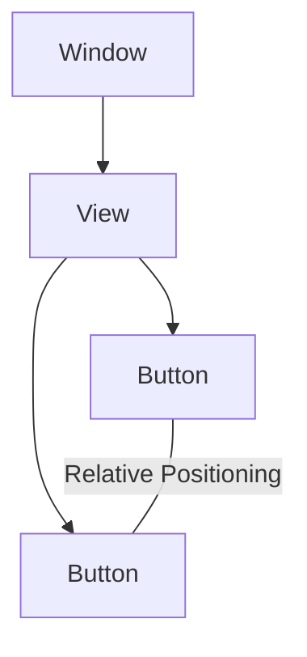
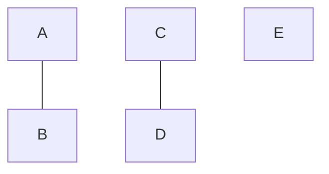
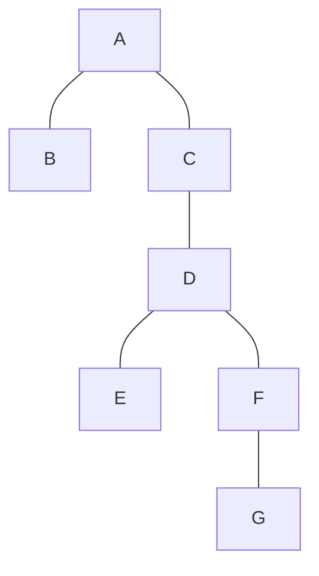

# Layout


---
# Layout

Problema: Como posicionar os elementos gráficos no écran?

Hipótese: Indico as coordenadas de cada elemento, no exemplo: (100, 250)

A isto chama-se **posicionamento absoluto**

```
Carrier  11:16 AM

┌─────────────────┐
│                 │
│                 │
│                 │
│                 │ 250 px
│        Button   │
│                 │
│                 │
│                 │
│ 100 px          │
│                 │
└─────────────────┘
```


---
```markdown
                                                      Carrier         11:31 AM
Carrier     11:16 AM

                        250 p
---
# Posicionamento absoluto não funciona para diferentes tamanhos de écran

The image illustrates the issue of absolute positioning not working for different screen sizes. It shows two iPhone models side by side:

1. iPhone 5 (smaller screen)
2. iPhone 6 (larger screen)

Both devices display a simple user interface with a red button labeled "Button". The button's position is different on each device:

- On the iPhone 5, the button is positioned in the lower left quadrant of the screen.
- On the iPhone 6, the button appears in the upper right quadrant of the screen.

This visual comparison demonstrates how absolute positioning can lead to inconsistent layouts across different device sizes.

At the bottom right of the image, there's a copyright notice: ""

This example highlights the importance of using responsive design techniques instead of absolute positioning to ensure consistent user interfaces across various screen sizes and devices.
---
# Layout

Problema: Como posicionar os elementos gráficos no écran?

Hipótese 2: Indico as posições relativas dos elementos:
- Relativas às margens do écran
- Relativas a outros elementos

Exemplos:
- O botão A deve estar a 10 px para direita do botão B
- O botão A deve estar centrado verticalmente no écran
- O botão A e o botão B devem estar alinhados horizontalmente

A isto chama-se **posicionamento relativo**


---
# Layout

Aplicações iOS utilizam posicionamento relativo.
Esse posicionamento é feito normalmente através do editor gráfico do
XCode mas também pode ser feito programaticamente.



The diagram above represents a simplified view of the iOS layout system, showing two buttons positioned relative to each other within a view.


---
# Layout

Aplicações Android utilizam posicionamento relativo.
Esse posicionamento é feito normalmente no ficheiro de layout em XML
mas também pode ser feito programaticamente.

```xml
<?xml version="1.0" encoding="utf-8"?>
<RelativeLayout xmlns:android="http://schemas.android.com/apk/res/android"
    android:layout_width="match_parent"
    android:layout_height="match_parent"
    android:paddingLeft="16dp"
    android:paddingRight="16dp" >
    <EditText
        android:id="@+id/name"
        android:layout_width="match_parent"
        android:layout_height="wrap_content"
        android:hint="@string/reminder" />
    <Spinner
        android:id="@+id/dates"
        android:layout_width="0dp"
        android:layout_height="wrap_content"
        android:layout_below="@id/name"
        android:layout_alignParentLeft="true"
        android:layout_toLeftOf="@+id/times" />
    <Spinner
        android:id="@id/times"
        android:layout_width="96dp"
        android:layout_height="wrap_content"
        android:layout_below="@id/name"
        android:layout_alignParentRight="true" />
    <Button
        android:layout_width="96dp"
        android:layout_height="wrap_content"
        android:layout_below="@id/times"
        android:layout_alignParentRight="true"
        android:text="@string/done" />
</RelativeLayout>
```

o Spinner dates fica por baixo do EditText name

Relative Layout

Reminder name

Wed, June 27, 2012   8:00am

Done


---
# Layout

Problema: Como posicionar os elementos gráficos no écran?

Hipótese 3: Crio uma grelha "virtual" e distribuo os elementos por essa grelha

| 1 | 2 | 3 | 4  | 5  | 6  |
| - | - | - | -- | -- | -- |
| 7 | 8 | 9 | 10 | 11 | 12 |


A isto chama-se **posicionamento em grelha**


---
# Layout

## Posicionamento em grelha

O primeiro passo é decidir quantas colunas tem a grelha
Por exemplo, o Bootstrap define uma grelha com 12 colunas.

Para cada elemento podemos indicar quantas colunas esse
elemento pode ocupar.

| 1  | 3  | 4 | 5 | 6 | 7  |
| -- | -- | - | - | - | -- |
| 8  | 9  | 2 |   |   | 10 |
| 11 | 12 |   |   |   |    |


O elemento 2 ocupa 3 colunas

Esta grelha tem 7 colunas


---
# Layout

## Posicionamento em grelha

Combinando diferentes larguras consegue-se definir uma grande diversidade de écrans




---
# Layout

## Posicionamento em grelha

Por vezes é necessário colocar layouts dentro de layouts (nested grids). Nestes casos, o elemento passa a conter outros elementos




---
# Layout

## Posicionamento em grelha

O Flutter, através da combinação dos widgets Row e Column, favorece o posicionamento em grelha

Column
- SalesByMonth
- Row
  - QuarterlyProfits
  - Column
    - MktSpend
    - Users
- Conversion

| **Sales Dashboard 2018**                                                            |                           |
| ----------------------------------------------------------------------------------- | ------------------------- |
| **Sales by Month**<br/>421.3M<br/>+12.9% of target<br/>\[Line graph representation] |                           |
| **Quarterly Profits**<br/>68.7M<br/>\[Pie chart representation]                     | **Mktg. Spend**<br/>48.6M |
|                                                                                     | **Users**<br/>25.5M       |
| **Conversion**<br/>0.9M                                                             |                           |


---
# Layout

Posicionamento em grelha

Este posicionamento permite também maximizar a utilização do espaço disponível, facilitando a interação em touch-screens

Ex: "Metro" interface do Windows 10

[An image of a smartphone display showing a grid-based interface with colorful tiles of various sizes, characteristic of the Windows Phone "Metro" design]
---
# Layout

| Posicionamento | Usado quando...                                                                                                          | Tecnologia                 |
| -------------- | ------------------------------------------------------------------------------------------------------------------------ | -------------------------- |
| Absoluto       | A app vai ser usado num tamanho de écran único ou queremos controlar ao pixel o posicionamento dos elementos (ex: jogos) | Todas                      |
| Relativo       | Queremos distribuir os elementos sempre da mesma forma em vários tamanhos de écran                                       | iOS, Android               |
| Grelha         | Queremos maximizar a utilização do espaço disponível e facilitar a interação em touch screens                            | HTML5, Flutter, Windows 10 |


