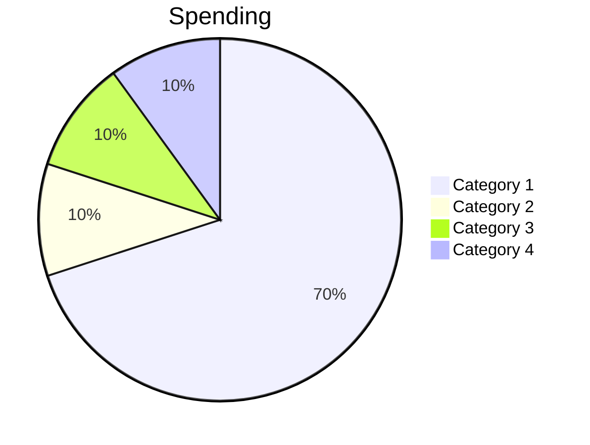
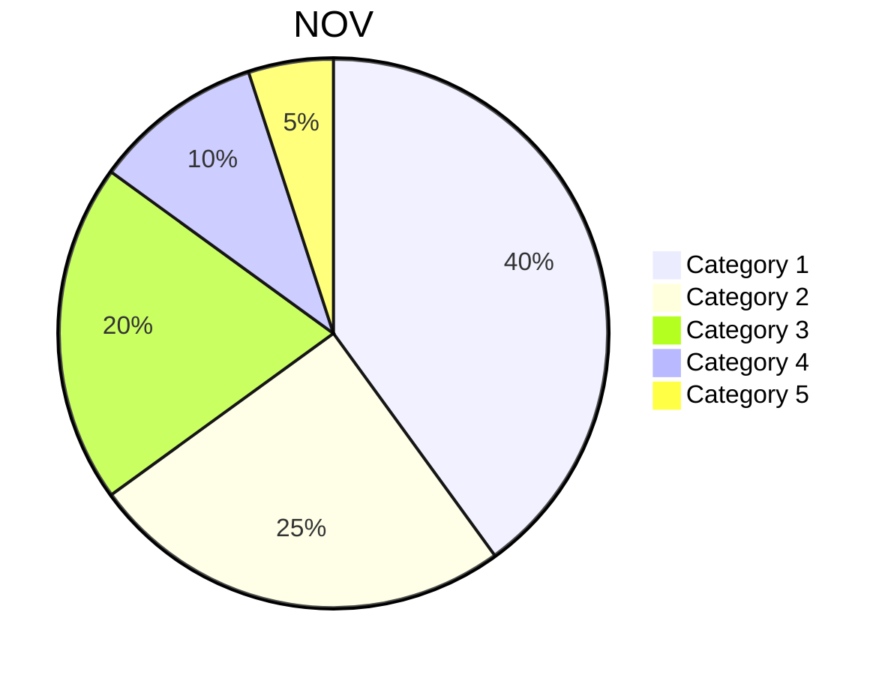

# Mecanismos de navegação

O conteúdo da imagem apresenta dois tipos de mecanismos de navegação em interfaces de usuário:

## Persistente

A imagem à esquerda mostra uma interface de aplicativo móvel com uma barra de navegação persistente na parte inferior da tela. Esta barra contém ícones para diferentes funções ou seções do aplicativo, que estão sempre visíveis e acessíveis ao usuário.

## Transiente

A imagem à direita demonstra um mecanismo de navegação transiente. Há um ícone de menu (três linhas horizontais) no canto superior esquerdo da interface de e-mail. Quando acionado, este ícone revela um menu lateral com opções adicionais como "Inbox", "Outbox", "Trash" e "Spam".

A imagem ilustra como o menu transiente aparece sobreposto à interface principal do e-mail, fornecendo acesso temporário a essas opções de navegação.

Os exemplos mostram interfaces de diferentes aplicativos:
- À esquerda: uma interface semelhante ao Twitter ou outra rede social
- À direita: uma interface de e-mail, possivelmente do Gmail


---
# Mecanismos de navegação

## Persistente

![Imagem de um smartphone mostrando uma interface de aplicativo com uma barra de navegação persistente na parte inferior da tela. A barra contém ícones para diferentes funções e está destacada com um círculo vermelho.]

sempre visíveis, mais fáceis de encontrar mas ocupam permanentemente espaço precioso de écran

## Transiente

![Imagem de duas telas de smartphone mostrando uma interface de e-mail. A primeira tela mostra a caixa de entrada com um ícone de menu destacado no canto superior esquerdo. A segunda tela mostra um menu lateral aberto com opções de navegação.]

escondidos, ficam visíveis através de uma acção, difíceis de encontrar, só ocupam espaço de écran durante o acto de navegação


---
# Mecanismos de navegação

## Persistentes
(o mecanismo de navegação é logo visível)
- Tab Bar
- FAB (Floating Action Button)
- Menu em Lista
- Springboard
- Dashboard
- Galeria
- Skeuomorphic

## Transientes
(o mecanismo só é visível temporariamente)
- Side Drawer
- Toggle Menu
- Gestos
- 3D Touch


---
# Tab Bar

As opções aparecem sempre visíveis, numa barra definida pelo sistema operativo (normalmente no fundo do écran)

| !World Clock Icon World Clock | !Alarm Icon Alarm | !Stopwatch Icon Stopwatch | !Timer Icon Timer |
| ----------------------------------------------- | ----------------------------------- | ----------------------------------------------- | ----------------------------------- |


---
# Tab Bar

## Vantagens
- Menu sempre visível, o utilizador sabe sempre onde está e como saltar para outras opções
- Está na zona "confortável" para o polegar

## Desvantagens
- Ocupa permanentemente espaço precioso de écran
- Limitado a 5 opções visíveis (mais opções implicam uma opção "More")

| Cart                                                                                    | Cart           | Cart | Checkout |     |
| --------------------------------------------------------------------------------------- | -------------- | ---- | -------- | --- |
| 6 items to buy now                                                                      |                |      |          | Qty |
| Beige Rod Pocket Energy Saving Thermal Insulated Blackout Curtain 74 Inc...             |                |      |          | 1   |
| $39.99                                                                                  | Save for later |      | Delete   |     |
| Beige Rod Pocket Thermal Insulated Blackout Tie Up Sha...                               |                |      |          | 5   |
| $21.50                                                                                  | Save for later |      | Delete   |     |
| Subtotal = $147.49                                                                      |                |      |          |     |
| Items saved for later                                                                   |                |      |          |     |
| Nano sim cutter For iPhone 5 Simcard Cutter cut Any GSM sim into Nano or any Micro S... |                |      |          | >   |
| $3.46                                                                                   | Move to cart   |      | Delete   |     |


| Cart (1 item)                                                                             | Cart (1 item) | Edit |
| ----------------------------------------------------------------------------------------- | ------------- | ---- |
| Subtotal: $24.00                                                                          |               |      |
| Does not include any applicable shipping charges, sales tax or any optional gift charges. |               |      |
| Gibson Home Stanza 16-Piece Dinnerware Set                                                |               | >    |
| $24.00                                                                                    |               |      |
| Qty: 1                                                                                    |               |      |
| Color: Red                                                                                |               |      |
| Sync with online cart                                                                     |               | >    |


---
# Tab Bar
(iOS)

É possível dar destaque a uma opção (mas apenas uma) colocando-a na posição central e "pintando-a" de maneira diferente

[Two smartphone screenshots side by side, one of Instagram and one of a fitness app, demonstrating different tab bar designs]


---
# Tab Bar
(iOS vs Android)

| !iOS device with tab bar at bottom | !Android device with tab bar at top |
| :------------------------------------: | :-------------------------------------: |
|                   iOS                  |                 Android                 |


---
# Tab Bar

Se o ícone não é perceptível só por si, recomenda-se a utilização de uma legenda

| 		 |
| -- |

      <div style="background-color: red; height: 5px;"></div>
      Don't
    </td>
    <td>
      | !clock icon | !heart icon | !location icon |
| --------------- | --------------- | ------------------ |
| Recents         | Favorites       | Nearby             |

      <div style="background-color: green; height: 5px;"></div>
      Do
    </td>
  </tr>
</table>


---
# FAB
## (Floating Action Button)

Orientado à funcionalidade principal da aplicação, está sempre visível, parece flutuar por cima da interface, no canto inferior direito, muito utilizado em Android

| ```
▼ ▲ ■ 12:30

≡


        +


◁     ○     □
      
``` |
| ---------------------------------------------------------------- |


---
# FAB
## (Floating Action Button)

| !Smartphone interface showing a colorful geometric face and music player controls | ### Vantagens- Sempre visível, direcciona o utilizador para a acção mais importante
- Está na zona "confortável" para o polegar
- Ocupa pouco espaço do écran (embora permanentemente)### Desvantagens- Pode ser difícil identificar uma acção principal
- Pode tapar conteúdo importante
- Se o ícone não fôr auto-explicativo, pode criar confusão |
| ------------------------------------------------------------------------------------------------------------- | ---------------------------------------------------------------------------------------------------------------------------------------------------------------------------------------------------------------------------------------------------------------------------------------------------------------------------------------------------- |


---
# FAB
## (Floating Action Button)

| Andy Brown                             | 1:45 PM |
| -------------------------------------- | ------- |
| Bring Your Parents to Work Day!        |         |
| Hey! What do you think about a... Work |         |


| Keri Anderson                           | 1:39 PM |
| --------------------------------------- | ------- |
| Picture from last Saturday              |         |
| Check out the new friend we made, Me... |         |


| Regis, Peter, Rachel 3                    | Sep 29 |
| ----------------------------------------- | ------ |
| Board game night?                         |        |
| Sunday works! If you can get Dex... Fun ⭐ |        |


| Aruna Knight                                |
| ------------------------------------------- |
| Book you recommended                        |
| About to go on a trip and was h... Family ⭐ |


Está a tapar conteúdo

[Navigation bar with three buttons]


---
# FAB
## (Floating Action Button)

Variante que
transforma o botão
em vários
(similar ao Side
Drawer)


---
# Menu em Lista

Opções apresentadas em Lista (ListView), ocupando o écran todo

```mermaid
graph LR
    A[List] --> B[Sub List]
    B --> C[Nested List]
    C --> D[Content]
    
    A[List] --> |+|
    A --> |>|
    A --> |>|
    A --> |>|
    A --> |>|
    
    B[Sub List] --> |<-|
    B --> |>|
    B --> |>|
    B --> |>|
    B --> |>|
    B --> |>|
    
    C[Nested List] --> |<-|
    C --> |>|
    C --> |>|
    C --> |>|
    C --> |>|
    
    D[Content] --> |User Icon|
    D --> |-|
    D --> |-|
    D --> |-|
```


---
# Menu em Lista

## Vantagens
- Permite representar um grande número de opções (basta fazer scroll)
- Permite hierarquizar opções, com vários níveis de menus

## Desvantagens
- A navegação ocupa o écran todo
- Se houver vários níveis, o utilizador pode-se perder na navegação

| !KAYAK                             |   |
| ---------------------------------------------------- | - |
| 🏨 Hotels<br/>Find the perfect hotel room.           | > |
| ✈️ Flights<br/>Get the best flight, fast.            | > |
| 🚗 Cars<br/>Seek a deal on wheels.                   | > |
| 💼 My Trips<br/>Your trip agenda in one place.       | > |
| 📡 Flight Tracker<br/>See if your flight is on time. | > |
| 🔔 Price Alerts<br/>Get notified when prices change. | > |
| Notifications                                        | > |


<table>
  <tr>
    <th colspan="2">< Home
---
# Menu em Lista

É importante aquilo que se coloca em cada item do menu.

Quanto mais informação, menos necessidade de navegar mais um nível.

Por outro lado, informação a mais torna a interface confusa.

A imagem mostra dois exemplos de interfaces de aplicativos móveis lado a lado:

1. AroundMe:
   - Lista de categorias com ícones:
     - Banks/ATM
     - Bars
     - Coffee Shops
     - Gas Stations
     - Hospitals
     - Hotels
     - Local Guides
     - Movie Theatres

2. AroundMe Restaurants:
   - Lista de restaurantes com detalhes:
     - Mothers Cafe
       4215 Duval St
       Austin
       0.30 mi
     - Daily Juice Cafe
       4500 Duval St
       Austin
       0.30 mi
     - Julio's Restaurant
       4230 Duval St
       Austin
       0.33 mi
     - Dolce Vita Gelato & Espresso
       4222 Duval St
       Austin
       0.33 mi

   - Barra de filtro na parte inferior: "All | Accepts Reservations"


---
# Springboard

As opções estão organizadas em grelha (tipicamente 3x3 ou 2x3) num écran central


---
# Springboard

## Vantagens
- Permite mais opções do que os modelos com separadores/tabs (limitado a 5 em iOS e Android)
- Tem o mesmo aspecto em todas as plataformas

## Desvantagens
- Todas as opções têm o mesmo nível de importância (não permite hierarquia)

| trulia&#xA;real estate search&#xA;For Sale	Open Houses	Reduced&#xA;For Rent	New Search	Sold&#xA;My Trulia	Feedback	More |
| ----------------------------------------------------------------------------------------------------------------------- |

    </td>
    <td>
      | Gowalla                                                             |          |          |
| ------------------------------------------------------------------- | -------- | -------- |
| Ashley Cass<br/>Austin, Texas<br/>782 44 140<br/>Stamps Pins Photos |          |          |
| Mellow Johnny's<br/>4 minutes ago >                                 |          |          |
| Check In                                                            | Activity | Spots    |
| Trips                                                               | Friends  | Settings |
| 2 new notifications >                                               |          |          |

    </td>
  </tr>
</table>


---
# Springboard

O próprio sistema operativo usa este modelo

[Three smartphone home screens side by side, displaying app icons and interfaces for iOS, Android, and Windows Phone operating systems]


---
# Dashboard

O écran principal não se limita a mostrar opções, mostra-nos um sumário da nossa situação actual

Vantagens
• Permite obter informação sem necessidade de navegação. Só navegamos se quisermos detalhes

Desvantagens
• Pode ser abusado e o écran principal ficar atulhado de informação





$9,370


---
# Galeria

O écran principal mostra conteúdos (fotos, notícias, receitas, ...) em forma de grelha, associado a scroll "infinito" (carrega mais informação à medida que se vai fazendo scroll)

Vantagens:
- Bom para conteúdos dinâmicos, muito visuais, sem hierarquia

Desvantagens:
- Só faz sentido para certo tipo de conteúdos

[A grid of 6 food photographs showing various dishes including tacos, curry, steak, fish, pasta, and grilled meat with corn salsa]


---
# Galeria

Por vezes é colocada uma legenda em cada conteúdo
(overlay ou à volta)

[The image contains two screenshots of mobile app interfaces showing various content thumbnails with overlaid text. These screenshots serve as examples of how captions or descriptions are placed on or around content in mobile applications.]


---
# Skeuomorphic

Emula o equivalente real da aplicação

Vantagens
• Intuitivo, vai ao encontro daquilo que os utilizadores se habituaram no mundo real

Desvantagens
• Não é viável para a maioria das aplicações

![DJ turntable interface with two vinyl records, waveform displays, and control buttons]


---
# Skeuomorphic

The image displays two examples of skeuomorphic design in digital interfaces:

1. On the left, there's a representation of a film camera interface:
   - It shows part of a camera body with "Choose Film" and "Edit" options at the top.
   - A film canister is visible with the text "Swipe up and down to change film".
   - The film type is labeled as "Ina's 1982".
   - This interface mimics the physical appearance and functionality of a real film camera.

2. On the right, there's a smartphone screen displaying a digital newsstand:
   - The screen shows a grid of magazine and newspaper covers.
   - Visible titles include "The New York Times", "Astronomy", "DISCOVER", and various other magazines.
   - This interface resembles a physical newsstand or magazine rack, translating that concept into a digital format.

Both examples demonstrate skeuomorphic design by using visual metaphors from the physical world in digital interfaces to make them more intuitive and familiar to users.


---
# Skeuomorphic

No Smartphone ou no Tablet, é como estar no Supermercado.

[The image shows a tablet displaying digital shelves with various cereal boxes, mimicking a physical supermarket layout. Hands are holding the tablet, and there are small icons for "SUPERMERCADO" with an apple logo and "El Corte Inglés" visible in the corners of the image.]
---
# Mecanismos de navegação transientes

- Menus estão escondidos até o utilizador executar uma acção para os mostrar

- Desaparecem após seleccionar a opção


---
# Side Drawer
## (Hamburger Menu)

Menu aparece do lado esquerdo cobrindo parcialmente o écran, quando se clica num botão ou se arrasta o bordo do écran (da esquerda para a direita)

### Vantagens
- Permite muitas opções, organizadas hierarquicamente
- Não ocupa espaço precioso de écran

### Desvantagens
- Pode não ser percetível como abrir o menu
- Perde-se o contexto de qual a opção activa nesse momento

| **Saved Coupons**<br/>Home<br/>Nearby<br/>Trending<br/>Categories<br/>Saved Coupons<br/>Settings | **Saved Coupons**<br/>1 IN-STORE SAVED COUPONS<br/>Target $1 Off Simple Facial Care Item<br/>69% Success<br/>3 ONLINE SAVED COUPONS<br/>Target.com $5 Off $50 On Baby Purchases<br/>Staff Pick Exp: 01/01/2014<br/>Target.com $5 Off $50 Sitewide + Free Shipping On Select Orde...<br/>Target.com Pre Black Friday Sale & Daily Doorbuster deals! |
| ------------------------------------------------------------------------------------------------ | -------------------------------------------------------------------------------------------------------------------------------------------------------------------------------------------------------------------------------------------------------------------------------------------------------------------------------------------------- |


---
# Side Drawer


---
# Side Drawer


Pode ser usado para "esconder" opções menos prioritárias, dando o espaço todo de écran à acção mais prioritária


---
# Side Drawer

![Four smartphone screenshots showing app interface and side drawer functionality]

Dificuldade em perceber a opção activa nesse momento


---
# Toggle Menu

Menu aparece quando se clica num botão - menu aparece por baixo do botão e pode cobrir todo ou parte do écran (eventualmente deslizando primeiro). Clicando novamente no botão, o menu desaparece. Se clicar fora do menu, também desaparece.

## Vantagens
• Intuitivo, parecido com as aplicações web e desktop

## Desvantagens
• Se o menu tapar todo o écran, perde-se o contexto

| pocket    |   |   |
| --------- | - | - |
| Home      |   |   |
| Favorites |   |   |
| Archive   |   |   |
| Options   |   |   |
| Help      |   |   |


---
# Toggle Menu

The image displays two mobile app interfaces side by side, demonstrating different approaches to menu design:

## Walmart App (Left)

| Walmart !Cart Icon      |                                          |                                               |
| ---------------------------------------- | ---------------------------------------- | --------------------------------------------- |
| !Home Icon<br/>Home     | !Search Icon<br/>Shop | !Truck Icon<br/>Track Order |
| !Clock Icon<br/>Stores | !Ad Icon<br/>Local Ad     | !More Icon<br/>More          |


Set your local store

- Rollbacks: Lower prices just got lower
- Local Ad: See your store's in-store great savings
- Find a Store: View and search for nearby stores
- Pharmacy: Order refills and view Rx prescriptions
- Learn about Scan & Go: A faster way to shop and pay

## The Home Depot App (Right)

| !Store Icon<br/>Stores | !Account Icon<br/>Account | !Cart Icon<br/>Cart |
| ---------------------------------------- | --------------------------------------------- | ------------------------------------ |


SHOP ALL      Search Products

- Savings Center
- Local Ad
- Gift Cards
- Appliances
- Bath
- Building Materials
- Cleaning
- Decor
- Doors & Windows

[Bottom navigation buttons]


---
# Gestos

Arrastar (swipe) para revelar opções

| !Smartphone interface showing email app Primary |
| --------------------------------------------------------------------------- |


---
# Gestos

## Vantagens
- Não ocupam espaço de écran
- Uma vez descobertas são bastante intuitivas (ex: arrastar para fora do écran = enviar para o lixo)
- Começam a ser comuns para opções em listas

## Desvantagens
- Difíceis de descobrir
- Pode ser pouco natural para alguns utilizadores

| !iPhone screen 1 | !iPhone screen 2 |
| --------------------------------------- | --------------------------------------- |


---
# 3D Touch

Premir com mais força/mais tempo para revelar opções


1. Camera app:
   - Take Selfie
   - Record Video
   - Record Slo-mo
   - Take Photo

2. Messaging app:
   - New Message
   - Melissa House
   - Tom McNeil
   - Farrah Tam

3. Maps app:
   - Directions Home
   - Mark My Location
   - Send My Location
   - Search Nearby


---
# Mecanismos de navegação

## Misturar mecanismos de navegação

Uma vez seleccionado um módulo através do mecanismo de navegação primário, é aplicado outro mecanismo para navegar dentro desse módulo

Spring Board -> navegação secundária

Tab Bar -> navegação primária

| Starbucks                   |                                  |                             | Edit |
| --------------------------- | -------------------------------: | --------------------------- | ---- |
| ! Messages | ! my Favorites | ! Coffees   |      |
| ! Food         |          ! Drinks | ! Settings |      |
| ! Help         |                                  |                             |      |


| ! Home | ! my Card | ! Rewards | ! eGifts | ! Stores |
| ------------------- | ---------------------- | ------------------------- | ---------------------- | ----------------------- |


---
# Tab Bar vs Side Drawer

O Facebook remodelou a sua App para passar a usar Tab Bar, após 2 anos de Side Drawer, com base em testes com 10 milhões de utilizadores

| Antes                                                                                                                                                  | Depois                                                                                                                                                                                                                                                                                                                                                                                                                                                                      |
| ------------------------------------------------------------------------------------------------------------------------------------------------------ | --------------------------------------------------------------------------------------------------------------------------------------------------------------------------------------------------------------------------------------------------------------------------------------------------------------------------------------------------------------------------------------------------------------------------------------------------------------------------- |
| Tele2 18:48Q SearchJesper BylundFAVORITES- News Feed
- Messages 1
- Nearby
- Events 2
- Friends
- Close Friends 20+
- Futurniture 20+
- Family 8Caroli | No Service 5:41 PMQ News FeedStatus Photo Check InLunch, and then a couple hours on a boat to see some whales. The kiddos are excited!\[Map showing Pacific Grove, Monterey, Seaside]Old Fisherman's Wharf Historical Place11 Likes 2 CommentsLike Comment ShareChris Heatherly2 hours ago near Monrovia, CAApropos of nothing, Mom: "Do you still believe in Santa?" Me: "I was Santa."5 Likes\[Tab bar with icons for News Feed, Requests, Messages, Notifications, More] |


---
# Tab Bar vs Side Drawer

Aumento de 65% no número de utilizadores activos

| !BEFORE<br/>BEFORE | !AFTER<br/>AFTER |
| -------------------------------------- | ----------------------------------- |


Hamburger menu ↑

Tab bar ↑

Fonte: https://redbooth.com/blog/hamburger-menu-iphone-app