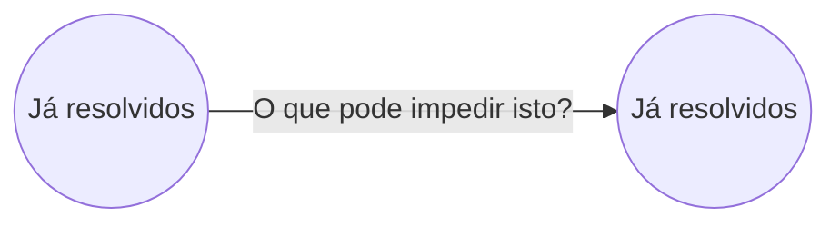
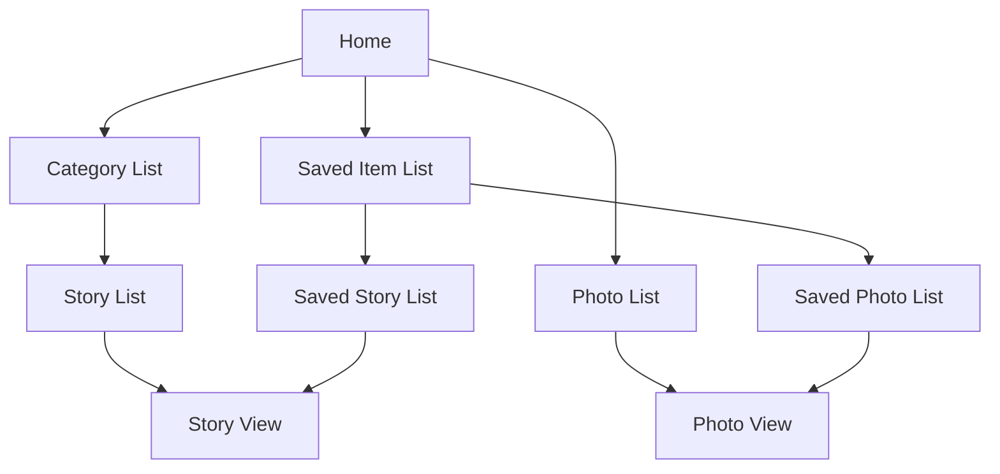
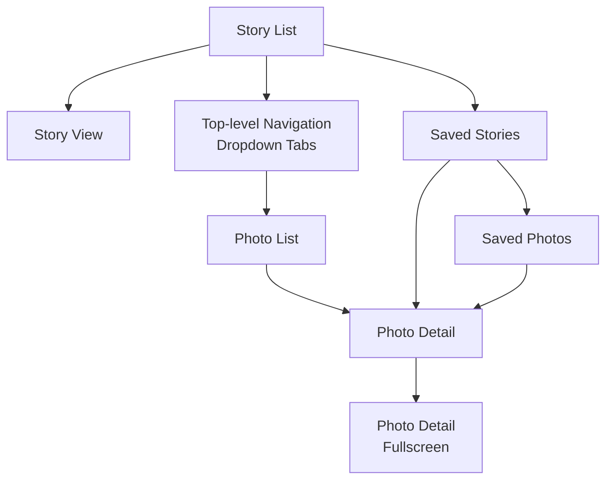
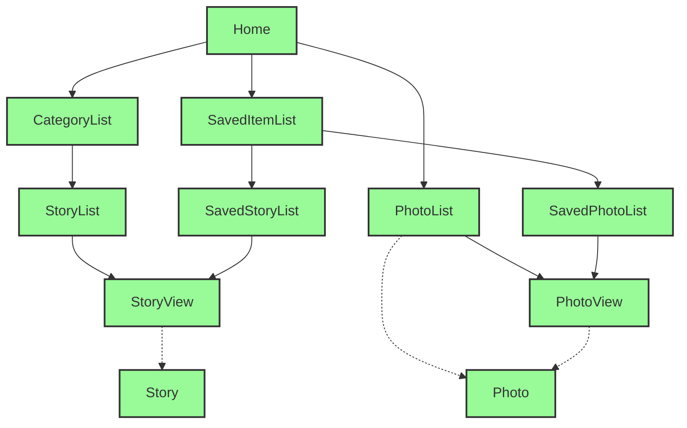

# Informação

Será publicado material de complemento a esta aula

- Modelos de navegação
- Formulários
- Layouts

Haverão 2 quizzes sobre isto


---
# Desafio

<div style="background-color: #D3D3D3; padding: 10px;">
<span style="color: red; font-size: 1.2em;">Só para relembrar!</span>
</div>

1. Assistir a este curso de Flutter - [https://www.youtube.com/playlist?list=PL4cUxeGkcC9jLYyp2Aoh6hcWuxFDX6PBJ])(https://www.youtube.com/playlist?list=PL4cUxeGkcC9jLYyp2Aoh6hcWuxFDX6PBJ)

2. Detetar informação desatualizada (na versão atual de Flutter há coisas que já não funcionam tal e qual é explicado no curso)

3. Reportar aqui [https://forms.gle/i3Av3DMyTzFJzcmWA])(https://forms.gle/i3Av3DMyTzFJzcmWA)

4. Os reports vão sendo publicados aqui: [https://docs.google.com/spreadsheets/d/e/2PACX-1vSEcNmEBf4DT1KhLuNFTUXKvr0jkVjiB0rxhcf-qqGzLsnk5BH6CwOzrhapli2atfTnbvFwwDow45dW/pubhtml])(https://docs.google.com/spreadsheets/d/e/2PACX-1vSEcNmEBf4DT1KhLuNFTUXKvr0jkVjiB0rxhcf-qqGzLsnk5BH6CwOzrhapli2atfTnbvFwwDow45dW/pubhtml)

## Regras:
Cada report vale 0,25 extra na nota final da componente prática. Mas:
- Cada aluno pode reportar no máximo 2 vezes
- Cada problema pode ser reportado por um único aluno (o primeiro que reportar). Ou seja, não deverão haver reports repetidos
- Este desafio termina no dia 25 de Março às 23h59


---


O que pode impedir isto?

Problemas que se conseguem resolver com computação tradicional

Problemas que se conseguem resolver com computação móvel


---
# Interação com dispositivos móveis

## Limitações


---
# Interação com dispositivos móveis

## Limitações

- Écran reduzido


---
# Interação com dispositivos móveis

## Limitações

- Écran reduzido
- Interação tátil (com o dedo)


---
# Interação com dispositivos móveis

## Limitações

- Écran reduzido
- Interação tátil (com o dedo)
- Difícil visibilidade ao sol


---
# Interação com dispositivos móveis

## Limitações

- Écran reduzido
- Interação tátil (com o dedo)
- Difícil visibilidade ao sol
- Interrupções constantes


---
# Interação com dispositivos móveis

## Limitações

- Écran reduzido
- Interação tátil (com o dedo)
- Difícil visibilidade ao sol
- Interrupções constantes
- Apenas uma mão disponível


---
# Interação com dispositivos móveis

## Limitações

- Écran reduzido
- Interação tátil (com o dedo)
- Difícil visibilidade ao sol
- Interrupções constantes
- Apenas uma mão disponível


---
# Interacção com touch-screens

Problema do "dedo gordo"

Em touch-screens, a precisão da interação depende da largura do dedo.

Cuidado com o tamanho dos botões!

![A smartphone screen showing a hotel search interface from KAYAK. The interface includes fields for location and check-in date, as well as a calendar for February 2011. The calendar shows dates from 1 to 26, with the 10th highlighted. Navigation buttons are visible at the bottom of the screen.]


---
# Problema do "dedo gordo"

Tamanho ideal de cada botão = 34px (9 mm)
Mínimo = 26px (7 mm)

| % OF MISSED TAPS | Target size                                                                    | Target size | Target size | Target size | Target size | Target size | | |
| ---------------- | ------------------------------------------------------------------------------ | ----------- | ----------- | ----------- | ----------- | ----------- |---|---|
| 25%              | 1 in 30 taps (3%) \| 1 in 100 (1%) \| 1 in 200 (0.5%)<br/>will miss the target |             |             |             |             |             |
| 20%              |                                                                                |             |             |             |             |             | | |
| 15%              |                                                                                |             |             |             |             |             | | |
| 10%              |                                                                                |             |             |             |             |             | | |
| 5%               |                                                                                |             |             |             |             |             | | |
|                  |                                                                                |             |             |             |             |             | | |
|                  | 3 mm                                                                           | 5 mm        | 7 mm        | 9 mm        | 11 mm       | 13 mm       | | |


---
# Problema do "dedo gordo"

The image illustrates the concept of the "fat finger problem" (Problema do "dedo gordo" in Portuguese). It shows a hand with the index finger extended, alongside three objects of different sizes for comparison:

| Object                                   | Size |
| ---------------------------------------- | ---- |
| Coin (appears to be a dime or similar)   | 18mm |
| Square object (possibly a key or button) | 15mm |
| Pink circle on fingertip                 | 10mm |


The image demonstrates how the size of a human fingertip (represented by the 10mm pink circle) can be larger than typical interface elements or touch targets on devices, potentially leading to accuracy issues when interacting with small objects or buttons on touchscreens.


---
# Problema do "dedo gordo"

| ```
Carrier     6:49 PM

YouTube                    □ 44px

Real-Time Feedback in Web Forms:
Options

BEFORE ANSWERING

1:14

□ Save to  Share  HQ       □ 44px

lukew                      □ 30px
Aug 22, 2009 — 12,840 views
The three inline validation variations
we tested after, while, and before and while.

◁   ▷   +   □   □
      
``` |
| ------------------------------------------------------------------------------------------------------------------------------------------------------------------------------------------------------------------------------------------------------------------------------------------------------------------------------------------------- |


---
# Problema do "dedo gordo"

Apesar de a interação ser com a checkbox, toda a linha é clicável fazendo o mesmo efeito que clicar na checkbox

| AT\&T                                           | 7:10 PM        |
| ----------------------------------------------- | -------------- |
| Web Images Places News more                     |                |
| From                                            | San Jose (SJC) |
| Airports near San Jose                          |                |
| ✓ Norman Y. Mineta Int'l<br/>0 miles (SJC)      | $304           |
| □ Metropolitan Oakland Int'l<br/>29 miles (OAK) | $270           |
| □ San Francisco Int'l<br/>30 miles (SFO)        | $241           |
| □ Monterey Peninsula<br/>53 miles (MRY)         | $336           |
| Chicago, IL                                     | from $384      |
| San Francisco, CA                               | from $275      |


---
# Posicionamento em grelha

Maximizar a utilização do espaço disponível, facilitando a interação em touch-screens

Diminui o problema do "dedo gordo"
---
# Problema do "dedo gordo"

O Android Studio alerta para potenciais problemas de "dedo gordo"

| Message                                                                                                                                                                                                            | Message                                    |
| ------------------------------------------------------------------------------------------------------------------------------------------------------------------------------------------------------------------ | ------------------------------------------ |
| **Touch target size too small**<br/>This item's height is 45dp. Consider making the height of this touch target 48dp or larger.<br/>Learn more at https\://support.google.com/accessibility/android/answer/7101858 |                                            |
| Fix                                                                                                                                                                                                                | Set this item's android:minHeight to 48dp. |
| Ignore                                                                                                                                                                                                             | Ignore this check if it is false positive. |


---
# Exercício

No vosso telemóvel, descubram um écran de uma app que tenha o problema do dedo gordo.

Partilhem com o vosso colega do lado!


---
# Alguns exemplos (dedo gordo)

Four mobile game interfaces showing different games

1. Game interface showing:
   - "Difícil"
   - ❤️❤️❤️
   - Empty grid puzzle

2. Sudoku.com interface:
   | 9 | 8 |   | 5 | 6 |   | 4 |   |   |
| - | - | - | - | - | - | - | - | - |
|   |   | 8 |   |   |   | 2 |   |   |
| 7 |   | 3 | 9 |   |   | 5 |   |   |
|   |   | 2 |   |   | 8 | 3 |   |   |
| 8 |   |   | 7 |   |   |   |   | 9 |
| 5 | 4 |   | 6 | 1 |   |   |   |   |
| 1 | 5 |   | 8 |   |   |   | 4 |   |
|   |   |   |   |   |   | 1 | 8 |   |
|   |   |   |   |   | 5 | 7 | 3 |   |


   Anular | Apagar | Notas | OFF | Sugestão

   1 2 3 4 5 6 7 8 9

3. Strategy game interface:
   - Turn 313 | 1886 AD
   - Fertilizer: 5 turns
   - Diplomacy
   - Ecbatana, Persepolis, Parsagadae (cities)
   - Various game notifications (e.g., "Catapult finished exploring", "Work has started on Harbor")

4. Minesweeper-like game:
   | 0 | 4 | 1 |   |   |   |   |   |   |
| - | - | - | - | - | - | - | - | - |
|   |   |   |   |   |   |   |   |   |
|   |   |   |   |   |   |   |   |   |
|   |   |   |   |   |   |   |   |   |
|   |   |   |   |   |   |   |   |   |
|   |   |   |   |   |   |   |   |   |
| 2 | 1 | 1 |   |   | 2 | 2 | 2 | 3 |
| 1 | 1 | 1 |   |   | 2 |   |   |   |
| 1 | 2 | 2 | 1 | 1 | 2 | 1 | 1 |   |


5. Betting interface (partial):
   - Total de cotas: 0,00
   - Montante base: €2,00
   - Montante total: €2,00
   - Ganhos possíveis: €0,00
   - Modalidade da Aposta: €2


---
# Interação com dispositivos móveis

## Limitações

- Écran reduzido
- Interação tátil (com o dedo)
- Difícil visibilidade ao sol
- Interrupções constantes
- Apenas uma mão disponível


---
# Problema do alcance do polegar

| OW      |         |   |
| ------- | ------- | - |
| NATURAL | STRETCH |   |
|         |         |   |


Este problema acontece quando seguramos no dispositivo apenas com uma mão

A área inferior esquerda do écran é confortável de aceder com o polegar.

As outras, nem por isso...


---
# Problema do alcance do polegar

A screenshot of a mobile app interface for hotel booking

Desconfortável de aceder com o polegar:
- Os botões "+" e "-" para ajustar o número de hóspedes e quartos estão localizados no canto superior direito da tela, difíceis de alcançar com o polegar.

Confortável de aceder com o polegar:
- O botão "Find Hotels" está localizado na parte inferior da tela, facilmente acessível com o polegar.

A interface mostra:
- Local: Los Angeles, CA
- Opções para 1 hóspede e 1 quarto
- Datas: Today e Tomorrow


---
# Problema do alcance do polegar

Este problema tem-se vindo a agravar com o aumento do tamanho de écran

Em 2014,
7,5% dos smartphones tinham entre 5,5 e 6 polegadas

Em 2017,
43% dos smartphone tinham entre 5,5 e 6 polegadas

Atualmente,
A maioria dos smartphone tem mais do que 6 polegadas

Fonte: https://www.scientiamobile.com/page/smartphone-screen-size-trend


---
# Interação com dispositivos móveis

## Limitações

- Écran reduzido
- Interação tátil (com o dedo)
- Difícil visibilidade ao sol
- Interrupções constantes
- Apenas uma mão disponível


---
# Problema das interrupções frequentes

Os padrões de utilização dos diversos tipos de dispositivo mostram que nos smartphones, as interações são de curta duração

| Dispositivo | Padrão de Utilização ao Longo do Dia |   |   |   |   |   |   |   |   |   |   |   |   |   |   |
| ----------- | ------------------------------------ | - | - | - | - | - | - | - | - | - | - | - | - | - | - |
| Laptop      |                                      |   |   |   |   |   |   |   |   |   |   |   |   |   |   |
| Tablet      |                                      |   |   |   |   |   |   |   |   |   |   |   |   |   |   |
| Smartphone  |                                      |   |   |   |   |   |   |   |   |   |   |   |   |   |   |


9              12              15              18              21              24

Fonte: https://gigaom.com/2011/07/25/smartphones-ipads-the-state-of-the-mobile-internet/


---
# Problema das interrupções frequentes

Em média, as pessoas interagem com o telemóvel cerca de 80x por dia

Esses acessos duram, em média, 38 segundos


---
# Problema das interrupções frequentes

Nos smartwatches, o problema é ainda mais grave...

| Smartwatch | Smartphone |
|------------|------------|
| ![Smartwatch on wrist showing 11:58] | ![Smartphone with pink background] |
| 7s | 38s |
| average interaction times | average interaction times |

Fonte: https://youtu.be/DD-8WjC79yQ?t=1h26m41s


---
# Interação com dispositivos móveis

## Limitações

- Écran reduzido
- Interação tátil (com o dedo)
- Difícil visibilidade ao sol
- Interrupções constantes
- Apenas uma mão disponível


---
# Contraste

## Alto contraste

- Círculo cromático com 12 segmentos de cores distintas, dispostos em ordem espectral.
- Linhas radiais dividem o círculo em seções iguais.
- Abaixo do círculo, duas fileiras de quadrados coloridos:
  - Fila superior: verde, azul-turquesa, azul, roxo, amarelo, verde-limão
  - Fila inferior: vermelho, laranja, azul, roxo, magenta, rosa

## Baixo contraste

- Círculo cromático similar, mas com círculos pequenos marcando as divisões entre as cores.
- As cores parecem mais suaves e com transições mais graduais.
- Abaixo do círculo, duas fileiras de quadrados coloridos com tons mais suaves:
  - 11 quadrados em cada fila, mostrando uma transição gradual de cores

Nota: As cores em ambos os círculos e quadrados do "Baixo contraste" apresentam uma aparência mais suave e menos vibrante em comparação com o "Alto contraste".


---
# Interação com dispositivos móveis

## Limitações

- Écran reduzido
- Interação tátil (com o dedo)
- Difícil visibilidade ao sol
- Interrupções constantes
- Apenas uma mão disponível


---
# Portrait vs Landscape


---
# Portrait vs Landscape

Apenas reorganiza elementos

| !Portrait mode Skype interface 23:04<br/>skype<br/>Tell friends what you're up to<br/>Contacts        Recent<br/>Call phones    Profile | !Landscape mode Skype interface 23:04<br/>skype<br/>Tell friends what you're up to<br/>Contacts    Recent    Call phones    Profile |
| ------------------------------------------------------------------------------------------------------------------------------------------- | --------------------------------------------------------------------------------------------------------------------------------------- |


---
# Portrait vs Landscape

Aumenta/esconde elementos

YouTube video player in portrait mode showing video thumbnail and metadata

YouTube video player in landscape mode showing larger video thumbnail with playback controls


---
# Portrait vs Landscape

Mostra/esconde elementos

The image illustrates the difference between portrait and landscape orientations using calculator app interfaces on smartphones.

1. Portrait Mode (left):
   - Shows a basic calculator interface
   - Time displayed: 10:42 AM
   - Current calculation: 42
   - Basic numeric keypad and operations

2. Landscape Mode (right):
   - Shows an advanced scientific calculator interface
   - Display shows: 3.141592653589793 (pi)
   - Extended set of mathematical functions and operations

A blue curved arrow points from the portrait mode to the landscape mode, indicating the transition or comparison between the two orientations.

The landscape mode reveals additional scientific and mathematical functions that are not visible in the portrait mode, demonstrating how changing the orientation can expose more features in the app.


---
# Portrait vs Landscape

Mostra/esconde elementos

| ← Search 🔍	12:00	88% ▉&#xA;← Centro Comercial Alvalade ⋮&#xA;📍 Universidade Lusófona - Centro... 🔗&#xA;4 min 🚇 9 min 🚶 14 min 🦽 4 min 🚲 5 min&#xA;\[Map with route]&#xA;14 min (1 km) ↑140 m ↓5 m&#xA;via Av. de Roma and R. Murtas&#xA;Preview	Steps	 |
| ------------------------------------------------------------------------------------------------------------------------------------------------------------------------------------------------------------------------------------------------------------- |

    </td>
    <td>
      | 14 min (1 km) ↑140 m ↓5 m<br/>via Av. de Roma and R. Murtas                                                                                                                               |                   |
| ----------------------------------------------------------------------------------------------------------------------------------------------------------------------------------------- | ----------------- |
| Steps<br/><br/>📍 Centro Comercial Alvalade<br/>Praça Alvalade 6B,<br/>1700-036 Lisboa<br/>\[Small image]<br/><br/>Walk for 26m<br/>Take the stairs<br/>\[Small image]<br/><br/>30 metres | \[Map with route] |
| Preview                                                                                                                                                                                   |                   |

    </td>
  </tr>
</table>


---
# Portrait vs Landscape

Mostra um écran completamente diferente com os mesmos dados

The image displays two Nokia smartphones side by side, demonstrating how the same data can be presented differently in portrait and landscape orientations.

On the left, a Nokia phone in portrait mode shows:

| NOKIA CITY LENS<br/>Nearby | NOKIA CITY LENS<br/>Nearby |
| -------------------------- | -------------------------- |
| Wine Cellar                | 0.05mi                     |
| Indian Store (The)         | 0.05mi                     |
| Pizza My Heart             | 0.07mi                     |
| Shuz Of Los Gatos          | 0.07mi                     |
| Runner's Factory           | 0.09mi                     |
| Luggage Center...          | 0.11mi                     |
| Purrsnickety               | 0.14mi                     |


On the right, a Nokia phone in landscape mode shows:

An augmented reality view of a street scene with overlaid information about nearby businesses. The businesses shown include:

- Prentiss Brown Thea... (0.44mi)
- Banana Republic (0.02mi)
- Posh Bagel (0.02mi)
- Steamer's Grill House (0.04mi)
- Old Town (0.04mi)
- GapBody (0.04mi)
- Wine Cellar (0.05mi)

A blue curved arrow points from the portrait view to the landscape view, indicating the transition between the two modes.


---
# Navegação
---
# Interação com dispositivos móveis

Principais queixas associadas às apps que estão na App Store e Play Store:

- Crashes
- Falta de funcionalidades essenciais (ex: filtrar, sincronizar)
- Desenho de interface confuso
- Navegação difícil (ex: não dá para voltar atrás, não encontra opções)


---
# Interação com dispositivos móveis

Os modelos de navegação tradicionais não funcionam bem num écran pequeno

| Hi! Sign in or register \| Daily Deals \| Gift Cards \| Sell \| Help & Contact                                                 |                                                                                                                                   |                                                                                                                | My eBay | 🔔 | 🛒 | | | | |
| ------------------------------------------------------------------------------------------------------------------------------ | --------------------------------------------------------------------------------------------------------------------------------- | -------------------------------------------------------------------------------------------------------------- | ------- | -- | -- |---|---|---|---|---|---|---|---|
| !eBay Shop by category ▼ \| \[Search bar] All Categories ▼ Search Advanced                                    |                                                                                                                                   |                                                                                                                |         |    |    | | | | | | | |
| Following \| Today \| Fashion \| Electronics \| Collectibles & Art \| Home & Garden \| Sporting Goods \| Motors \| Daily Deals |                                                                                                                                   |                                                                                                                |         |    |    |
| Top categories<br/><br/>📱 Cell Phones & Accessories<br/><br/>📷 Cameras & Photo<br/><br/>💻 Computers & Tablets               | Other categories<br/><br/>Car Audio, Video & GPS<br/><br/>iPhone<br/><br/>iPad<br/><br/>TV, Audio<br/><br/>Video Games & Consoles | EXPLORE ELECTRONICS<br/>SHOP NOW<br/>CHECK THE NEWEST TRENDS<br/>\[Image of a person using a laptop by a pool] |         |    |    | | | | | | | | |


---
# Como definir um modelo de navegação adequado?

## 1 - Definir os objectivos do utilizador (requisitos)
- enviar uma foto para alguém
- saber o caminho para chegar ao ponto X
- fazer um cálculo numérico
- saber a previsão do tempo para amanhã
- ~~fazer login~~
- ~~abrir o menu~~
- ~~navegar na aplicação~~

Isto não são requisitos pois, só por si, não satisfazem nenhum objetivo (são apenas um meio para chegar ao objetivo)


---
# Como definir um modelo de navegação adequado?

## 2 - Prioritizar os objectivos do utilizador (requisitos)

1. ver as fotos dos outros <-- mais prioritário
2. publicar uma foto
3. comentar uma foto <-- menos prioritário


---
# Como definir um modelo de navegação adequado?

## 3 - Desenhar um modelo que facilite a realização dos objectivos

Para cada objectivo:
- o utilizador consegue descobrir como é que se atinge?
- o utilizador consegue atingi-lo rapidamente?
- o utilizador não se perde pelo caminho?


---
# Mapa Aplicacional

Define os mecanismos de navegação que me permitem, a partir de um écran da aplicação, chegar aos outros écrans




---
# Storyboard

Mistura mockups com o mapa aplicacional




---
# MVC
(revisitado)

![Calculator interface showing "5+10" in the display and buttons for various operations]

Model - Guarda o valor "5+10" e sabe avaliar expressões aritméticas.

View - Contém 15 botões e um campo de texto

Controller - Apanha os eventos de carregar nos botões, transmite ao Model e atualiza a View com valor (atualizado) do Model


---
Android Emulator - Medium_Phone_API_34:5554

← Hospital Beatriz Ângelo

Hospital:

75458
Hospital Beatriz Ângelo
Avenida Carlos Teixeira, 3 2674 Loures
Lisboa
219847200
geral@hbeatrizangelo.pt
Com urgência
9111750 metros até este hospital
Média de avaliações: 1.5

Avaliações:

21/03/2025 10:00
2
Demasiado tempo de espera

20/03/2025 14:34
1

# Exercício

Qual a classe ou classes que vão constituir o Model deste ecrã?
Quais os seus atributos?


---
# Mapa Aplicacional + Modelo (incompleto)



| Photo                                     | Story          |
| ----------------------------------------- | -------------- |
| - id<br/>- file<br/>- date<br/>- location | - id<br/>- ... |


---
# Exercício

Desenhar o mapa aplicacional do aplicação dos tempos de espera (projeto de IHM) e indicar os respetivos modelos

Para quem não fez IHM:

Aplicação móvel que permita ao utilizador saber a que hospital se deve dirigir em caso de uma urgência, tirando partido do serviço de geolocalização do seu telemóvel.

- Ecrã inicial - dashboard
- Ecrã com lista de hospitais
- Ecrã com mapa dos hospitais
- Ecrã com detalhe do hospital (mostrado 2 slides atrás)
- Ecrã com avaliação do hospital (nome, data/hora, avaliação 1..5, descrição)

