# Programação funcional em Dart

```dart
int calculaMaximo(List<int> numeros) {
  ...
}
```

Função que recebe um List<int> e retorna um int


---
# Programação funcional em Dart

```dart
int calculaMaximo(List<int> numeros) {
  ...
}
```

Função que recebe um List<int> e retorna um int

```dart
void main() {
  Function funcaoMax = calculaMaximo;
}
```


---
# Programação funcional em Dart

```dart
int calculaMaximo(List<int> numeros) {
  ...
}
```

Função que recebe um List<int> e retorna um int

```dart
void main() {
  Function funcaoMax = calculaMaximo;

  funcaoMax('ola');
}
```

função não-tipificada ↑

não dá erro de compilação 😮 ↑


---
# Programação funcional em Dart

```dart
int calculaMaximo(List<int> numeros) {
  ...
}
```

Função que recebe um List<int> e retorna um int

```dart
void main() {
  int Function(List<int>) funcaoMax = calculaMaximo;

  funcaoMax('ola'); // dá erro de compilação! ainda bem!
}
```


---
# Exercício

```c
int soma(int numero1, int numero2) {
    ...
}

void main() {
    ???         funcaoSoma = soma;
}
```


---
# Exercício

```c
int soma(int numero1, int numero2) {
    ...
}

void main() {
    int Function(int,int) funcaoSoma = soma;
}
```


---
# Programação funcional em Dart



```mermaid
graph LR
    A["[ 3, 4, 6 ]"] --> B[transformaLista]
    C["função \"dobro\""] --> B
    B --> D["[ 6, 8, 12 ]"]
```

This diagram illustrates a functional programming concept in Dart. It shows:

1. An input list `[ 3, 4, 6 ]`
2. A function called `transformaLista` (which translates to "transform list" in English)
3. Another input labeled `função "dobro"` (which means "double" function in English)
4. An output list `[ 6, 8, 12 ]`

The diagram suggests that the `transformaLista` function takes two inputs: the initial list and the "dobro" function. It then applies the "dobro" function to each element of the input list, resulting in the output list where each element has been doubled.


---
# Programação funcional em Dart


```dart
List<int> transformaLista(List<int> numeros, int Function(int) f) {
  ...
}
```


---
# Exercício

```cpp
List<int> transformaLista(List<int> numeros, int Function(int) f) {
  ...
}
```

```
???
```

```cpp
void main() {
  List<int> result = transformaLista([3,4,6], dobro);
}
```


---
# Resolução

```cpp
List<int> transformaLista(List<int> numeros, int Function(int) f) {
  ...
}

int dobro(int numero) {
  return numero * 2;
}

void main() {
  List<int> result = transformaLista([3,4,6], dobro);
}
```


---
# Resolução

```csharp
List<int> transformaLista(List<int> numeros, int Function(int) f) {
  ...
}
```

```csharp
int dobro(int numero) {
  return numero * 2;
}
```

ou

```csharp
int dobro(int numero) => numero * 2;
```

```csharp
void main() {
  List<int> result = transformaLista([3,4,6], dobro);
}
```


---
# Lambda

```csharp
List<int> transformaLista(List<int> numeros, int Function(int) f) {
  ...
}
```

~~`int dobro(int numero) {
  return numero * 2;
}`~~

OU

~~`int dobro(int numero) => numero * 2;`~~

```csharp
void main() {
  List<int> result = transformaLista([3,4,6], (n) => n*2);
}
```


---
# Código completo

```dart
List<int> transformaLista(List<int> numeros, int Function(int) f) {
  List<int> resultado = [];
  for (var numero in numeros) {
    resultado.add(f(numero));
  }

  return resultado;
}

void main() {
  List<int> result = transformaLista([3,4,6], (n) => n*2);
}
```


---
# Exercício


```java
void main() {
    List<int> result = transformaLista([3,-4,6], ???);
}
```

The exercise appears to be asking to complete the `transformaLista` function call. Based on the input `[3, -4, 6]` and the expected output `[-3, 4, -6]`, the transformation seems to be negating each number in the list.

Therefore, the missing part (represented by `???`) should be a lambda function that negates its input:

```java
void main() {
    List<int> result = transformaLista([3,-4,6], (n) => -n);
}
```

This lambda function `(n) => -n` takes each number `n` in the list and returns its negation `-n`, which matches the expected transformation shown in the diagram.


---
# Resolução


```java
void main() {
    List<int> result = transformaLista([3,-4,6], (n) => -n);
}
```


---
# map

```dart
List<int> transformaLista(List<int> numeros, int Function(int) f) {
  List<int> resultado = [];
  for (var numero in numeros) {
    resultado.add(f(numero));
  }

  return resultado;
}
```

↓

```dart
List<int> transformaLista(List<int> numeros, int Function(int) f) {
  return numeros.map((n) => f(n)).toList();
}
```


---
# map

```mermaid
graph TD
    A[List of Blue Squares] -->|lista.map(transformador)| B[List of Green Squares]
    
    subgraph A
        A1[Blue Square] --- A2[Blue Square] --- A3[Blue Square]
    end
    
    subgraph B
        B1[Green Square] --- B2[Green Square] --- B3[Green Square]
    end
```

The diagram illustrates the concept of the `map` function:

1. At the top, there's a list containing three blue squares, representing the original list.
2. An arrow points downward, labeled with `lista.map(transformador)`, indicating the application of the map function with a transformer.
3. At the bottom, there's a resulting list of three green squares, representing the transformed list.

This visualization demonstrates how the `map` function applies a transformation (represented by the color change from blue to green) to each element of the input list, producing a new list with the transformed elements.


---
# map


lista.map(transformador)

3, 4, 1 --> map ((i) => i + 1) --> 4, 5, 2


---
# Exercício

```javascript
final result = [2,3,7].map((n) => "$n${n+1}");
```

Qual o valor da variável result?


---
# Resolução

```javascript
final result = [2,3,7].map((n) => "$n${n+1}");
```

The code above results in:

```javascript
["23", "34", "78"]
```


---
# Callbacks
(problema motivador)

```cpp
class Aluno {
  int _numero;
  bool _inscrito = true;

  Aluno(this._numero);

  void cancelarInscricao() {
    _inscrito = false;
  }
}
```


---
```cpp
class Escola {
  int _numAlunosInscritos = 0;

  Aluno inscreveAluno(int numero) {
    _numAlunosInscritos++;
    return Aluno(numero);
  }
}

class Aluno {
  int _numero;
  bool _inscrito = true;

  Aluno(this._numero);

  void cancelarInscricao() {
    _inscrito = false;
  }
}
```

# Callbacks
(problema motivador)


---
# Callbacks (problema motivador)

```cpp
class Escola {
  int _numAlunosInscritos = 0;

  Aluno inscreveAluno(int numero) {
    _numAlunosInscritos++;
    return Aluno(numero);
  }
}

class Aluno {
  int _numero;
  bool _inscrito = true;

  Aluno(this._numero);

  void cancelarInscricao() {
    _inscrito = false;
  }
}

void main() {
  Escola escola = Escola();
  Aluno aluno123 = escola.inscreveAluno(123);
  // ...
  aluno123.cancelarInscricao();
}
```

Qual o problema deste programa?


---
# Callbacks
(problema motivador)

```cpp
class Escola {
  int _numAlunosInscritos = 0;

  Aluno inscreveAluno(int numero) {
    _numAlunosInscritos++;
    return Aluno(numero);
  }
}

class Aluno {
  int _numero;
  bool _inscrito = true;

  Aluno(this._numero);

  void cancelarInscricao() {
    _inscrito = false;
  }
}

void main() {
  Escola escola = Escola();
  Aluno aluno123 = escola.inscreveAluno(123);
  // ...
  aluno123.cancelarInscricao();
}
```

Qual o problema deste programa?

_numAlunosInscritos não é atualizado quando o aluno cancela a inscrição

Como "avisar" a escola que o aluno cancelou a inscrição?


---
# Callbacks

```mermaid
graph LR
    A[Escola] -->|numero| B[Aluno]
    B -.->|"_numInscritos"| A
    
    A -->|inscreveAluno(..)| A
    B -->|cancelaInscricao(..)| B

    subgraph Escola
        A1[_numInscritos]
        A2[inscreveAluno(..)]
    end

    subgraph Aluno
        B1[_numero]
        B2[cancelaInscricao(..)]
    end
```


---
# Callbacks

```mermaid
graph LR
    A[Escola] -->|numero| B[Aluno]
    A -->|_numInscritos| A
    B -->|avisar que cancelou (?)| A
    
    subgraph A
        A1[_numInscritos]
        A2[inscreveAluno(..)]
    end
    
    subgraph B
        B1[_numero]
        B2[cancelaInscricao(..)]
    end
```

This diagram illustrates the concept of callbacks in a school enrollment system:

1. The "Escola" (School) class has:
   - An attribute `_numInscritos` (number of enrolled students)
   - A method `inscreveAluno(..)` (enroll student)

2. The "Aluno" (Student) class has:
   - An attribute `_numero` (student number)
   - A method `cancelaInscricao(..)` (cancel enrollment)

3. There's a solid arrow labeled "numero" from "Escola" to "Aluno", indicating that the school assigns a number to the student.

4. A dotted arrow from "Aluno" to "Escola" with the label "avisar que cancelou (?)" (notify of cancellation?) suggests a callback mechanism where the student notifies the school when canceling enrollment.

5. The diagram implies a relationship between the `_numInscritos` in "Escola" and the enrollment/cancellation methods, suggesting that these operations may update the number of enrolled students.


---
# Callbacks

1. Criar uma função onXXX que será executada sempre que XXX ocorre

```mermaid
graph LR
    subgraph Escola
        A[_numInscritos]
        B[inscreveAluno(..)]
        C[onCancelarInscricao(..)]
    end
    
    subgraph Aluno
        D[_numero]
        E[cancelaInscricao(..)]
    end
    
    A -.-> D
    B -.-> D
    D -->|numero| A
    E -.-> C
```


---
# Callbacks

2. Passar essa função ao objecto que faz XXX

```mermaid
graph LR
    subgraph Escola
        E[_numInscritos]
        F[inscreveAluno(..)]
        G[onCancelarInscricao(..)]
    end
    
    subgraph Aluno
        A[_numero]
        B[_onCancelarInscricao]
        C[cancelaInscricao(..)]
    end
    
    E -.-> A
    F -.-> A
    A -->|numero| E
    B -->|onCancelarInscricao| G
```


---
# Callbacks

3. Executar essa função quando acontece XXX

```mermaid
graph LR
    subgraph Escola
        A[_numInscritos]
        B[inscreveAluno(..)]
        C[onCancelarInscricao(..)]
    end
    subgraph Aluno
        D[_numero]
        E[_onCancelarInscricao]
        F[cancelaInscricao(..)]
    end
    A -.-> D
    B -.-> D
    D -->|numero| A
    C -.-> E
    E -.-> F
    F -.-> C
```


---
# Callbacks

1. Criar uma função onXXX que será executada sempre que XXX ocorre

```cpp
class Escola {
  int _numAlunosInscritos = 0;

  Aluno inscreveAluno(int numero) {
    _numAlunosInscritos++;
    return Aluno(numero);
  }

  void onCancelarInscricao() {
    _numAlunosInscritos--;
  }
}
```


---
# Callbacks

2. Passar essa função ao objecto que faz XXX

```cpp
class Escola {
  int _numAlunosInscritos = 0;

  Aluno inscreveAluno(int numero) {
    _numAlunosInscritos++;
    return Aluno(numero, onCancelarInscricao);
  }

  void onCancelarInscricao() {
    _numAlunosInscritos--;
  }
}
```


---
# Callbacks

3. Executar essa função quando acontece XXX

```cpp
class Aluno {
  int _numero;
  bool _inscrito = true;
  Function _onCancelarInscricao;

  Aluno(this._numero, this._onCancelarInscricao);

  void cancelarInscricao() {
    _inscrito = false;
    _onCancelarInscricao();
  }
}
```


---
```cpp
class Escola {
  int _numAlunosInscritos = 0;

  void onCancelarInscricao() {
    _numAlunosInscritos--;
  }

  Aluno inscreveAluno(int numero) {
    _numAlunosInscritos++;
    return Aluno(numero, onCancelarInscricao);
  }
}

class Aluno {
  int _numero;
  bool _inscrito = true;
  Function _onCancelarInscricao;

  Aluno(this._numero, this._onCancelarInscricao);

  void cancelaInscricao() {
    _inscrito = false;
    _onCancelarInscricao();
  }
}

void main() {
  Escola escola = Escola();
  Aluno aluno123 = escola.inscreveAluno(123);
  // ...
  aluno123.cancelaInscricao();
}
```

# Callbacks
(programa completo)


---
```cpp
class A {
  int _x = 0;
  int _y = 2;

  void onX(int i) {
    _x += i;
  }

  void onY() {
    _y *= 2;
  }

  B criaB(int i) {
    return B(i, onX, onY);
  }
}

class B {
  int _i;
  Function(int) _onX;
  Function _onY;

  B(this._i, this._onX, this._onY);

  void fazCoisas() {
    _onX(_i);
    _onY();
  }
}

void main() {
  A a = new A();
  B b1 = a.criaB(3);
  B b2 = a.criaB(4);
  b1.fazCoisas();
  b1.fazCoisas();
  b2.fazCoisas();
}
```

# Exercício

Qual o valor de _x e _y no final do programa?


---
```cpp
class A {
    int _x = 0;
    int _y = 2;

    void onX(int i) {
        _x += i;
    }

    void onY() {
        _y *= 2;
    }

    B criaB(int i) {
        return B(i, onX, onY);
    }
}

class B {
    int _i;
    Function(int) _onX;
    Function _onY;

    B(this._i, this._onX, this._onY);

    void fazCoisas() {
        _onX(_i);
        _onY();
    }
}

void main() {
    A a = new A();
    B b1 = a.criaB(3);
    B b2 = a.criaB(4);
    b1.fazCoisas();
    b1.fazCoisas();
    b2.fazCoisas();
}
```

## Resolução

| Variable | Value |
|----------|-------|
| _x       | 10    |
| _y       | 16    |

