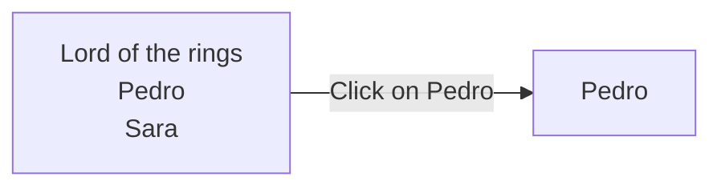
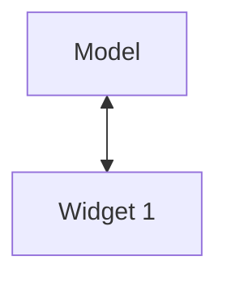
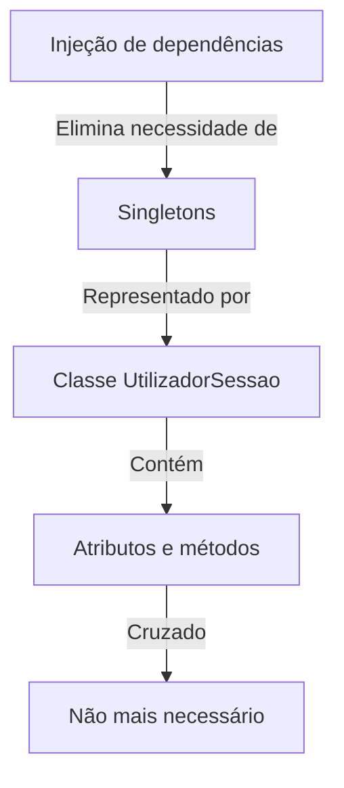

# Testes

Imagem gerada por AI


UNIT TESTS
---
# Testes em Flutter

- Testes unitários
  Testam uma "unidade" de forma isolada (função, classe)

- Testes de widget
  Testam um widget de forma isolada

- Testes de integração
  Testam a aplicação toda


---
# Testes em Flutter

|                      | Dependências                     | Precisa emulador? | Execução |
| -------------------- | -------------------------------- | ----------------- | -------- |
| Testes unitários     | nenhuma                          | não               | rápida   |
| Testes de widget     | flutter\_test                    | não               | rápida   |
| Testes de integração | flutter\_test, integration\_test | sim               | lenta    |


---
# Testes unitários em Flutter

```
controlador_ar_condicionado ~/projects/Lusofona/CM-
> .dart_tool
> .idea
  android [controlador_ar_condicionado_android]
> build
> integration_test
> lib
v test
    controlador_ac_test.dart
```


---
# Testes unitários em Flutter

```dart
void main() {
  test("construtor inicializa bem o valor", () {
    final controladorAC = ControladorAC(20);
    expect(controladorAC.temperatura, 20);
  });

  test("aumenta", () {
    final controladorAC = ControladorAC(20);

    controladorAC.aumenta();
    expect(controladorAC.temperatura, 21);
  });
}
```


---
# Testes unitários em Flutter

`test(String description, Function body)`

| Junit                                                   | Dart Unit Tests                                |
| ------------------------------------------------------- | ---------------------------------------------- |
| assertEquals(number, 1)<br/>assertEquals(text, "hello") | expect(number, 1)<br/>expect(text, 'hello')    |
| assertNull(obj)<br/>assertNotNull(obj)                  | expect(obj, isNull)<br/>expect(obj, isNotNull) |
| assertTrue(expr)<br/>assertFalse(expr)                  | expect(expr, isTrue)<br/>expect(expr, isFalse) |
| fail(message)                                           | fail(message)                                  |
| ...                                                     | ...                                            |


https://cms.invertase.io/wp-content/uploads/2023/03/cheat-sheet.png


---
# Agrupar testes

```cpp
void main() {
  group("grupo de testes", () {
    test("teste 1", () {
      ...
    });

    test("teste 2", () {
      ...
    });
  });
}
```


---
# Testes de widgets/integração

- Cria/executa widgets
  ```
  pumpWidget(MyWidget())
  ```

- Encontra widgets
  ```
  find.byType(ElevatedButton), ...
  ```

- Testar o "conteúdo" dos widgets
  ```
  tester.widget(...)
  ```

- Interagir com widgets
  ```
  tester.tap(...), ...
  ```


---
# Testes de widgets

Os testes de Widgets devem testar Widgets de forma isolada

Imaginando que quero testar o widget MyWidget

```dart
void main() {
  testWidgets('MyWidget has a title and message', (tester) async {
    await tester.pumpWidget(const MyWidget(title: 'Title', message: 'Msg'));
    final titleFinder = find.text('Title');
    final messageFinder = find.text('Msg');

    expect(titleFinder, findsOneWidget);
    expect(messageFinder, findsOneWidget);
  });
}
```


---
# Testes de widgets

Devem ser colocados na pasta test, tal como os testes unitários

```
v test
    controlador_ac_test.dart
    controlador_ac_widget.dart <-
```


---
# Testes de widget

Necessário acrescentar esta dependência no pubspec.yaml

```yaml
dev_dependencies:
  flutter_test:
    sdk: flutter
```


---
# Testes de integração

Testam a aplicação inteira ou partes da aplicação, executando-a num emulador e simulando interações

A programação é similar aos testes de widget

Necessário acrescentar estas dependências no pubspec.yaml

```yaml
dev_dependencies:
  flutter_test:
    sdk: flutter
  
  integration_test:
    sdk: flutter
```


---
# Testes de integração

Devem estar numa pasta própria, chamada integration_test

```
awesome_quotes_app ~/projects/Lusofona/CM
├── .dart_tool
├── .github
├── .idea
├── android [awesome_quotes_app_android]
├── build
├── integration_test
│   └── integration_test.dart ←
├── ios
└── lib
```

The arrow (←) in the diagram points to the `integration_test.dart` file within the `integration_test` folder, which is the focus of this instruction.


---
# Testes de widgets/integração

Como a programação é similar, os slides seguintes são válidos quer para testes de widget quer para testes de integração


---
# Testes de widgets/integração

```javascript
testWidgets('descrição', (tester) async {
  // Test code goes here.
});
```


---
# Testes de widgets/integração

## Encontrar widgets

Usa-se o objeto find (global), fornecido pela biblioteca de testes

```dart
Finder finder1 = find.text('Ola');

Finder finder2 = find.byType(ElevatedButton);

Finder finder3 = find.byKey(Key('widget-key'));
```


---
# Testes de widgets/integração

## Encontrar widgets

Usa-se o objeto find (global), fornecido pela biblioteca de testes

```dart
Finder finder1 = find.text('Ola');

Finder finder2 = find.byType(ElevatedButton);

Finder finder3 = find.byKey(Key('widget-key'));
```

Usar este método, sempre que possível


---
# Testes de widgets/integração

## Encontrar widgets

### código dos testes

```dart
Finder finderGravarBtn = find.byKey(Key('gravar-btn'));
```

### código do widget

```dart
@override
Widget build(BuildContext context) {
  return ElevatedButton(
    key: Key('gravar-btn'),
    onPressed: () {},
    child: Text('Gravar'),
  );
}
```

Nota: chave deve ser única!


---
# Testes de widgets/integração

## Encontrar widgets

```dart
Finder finder2 = find.byType(ElevatedButton);
```

O finder pode encontrar 0, 1 ou mais widgets que satisfaçam a condição.

Deve-se começar por verificar quantos widgets encontrou

```dart
expect(finder2, findsNothing);
expect(finder2, findsOneWidget);
expect(finder2, findsNWidgets(3));
```


---
# Testes de widgets/integração

## Testar o "conteúdo" dos widgets

```dart
Finder finderQuoteText = find.byKey('quote-text');

Text quoteText = tester.widget(finderQuoteText);

String? quote = quoteText.data;
expect(quote, isNotNull);
expect(quote, 'Texto da quote');
```

Permite obter o widget encontrado por este finder (assumindo que é único)


---
# Testes de widgets/integração

Testar o "conteúdo" dos widgets (avançado)

```dart
ElevatedButton(
  key: Key('like-btn'),
  onPressed: () {},
  child: Text('Like'),
)
```

Como testar que o botão com a chave 'like-btn' tem um filho com um certo texto?


---
# Testes de widgets/integração

## Testar o "conteúdo" dos widgets (avançado)

```dart
ElevatedButton(
  key: Key('like-btn'),
  onPressed: () {},
  label: Text('Like'),
)
```

Como testar que o botão com a chave 'like-btn' tem um filho com um certo texto?

```dart
final Finder buttonFinder = find.byKey(Key('like-btn'));
final Finder textInsideButtonFinder =
    find.descendant(of: buttonFinder, matching: find.byType(Text));
Text textInsideButton = tester.widget(textInsideButtonFinder);
expect(textInsideButton.data, "Like");
```


---
# Testes de widgets/integração

## Interagir com os widgets

```dart
Finder finderSaveBtn = find.byKey('save-btn');

await tester.tap(finderSaveBtn);

await tester.pump();
```

Temos que explicitamente dizer para "refrescar" o ecrã


---
# Testes de widgets/integração

## Interagir com os widgets

```dart
Finder finderSaveBtn = find.byKey('save-btn');

await tester.tap(finderSaveBtn);

await tester.pump();

await tester.pumpAndSettle(); // Se um evento gerar vários "refresh", podemos usar esta função
```

Se um evento gerar vários "refresh", podemos usar esta função


---
# Testes de widgets/integração

## Interagir com os widgets

```javascript
// enter username and password
await tester.enterText(find.byKey(Key('emailTextField')), email);
await tester.enterText(find.byKey(Key('passwordTextField')), password);
await tester.tap(find.byKey(Key('signInButton')));
```


---
# Testes de integração

Diferença importante entre testes de widget e testes de integração

```dart
void main() {
  IntegrationTestWidgetsFlutterBinding.ensureInitialized();

  testWidgets('Login and show list', (tester) async {
    // Test code goes here.
  });
}
```


---
# Na prática...

- Uma vez que os testes de widget conseguem testar qualquer widget, também podem testar a aplicação completa, pois ela está encapsulada num Widget (o famoso "MyApp")

- Como executam muito mais rápido, mais vale fazer os testes usando testes de widget

- Porque se usam então testes de integração?


---
# Testes de integração
## (mesmo assim são úteis)

- Pode ser difícil perceber o que está a correr mal num teste de Widget
(ex: diz que não encontra o Widget no ecrã mas achamos que ele está lá).
Nos testes de integração, conseguimos visualizar o que está a acontecer.

- Há coisas que não conseguimos testar com testes de widget (ex: acesso
a uma base de dados local, geo-localização, etc...)

- Temos mais garantias que a aplicação vai funcionar bem se a testarmos
num emulador (ou até em vários...)


---
# Injeção de dependências

The image depicts an illustrated scene in a modern office or laboratory setting. The main elements of the scene are:

1. A humanoid robot standing in the foreground
2. A person in business attire holding a large syringe labeled "Dependency Injection"
3. A computer workstation in the background
4. Green-tinted windows suggesting a high-tech environment

The scene appears to be a visual metaphor for the concept of dependency injection in software development, with the syringe representing the "injection" of dependencies into the robot (which could symbolize a software system or application).

Imagem gerada por AI 🤷


---
# Problema 1

Vários Widgets precisam de aceder ao mesmo modelo
(objeto com dados que contém estado da aplicação)

```mermaid
graph TD
    A[Modelo<br>(estado)] --> B[Widget 1]
    A --> C[Widget 2]
```


---
# Problema 1

Vários Widgets precisam de aceder ao mesmo modelo
(objeto com dados que contém estado da aplicação)

```mermaid
graph TD
    A[Modelo<br>(estado)] <--> B[Widget 1]
    A <--> C[Widget 2]
```

Em que casos é que isto é necessário?


---
# Problema 1

Vários Widgets precisam de aceder ao mesmo modelo
(objeto com dados que contém estado da aplicação)

- Lista de items e respetivo detalhe
- Formulário de registo e lista com registos
- Dashboard e lista de items
- ...


---
# Lista de items e respetivo detalhe




---
# Passar o modelo através do construtor

```
onTap: push(PersonagemDetailPage(personagens[0]))
```
(código simplificado)

List personagens                    Personagem personagem

[Image of a smartphone screen showing:
Lord of the rings
Pedro
Sara]

personagens[0]
→

[Image of a smartphone screen showing:
Pedro]


---
# Passar o modelo através do construtor
(alternativa)

```
onTap: push(PersonagemDetailPage(personagens[0].id))
```
(código simplificado)

## List personagens vs Personagem personagem

| !Smartphone showing a list with 'Lord of the rings' at the top and two names 'Pedro' and 'Sara' | !Smartphone showing a detail page with 'Pedro' displayed |
| --------------------------------------------------------------------------------------------------- | ------------------------------------------------------------ |


Uma seta azul conecta os dois smartphones, indicando `personagens[0].id` sendo passado da lista para a página de detalhes.

Uma seta vermelha curva aponta para o smartphone da direita com o texto:

"vai ao servidor/BD buscar os dados do personagem com esse id"


---
# Lista de items e respetivo detalhe

Duas opções:

- Passar ao construtor da página de detalhe o objeto completo

- Passar ao construtor da página de detalhe o id do objeto e obter os dados a partir desse id


---
# Formulário e lista

## Registo de Incidentes

Selecionar parque

Gravidade 1 a 5

Data e hora: 31/12/2024 23:59

Notas

[Submeter]

## Lista de Parques

S. Domingos
14 / 88
06/03/2024 14:59

Cidade de Coimbra
06/03/2024 04:59

Avenida da Palma - Olhão
06/03/2024 04:59

Parque Vila Maria
06/03/2024 14:59

Estrada da Luz
06/03/2024 04:59

Campo Grande
18 / 88
06/03/2024 16:59

EDC Sul, Inf. S. Henrique
06/03/2024 04:59

Parque da Cidade
06/03/2024 04:59

## Campo Grande

Parque:

Campo Grande
18/88
06/03/2024 16:59
Superficie

Incidentes:

06/03/2024 17:19


---
# Formulário e lista

Não dá para passar o modelo através do construtor
(o widget da lista já foi construído e "vive" na bottom bar)

## Incidente incidente                            List incidentes

![Smartphone screen showing Registro de Incidentes form]

![Smartphone screen showing Lista de Parques]

![Smartphone screen showing Campo Grande details]


---
# Singleton

```mermaid
graph LR
    A[Incidente incidente] --> B[List incidentes<br>(singleton)]
    B --> C[List incidentes]
```

Nota: A lista de incidentes tem que estar associada a um parque

## Incidente incidente

| !Smartphone screen showing 'Registro de Incidentes' form Registro de Incidentes<br/>Selecionar parque ▼<br/>Gravidade: 1 a 3 ▼<br/>Data e Hora: 31/12/2024 23:59<br/>Notas:<br/>\[Submeter] |
| ----------------------------------------------------------------------------------------------------------------------------------------------------------------------------------------------- |


## List incidentes

| !Smartphone screen showing 'Lista de Parques' Lista de Parques<br/>S Domingos<br/>Parque do Covelo<br/>Avenida de Palma - Olivais<br/>Parque Vila Maria<br/>Jardim da Luz<br/>Campo Grande<br/>EDC Art. Inf. S. Henrique<br/>Parque da Graça |
| ------------------------------------------------------------------------------------------------------------------------------------------------------------------------------------------------------------------------------------------------ |


## List incidentes

| !Smartphone screen showing 'Campo Grande' park details ← Campo Grande<br/>Parque:<br/>Campo Grande<br/>16:59<br/>06/03/2024 16:59<br/>Superfície<br/>Incidentes<br/>06/03/2024 17:15 |
| ---------------------------------------------------------------------------------------------------------------------------------------------------------------------------------------- |


---
# Singleton

Um objeto que representa uma instância única em toda a aplicação


---
# Exercício

```java
// representa o utilizador autenticado
class UtilizadorSessao {
    String _nome;
    
    UtilizadorSessao(this._nome);
    
    String get nome => _nome;
    set nome(String value) => _nome = value;
}
```

É possível criar um singleton a partir desta classe?


---
# Resolução

```java
// representa o utilizador autenticado
class UtilizadorSessao {
    String _nome;
    
    UtilizadorSessao(this._nome);
    
    String get nome => _nome;
    set nome(String value) => _nome = value;
}
```

É possível criar um singleton a partir desta classe?

Não! Consegui criar várias instâncias da classe UtilizadorSessao

```java
void main() {
    final utilizador1 = UtilizadorSessao('Pedro');
    final utilizador2 = UtilizadorSessao('Cris');
}
```


---
# Tornar o construtor privado

```java
// representa o utilizador autenticado
class UtilizadorSessao {

  String _nome;

  UtilizadorSessao._(this._nome);

  String get nome => _nome;
  set nome(String value) => _nome = value;
}
```

Erro de compilação a instanciar:

```java
final utilizador1 = UtilizadorSessao('Pedro');
final utilizador2 = UtilizadorSessao('Cris');
```


---
# Tornar o objeto acessível a todos

```java
// representa o utilizador autenticado
class UtilizadorSessao {

    String? _nome;

    UtilizadorSessao._(); // Objeto passa a ser criado "vazio"

    String? get nome => _nome;
    set nome(String? value) => _nome = value;

    // única instância
    static final UtilizadorSessao _instance = UtilizadorSessao._(); // guardar a única instância numa variável static (global)

    // Getter para aceder à instância
    static UtilizadorSessao get instance => _instance;
}

UtilizadorSessao.instance.nome = 'Pedro';
```


---
# Widget instancia Model

Se o model é apenas usado por um widget então ele pode instanciá-lo



```cpp
class Widget1 {
    Model _model = Model(...);
    ...
}
```


---
# Widget instancia Model

Se o model é apenas usado por um widget então ele pode instanciá-lo


```
class Widget1 {
    Model _model = Model(...);
    ...
}
```

Mas esta solução acarreta potenciais problemas


---
# Controlador AC

```mermaid
graph LR
    A[MyApp] --> B[ControladorACPage]
    B --> C[ControladorAC]
    
    subgraph A[MyApp]
        A1[build(...)]
    end
    
    subgraph B[ControladorACPage]
        B1[_controladorAC<br/>(inicializado a 25 graus)]
    end
    
    subgraph C[ControladorAC]
        C1[temperatura]
        C2[aumenta()]
        C3[diminui()]
    end
```

_controladorAC = ControladorAC(25)


---
# Controlador AC

```mermaid
graph TD
    A[main.dart] -->|runApp(...)| B[MyApp]
    B -->|build(...)| C[ControladorACPage]
    C -->|_controladorAC| D[ControladorAC]
    E[integration_test.dart] -->|pumpWidget(...)| B
    C -.->|_controladorAC = ControladorAC(25)| D
    
    A[main.dart]
    A --> |• runApp(...)|B
    
    E[integration_test.dart]
    E --> |• pumpWidget(...)|B
    
    B[MyApp]
    B --> |• build(...)|C
    
    C[ControladorACPage]
    C --> |• _controladorAC<br>(inicializado a 25 graus)|D
    
    D[ControladorAC]
    D --> |• temperatura<br>• aumenta()<br>• diminui()|D
```

Os meus testes vão assumir que o Controlador é inicializado a 25° (e se mudar?)


---
# Controlador AC

```mermaid
graph LR
    A[main.dart] -->|runApp(...)| B[MyApp]
    B -->|build(...)| C[ControladorACPage]
    C --> D[ControladorAC]
    E[integration_test.dart] -->|pumpWidget(...)| B
    C -.->|_controladorAC = obtemControlador()| F[Injeção de dependências]

    A[main.dart]
    A --> |• runApp(...)|B

    E[integration_test.dart]
    E --> |• pumpWidget(...)|B

    B[MyApp]
    B --> |• build(...)|C

    C[ControladorACPage]
    C --> |• _controladorAC<br>(inicializado a 25 graus)|D

    D[ControladorAC]
    D --> |• temperatura<br>• aumenta()<br>• diminui()|D
```


---
# Controlador AC

controladorAC = ControladorAC(20)

```mermaid
graph TD
    A[main.dart] -->|runApp(...)| B[MyApp]
    B -->|build(...)| C[ControladorACPage]
    C --> D[ControladorAC]
    E[integration_test.dart] -->|pumpWidget(...)| B
    F[controladorAC = ControladorAC(20)] -.-> C
    G[_controladorAC = obtemControlador()] -.-> C

    A[main.dart]
    A --> |• runApp(...)|B
    
    E[integration_test.dart]
    E --> |• pumpWidget(...)|B
    
    B[MyApp]
    B --> |• build(...)|C
    
    C[ControladorACPage]
    C --> |• _controladorAC<br>~~(inicializado a 25 graus)~~|D
    
    D[ControladorAC]
    D --> |• temperatura|D
    D --> |• aumenta()|D
    D --> |• diminui()|D
```

_controladorAC = obtemControlador()


---
# Controlador AC

```mermaid
graph TD
    A[main.dart] -->|runApp(...)| B[MyApp]
    B -->|build(...)| C[ControladorACPage]
    C --> D[ControladorAC]
    E[integration_test.dart] -->|pumpWidget(...)| B
    F[controladorAC = ControladorAC(20)] -.-> C
    G[_controladorAC = ControladorAC(25)] -.-> C
    H[_controladorAC = obtemControlador()] -.-> C

    A[main.dart]
    A --> |runApp(...)| B

    E[integration_test.dart]
    E --> |pumpWidget(...)| B

    B[MyApp]
    B --> |build(...)| C

    C[ControladorACPage]
    C --> |_controladorAC| D

    D[ControladorAC]
    D --> |temperatura| D
    D --> |aumenta()| D
    D --> |diminui()| D

    style A fill:#98FB98
    style B fill:#FFA500
    style C fill:#FFA500
    style D fill:#FFA500
    style E fill:#87CEFA
```

`controladorAC = ControladorAC(20)`

main.dart
- runApp(...)

MyApp
- build(...)

ControladorACPage
- _controladorAC
~~(inicializado a 25 graus)~~

ControladorAC
- temperatura
- aumenta()
- diminui()

integration_test.dart
- pumpWidget(...)

`_controladorAC = ControladorAC(25)`

`_controladorAC = obtemControlador()`


---
# Injeção de dependências

objetoA depende de objetoB para fazer alguma coisa
(ex: ControladorACPage depende do ControladorAC)

Tradicional:
objetoA instancia objetoB 👎

Injeção de dependências:
objetoA recebe objetoB 👍


---
# Injeção de dependências

Com injeção de dependências, deixamos de precisar de singletons



O código da classe `UtilizadorSessao`, que anteriormente implementava o padrão Singleton, é mostrado cruzado para indicar que não é mais necessário com a injeção de dependências:

```java
// representa o utilizador autenticado
class UtilizadorSessao {

    String? _nome;

    UtilizadorSessao._();

    String? get nome => _nome;
    set nome(String? value) => _nome = value;

    // única instância
    static final UtilizadorSessao _instance = UtilizadorSessao._();

    // Getter para aceder à instância
    static UtilizadorSessao get instance => _instance;
}
```


---
# Injeção de dependências

Basta uma classe simples

```dart
// representa o utilizador autenticado
class UtilizadorSessao {
    String? _nome;

    UtilizadorSessao();

    String? get nome => _nome;
    set nome(String? value) => _nome = value;
}
```

Instanciá-la no main e injetá-la

```dart
void main() {
  UtilizadorSessao utilizadorSessao = UtilizadorSessao();
  runApp(MultiProvider(
    providers: [ Provider.value(value: utilizadorSessao) ],
    child: MyApp(),
  ));
}
```


---
# Material de apoio

Foram publicados vídeos sobre isto:

- Desenvolvimentos com widgets em flutter (parte 5)
  Testes de integração + injeção de dependências

- Desenvolvimentos com widgets em flutter (parte 6)
  Padrão Observer/Observable

- Navegação em flutter (parte 2)
  Melhorar a navegação com Observer/Observable

<div style="background-color: #d9534f; color: white; padding: 10px; margin-top: 20px;">
Nota: O projeto vai precisar disto
</div>


---
# Exercícios

"If you can't explain it simply, you don't understand it well enough."

— Einstein (*)

(*) Nunca foi oficialmente confirmado que Einstein disse isto


---
# Exercício 1

Explica a diferença entre testes unitários, testes de widget e testes de integração de forma que uma criança de 5 anos entenda

(Dica: Usa analogias. Ex: "Imagina que tens várias gomas de diferentes côres...")

Coloca a resposta no slido


---
# Exercício 1 - possível resposta

Imagina que queres montar uma casa de legos.

Os testes unitários são para testar cada peça do lego separadamente (a porta abre e fecha?)

Os testes de widget são para testar divisões da casa (a sala tem um sofá e uma televisão?)

Os testes de integração são para testar a casa toda (dá para entrar pela porta, ir até ao sofá e sentar-se nele a ver televisão?)


---
# Exercício 2

Explica o conceito de injeção de dependências de forma que uma criança de 5 anos entenda

Coloca a resposta no slido


---
# Exercício 2 - possível resposta

Imagina que tens um carro telecomandado que precisa de pilhas.

És tu que colocas as pilhas no carro, não é ele que fabrica as pilhas.

Porque é que isso é bom? Porque podes facilmente trocar as pilhas, usar diferentes tipos de pilha, etc..

[A imagem mostra um carro de brinquedo telecomandado de corrida, em preto e verde, junto com quatro pilhas AA.]

