# Conectividade

Conectividade permite a transmissão/recepção de dados entre dispositivos

## Curta-distância

[Image shows a highway with an electronic toll collection system overhead. Cars are passing underneath the gantry which contains sensors and equipment for automatic toll collection.]

## Longa-distância

[Image depicts a person using a mobile phone in a public setting, surrounded by other people. This illustrates long-distance communication capabilities.]


---
# Conectividade

Computação móvel implica conectividade sem fios (wireless)


---
# Redes sem fios

Ondas eletromagnéticas substituem os fios

RF (Rádio-frequência) - 3kHz - 300 GHz
IR (Infravermelhos) - 3 THz - 430 THz


---
# Comunicação wireless

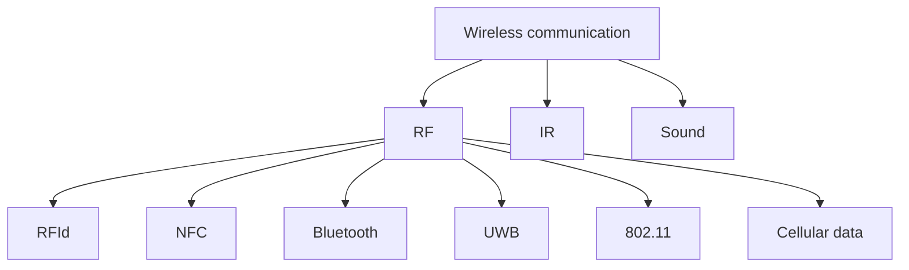


---
# Comunicação wireless

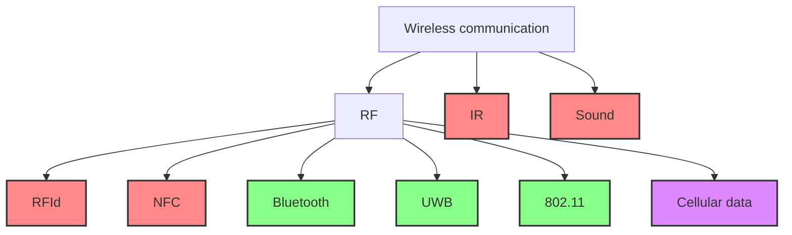

| Cor | Significado |
|-----|-------------|
| <span style="color: #f88;">■</span> | Curta distância (máx: alguns metros) |
| <span style="color: #8f8;">■</span> | Média distância (30-300 metros) |
| <span style="color: #d8f;">■</span> | Longa distância |


---
# Comunicação curta-distância

- RFID
  - Normalmente utilizado para identificar objectos, aos quais é "colada" uma tag com informação. As tags podem atuar de forma passiva (i.e., sem fonte de energia, mais comum) ou de forma activa (i.e., com fonte de energia). Está lentamente a substuir os códigos de barras nas cadeias de retalho, logística, etc..

[Image of a roll of RFID tags]

[Image of a cardboard box with barcode and RFID tag]


---
# Comunicação curta-distância

## NFC

- Near-field Communication - Utiliza a mesma tecnologia que o RFID mas o emissor e o receptor têm que estar muito próximos (alguns centímetros), aumentando a segurança das comunicações.

[Two images side by side: 
Left image shows a hand holding a smartphone with a green screen over a payment terminal.
Right image shows a hand holding a contactless card near a yellow payment terminal in a public transport setting.]


---
# Comunicação curta-distância

- IrDA
  - Apenas suporta comunicação direccional Line-of-Sight (sem obstáculos), quer o emissor quer o recetor têm que ser ativos

[An image of a black remote control with various buttons is shown here]


---
# Comunicação curta-distância

- Ultra-sound
  - Audio QR é uma tecnologia da Google que permite fazer transferências de dinheiro entre 2 telemóveis através de ultra-sons

[Two smartphone devices displaying a blue interface with circular buttons]


---
# Comunicação média-distância

- Bluetooth
  - Comunicação entre dispositivos próximos (802.15.1)
    - 1.0: 1 Mbps (< 10m)
    - 2.0 + EDR: 3 Mbps (< 30m)
    - 4.0 (BLE): 1 Mbps (< 60m, menor consumo)
    - 5.0 (BLE): 2 Mbps (< 240m, menor consumo)


---
# Comunicação média-distância

- UWB
  - Opera em frequências muito elevadas e é utilizado para localizar dispositivos com grande precisão.

![Image showing a set of keys with a black tag on grass next to a smartphone displaying a map interface for SmartThings Find]


---
# Comunicação curta e média

|                            | RFID             | NFC                        | IrDA                      | Bluetooth                     | UWB                            |
| -------------------------- | ---------------- | -------------------------- | ------------------------- | ----------------------------- | ------------------------------ |
| Transmissão                | 424 Kb/s         | 424 Kb/s                   | 1.2 Kb/s                  | 24 Mb/s                       | 100 Mb/s                       |
| Alcance                    | < 12 m (passivo) | < 10 cm                    | < 5 m<br/>(Line-of-Sight) | < 60 m / 240 m                | < 100 m                        |
| Segurança                  | fraca            | elevada                    | fraca                     | elevada (com<br/>encriptação) | elevada                        |
| Custo                      | baixo            | alto                       | baixo                     | médio                         | médio                          |
| Suporte em<br/>smartphones | N/A              | iPhone, alguns<br/>Android | Apenas alguns<br/>Android | Todos (\*)                    | iPhone 11+,<br/>alguns Android |


(*) Todos suportam Bluetooth, no entanto apenas alguns suportam as versões 4 e 5 (BLE)


---
# Comunicação curta e média

|                            | RFID             | NFC                        | IrDA                      | Bluetooth                     | UWB                                   |
| -------------------------- | ---------------- | -------------------------- | ------------------------- | ----------------------------- | ------------------------------------- |
| Transmissão                | 424 Kb/s         | 424 Kb/s                   | 1.2 Kb/s                  | 24 Mb/s                       | 100 Mb/s                              |
| Alcance                    | < 12 m (passivo) | < 10 cm                    | < 5 m<br/>(Line-of-Sight) | < 60 m / 240 m                | < 100 m                               |
| Segurança                  | fraca            | elevada                    | fraca                     | elevada (com<br/>encriptação) | elevada                               |
| Custo                      | baixo            | alto                       | baixo                     | médio                         | médio                                 |
| Suporte em<br/>smartphones | N/A              | iPhone, alguns<br/>Android | Apenas alguns<br/>Android | Todos (\*)                    | iPhone 11+ (\*\*),<br/>alguns Android |
| Casos de uso               | ???              | ???                        | ???                       | ???                           | ???                                   |


(*) Todos suportam Bluetooth, no entanto apenas alguns suportam as versões 4 e 5 (BLE)

(**) Não acessível a programadores


---
# Comunicação curta e média

|                        | RFID                      | NFC                    | IrDA                  | Bluetooth                 | UWB                               |
| ---------------------- | ------------------------- | ---------------------- | --------------------- | ------------------------- | --------------------------------- |
| Transmissão            | 424 Kb/s                  | 424 Kb/s               | 1.2 Kb/s              | 24 Mb/s                   | 100 Mb/s                          |
| Alcance                | < 12 m (passivo)          | < 10 cm                | < 5 m (Line-of-Sight) | < 60 m / 240 m            | < 100 m                           |
| Segurança              | fraca                     | elevada                | fraca                 | elevada (com encriptação) | elevada                           |
| Custo                  | baixo                     | alto                   | baixo                 | médio                     | médio                             |
| Suporte em smartphones | N/A                       | iPhone, alguns Android | Apenas alguns Android | Todos (\*)                | iPhone 11+ (\*\*), alguns Android |
| Casos de uso           | Identificação de produtos | ???                    | ???                   | ???                       | ???                               |


(*) Todos suportam Bluetooth, no entanto apenas alguns suportam as versões 4 e 5 (BLE)

(**) Não acessível a programadores


---
# Comunicação curta e média

|                            | RFID                          | NFC                                       | IrDA                      | Bluetooth                     | UWB                                   |
| -------------------------- | ----------------------------- | ----------------------------------------- | ------------------------- | ----------------------------- | ------------------------------------- |
| Transmissão                | 424 Kb/s                      | 424 Kb/s                                  | 1.2 Kb/s                  | 24 Mb/s                       | 100 Mb/s                              |
| Alcance                    | < 12 m (passivo)              | < 10 cm                                   | < 5 m<br/>(Line-of-Sight) | < 60 m / 240 m                | < 100 m                               |
| Segurança                  | fraca                         | elevada                                   | fraca                     | elevada (com<br/>encriptação) | elevada                               |
| Custo                      | baixo                         | alto                                      | baixo                     | médio                         | médio                                 |
| Suporte em<br/>smartphones | N/A                           | iPhone, alguns<br/>Android                | Apenas alguns<br/>Android | Todos (\*)                    | iPhone 11+ (\*\*),<br/>alguns Android |
| Casos de uso               | Identificação de<br/>produtos | Identificação<br/>segura /<br/>pagamentos | ???                       | ???                           | ???                                   |


(*) Todos suportam Bluetooth, no entanto apenas alguns suportam as versões 4 e 5 (BLE)

(**) Não acessível a programadores


---
# Comunicação curta e média

|                            | RFID                          | NFC                                       | IrDA                      | Bluetooth                     | UWB                                   |
| -------------------------- | ----------------------------- | ----------------------------------------- | ------------------------- | ----------------------------- | ------------------------------------- |
| Transmissão                | 424 Kb/s                      | 424 Kb/s                                  | 1.2 Kb/s                  | 24 Mb/s                       | 100 Mb/s                              |
| Alcance                    | < 12 m (passivo)              | < 10 cm                                   | < 5 m<br/>(Line-of-Sight) | < 60 m / 240 m                | < 100 m                               |
| Segurança                  | fraca                         | elevada                                   | fraca                     | elevada (com<br/>encriptação) | elevada                               |
| Custo                      | baixo                         | alto                                      | baixo                     | médio                         | médio                                 |
| Suporte em<br/>smartphones | N/A                           | iPhone, alguns<br/>Android                | Apenas alguns<br/>Android | Todos (\*)                    | iPhone 11+ (\*\*),<br/>alguns Android |
| Casos de uso               | Identificação de<br/>produtos | Identificação<br/>segura /<br/>pagamentos | Controlo de<br/>aparelhos | ???                           | ???                                   |


(*) Todos suportam Bluetooth, no entanto apenas alguns suportam as versões 4 e 5 (BLE)

(**) Não acessível a programadores


---
# Comunicação curta e média

|                            | RFID                          | NFC                                       | IrDA                      | Bluetooth                     | UWB                                   |
| -------------------------- | ----------------------------- | ----------------------------------------- | ------------------------- | ----------------------------- | ------------------------------------- |
| Transmissão                | 424 Kb/s                      | 424 Kb/s                                  | 1.2 Kb/s                  | 24 Mb/s                       | 100 Mb/s                              |
| Alcance                    | < 12 m (passivo)              | < 10 cm                                   | < 5 m<br/>(Line-of-Sight) | < 60 m / 240 m                | < 100 m                               |
| Segurança                  | fraca                         | elevada                                   | fraca                     | elevada (com<br/>encriptação) | elevada                               |
| Custo                      | baixo                         | alto                                      | baixo                     | médio                         | médio                                 |
| Suporte em<br/>smartphones | N/A                           | iPhone, alguns<br/>Android                | Apenas alguns<br/>Android | Todos (\*)                    | iPhone 11+ (\*\*),<br/>alguns Android |
| Casos de uso               | Identificação de<br/>produtos | Identificação<br/>segura /<br/>pagamentos | Controlo de<br/>aparelhos | Comunicação<br/>de dados      | ???                                   |


(*) Todos suportam Bluetooth, no entanto apenas alguns suportam as versões 4 e 5 (BLE)

(**) Não acessível a programadores


---
# Comunicação curta e média

|                            | RFID                          | NFC                                       | IrDA                      | Bluetooth                     | UWB                                   |
| -------------------------- | ----------------------------- | ----------------------------------------- | ------------------------- | ----------------------------- | ------------------------------------- |
| Transmissão                | 424 Kb/s                      | 424 Kb/s                                  | 1.2 Kb/s                  | 24 Mb/s                       | 100 Mb/s                              |
| Alcance                    | < 12 m (passivo)              | < 10 cm                                   | < 5 m<br/>(Line-of-Sight) | < 60 m / 240 m                | < 100 m                               |
| Segurança                  | fraca                         | elevada                                   | fraca                     | elevada (com<br/>encriptação) | elevada                               |
| Custo                      | baixo                         | alto                                      | baixo                     | médio                         | médio                                 |
| Suporte em<br/>smartphones | N/A                           | iPhone, alguns<br/>Android                | Apenas alguns<br/>Android | Todos (\*)                    | iPhone 11+ (\*\*),<br/>alguns Android |
| Casos de uso               | Identificação de<br/>produtos | Identificação<br/>segura /<br/>pagamentos | Controlo de<br/>aparelhos | Comunicação<br/>de dados      | Localização de<br/>dispositivos       |


(*) Todos suportam Bluetooth, no entanto apenas alguns suportam as versões 4 e 5 (BLE)

(**) Não acessível a programadores


---
# Comunicação média-distância

## 802.11 (Wifi)

- 802.11ax: 10 Gbps (<300m)
- 802.11ac: 1 Gbps (<300m)
- 802.11n: 600 Mbps (<250m)
- 802.11a/g: 54 Mbps (<70m)
- 802.11b: 11 Mbps (<35m)


---
# Comunicação longa-distância

## Redes celulares

- 5G: > 1Gbps
- 4G (LTE): 100-300 Mbps (na prática < 40 Mbps)
- 3G enhanced: 4 Mbps
- 3G: 384 Kbps
- 2G: 56 Kbps


---
# Veículos autónomos

76 milhões de veículos autónomos até 2035

Cada um transmitirá 4 Tb / dia

[A imagem mostra uma estrada com vários veículos em movimento. Cada veículo é cercado por um círculo azul representando a transmissão de dados ou comunicação entre veículos. Esta visualização ilustra o conceito de veículos autônomos conectados.]


---
# Veículos autónomos

Estes 4 veículos terão que comunicar quantidades massivas de informação entre eles com uma latência máxima de 10ms

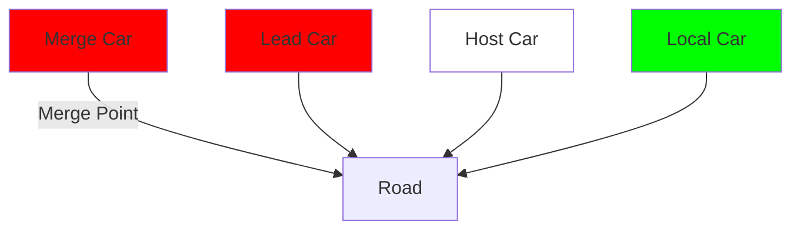

A imagem mostra uma representação esquemática de uma situação de tráfego envolvendo quatro veículos autônomos em uma estrada. Os veículos são representados por retângulos coloridos:

1. "Merge Car" (vermelho) - entrando na via principal
2. "Lead Car" (vermelho) - à frente na via principal
3. "Host Car" (branco) - no meio da via principal
4. "Local Car" (verde) - atrás na via principal

A estrada é representada por linhas cinza com faixas amarelas. O ponto de fusão onde o "Merge Car" se junta à via principal está indicado.

Esta ilustração demonstra o cenário em que os veículos autônomos precisam se comunicar entre si para coordenar seus movimentos de forma segura e eficiente.


---
# Veículos autónomos

|                | VEHICLE-BASED SENSORS | 802.11P                                         | LTE-V               | 5G Ad Hoc\*                             |
| -------------- | --------------------- | ----------------------------------------------- | ------------------- | --------------------------------------- |
| Range          | 10s of meters         | 100s of meters                                  | Cellular + sidelink | Cellular + 5 hops                       |
| Frequency Band | N/A                   | 5.9 GHz                                         | 700, 1800, 2600     | Tbc                                     |
| Bandwidth      | N/A                   | 30 MHz (in the EU)                              | 20 MHz              | < 100 MHz                               |
| Maturity       | Available             | SAE J2735: BSM<br/>IEEE 1609.X<br/>IEEE 802.11p | 2019                | Starting 2020<br/>General adoption 2025 |


## SERVICES

| Self-parking       | Yes     | N/A                              | N/A                              | N/A                             |
| ------------------ | ------- | -------------------------------- | -------------------------------- | ------------------------------- |
| Emergency Braking  | Yes     | Yes                              | Yes                              | Yes                             |
| Lane Merging       | No      | No                               | No                               | Yes                             |
| Assisted Driving   | Limited | Same                             | Same                             | Yes                             |
| Autonomous Driving | Limited | Limited 100 ms<br/>90% reception | Limited 100 ms<br/>90% reception | 1 ms 99.999%<br/>hard real-time |


https://www-file.huawei.com/-/media/corporate/pdf/x-lab/09-communications-networks-for-connected-cars.pdf?la=en-za
---
# offline vs online

Um dispositivo pode ter que operar em offline (desconectado da rede) por várias razões


---
# offline vs online

Um dispositivo pode ter que operar em offline (desconectado da rede) por várias razões

## Esperadas:
- Custos de comunicação
- Poupança de energia
- Privacidade

## Inesperadas:
- Interrupções de rede
- Congestão
- Falhas no servidor


---
# Exercício

Coloquem o vosso telemóvel em modo vôo e entrem em algumas aplicações.

Descubram:
- Uma app que não funcione em offline
- Uma app que funcione em offline

Mostrem ao colega do lado


---
# Deteção do estado da rede

Para trabalhar em offline, devemos usar duas abordagens:

- Interrogar o estado da rede no momento em que vamos comunicar com o servidor.
  Por exemplo: caso esteja indisponível, recorrer à BD.


---
# Deteção do estado da rede

Para trabalhar em offline, devemos usar duas abordagens:

- **Interrogar o estado da rede** no momento em que vamos comunicar com o servidor.
  Por exemplo: caso esteja indisponível, recorrer à BD.

- **Observar o estado da rede** para aproveitar esse momento para retomar comunicações com o servidor
  Por exemplo: enviar operações que fizemos apenas localmente na BD (operações pendentes)


---
# Deteção do estado da rede

## Flutter

Interrogar o estado da rede

```dart
final connectivity = await (Connectivity().checkConnectivity());
if (connectivity == ConnectivityResult.mobile ||
    connectivity == ConnectivityResult.wifi) {
  // do something remote
}
```

Nota: necessita da biblioteca connectivity_plus


---
# Deteção do estado da rede

## Flutter

Ser avisado de mudanças no estado da rede

```dart
Connectivity().onConnectivityChanged.listen((ConnectivityResult result) {
  debugPrint('Estado da rede mudou');
  if (result == ConnectivityResult.wifi ||
      result == ConnectivityResult.mobile) {
    // ...
  }
});
```

Nota: necessita da biblioteca connectivity_plus


---
# Deteção do estado da rede

## Importante:

Ter wifi não significa necessariamente que se consegue aceder à Internet

Continua a ser necessário verificar resultados das ligações remotas, timeouts, etc...


---
# offline vs online

Para poder operar em offline, o dispositivo tem que se preparar enquanto está online

Idealmente, o utilizador nem se apercebe que está offline!


---
# Replicação

Consiste em replicar parte ou a totalidade da informação em cada dispositivo

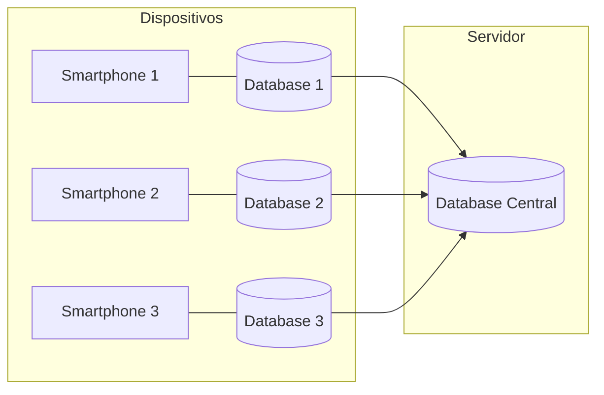

Dispositivo 1:
- Manuel
- João
- Sara
- Cristina
- António
- ...

Dispositivo 2:
- Sara
- Cristina

Dispositivo 3:
- Manuel
- João

Servidor:
- Manuel
- João
- Sara
- Cristina
- António
- ...


---
# Replicação

Consiste em replicar parte ou a totalidade da informação em cada dispositivo

Utilizado para melhorar:
- Desempenho (mais rápido aceder a dados locais)
- Disponibilidade (mesmo que o servidor esteja em baixo é possível aceder aos dados)


---
# Replicação

## Dois tipos de réplica

- **Réplica permanente** - o sistema mantém ativamente a réplica, normalmente numa BD
- **Cache** - réplica é criada e destruída quando necessário. Normalmente é uma réplica parcial e reside em memória


---
# Replicação

Pre-fetching


---
# Replicação

## Pre-fetching

Consiste em popular a cache/réplica antes de ser necessário. Exemplo: pré-carregar os últimos 10 posts do facebook, no momento em que se abre a aplicação.


---
# Replicação

## Pre-fetching

Consiste em popular a cache/réplica antes de ser necessário. Exemplo: pré-carregar os últimos 10 posts do facebook, no momento em que se abre a aplicação.

É difícil perceber que dados devemos pré-carregar. Decisão pode ser:
- do utilizador (decide que quer pré-carregar 5 notícias no seu news reader)
- ou automática (a aplicação analisa a história de acessos)

O pre-fetching tem que ser feito em online.


---
# Cenário de utilização (leitura com cache)

1 - App pretende atualizar o model com uma lista de 5 notícias

[A long vertical blue arrow points downward from this text]


---
# Cenário de utilização (leitura com cache)


---
# Cenário de utilização (leitura com cache)

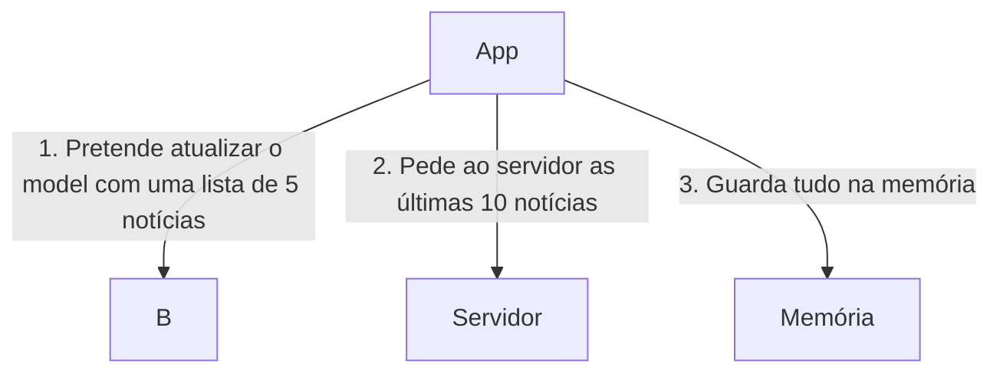

1. App pretende atualizar o model com uma lista de 5 notícias
2. Pede ao servidor as últimas 10 notícias
3. Guarda tudo na memória


---
# Cenário de utilização (leitura com cache)

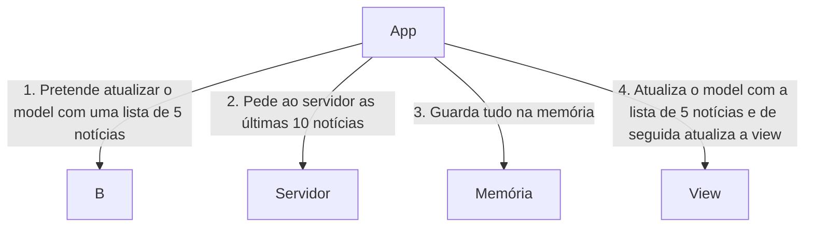

1. App pretende atualizar o model com uma lista de 5 notícias
2. Pede ao servidor as últimas 10 notícias
3. Guarda tudo na memória
4. App atualiza o model com a lista de 5 notícias e de seguida atualiza a view


---
# Cenário de utilização (leitura com cache)

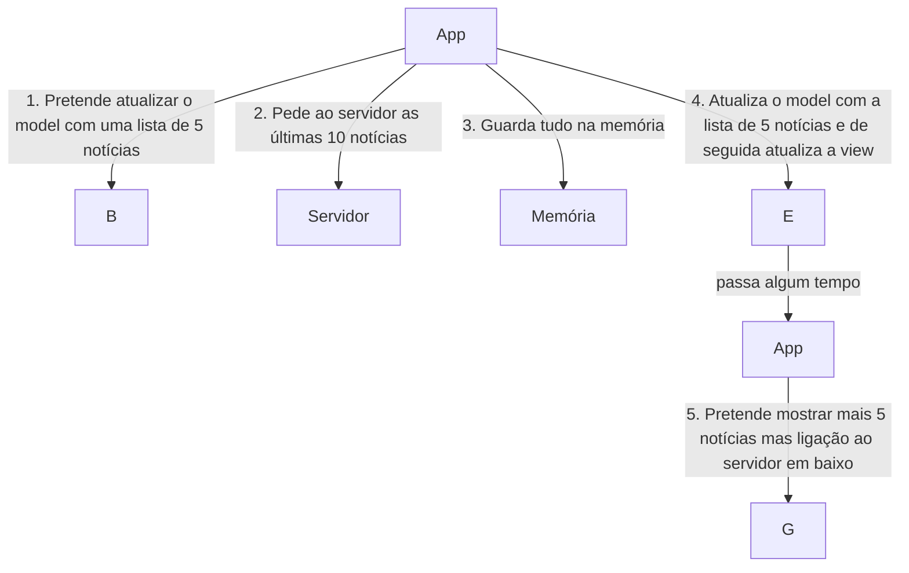

1. App pretende atualizar o model com uma lista de 5 notícias
2. Pede ao servidor as últimas 10 notícias
3. Guarda tudo na memória
4. App atualiza o model com a lista de 5 notícias e de seguida atualiza a view
   (passa algum tempo)
5. App pretende mostrar mais 5 notícias mas ligação ao servidor em baixo


---
# Cenário de utilização (leitura com cache)

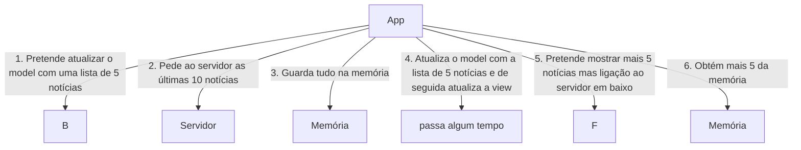

1. App pretende atualizar o model com uma lista de 5 notícias
2. Pede ao servidor as últimas 10 notícias
3. Guarda tudo na memória
4. App atualiza o model com a lista de 5 notícias e de seguida atualiza a view
   (passa algum tempo)
5. App pretende mostrar mais 5 notícias mas ligação ao servidor em baixo
6. Obtém mais 5 da memória


---
# Cenário de utilização (leitura com cache)

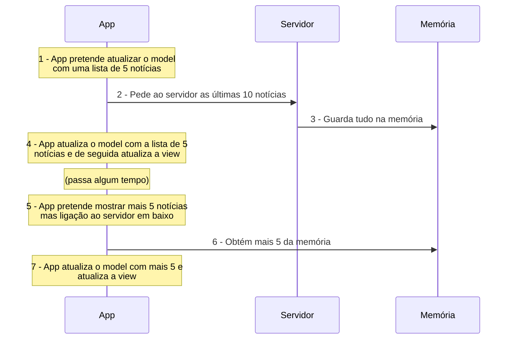


---
# Cenário de utilização (leitura com réplica permanente)

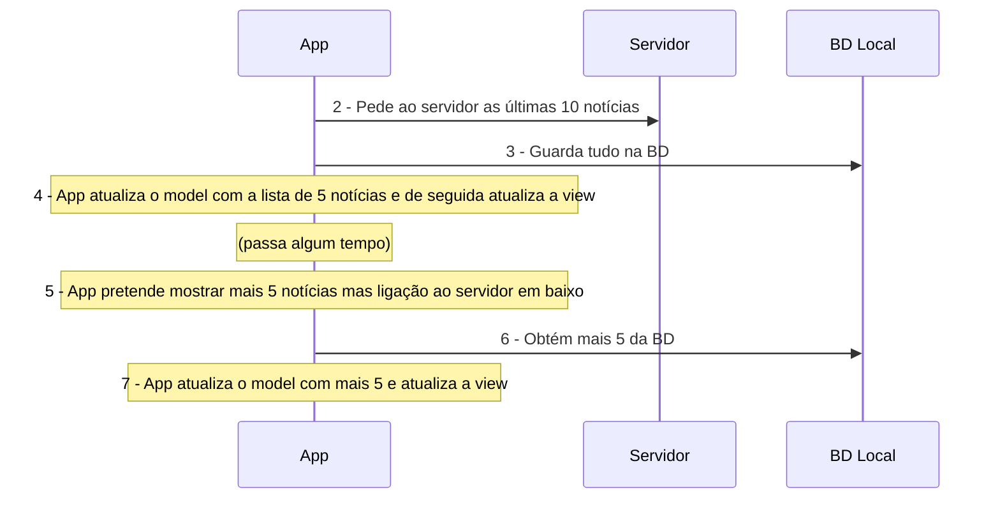

1. App pretende atualizar o model com uma lista de 5 notícias
2. Pede ao servidor as últimas 10 notícias
3. Guarda tudo na BD
4. App atualiza o model com a lista de 5 notícias e de seguida atualiza a view
5. App pretende mostrar mais 5 notícias mas ligação ao servidor em baixo
6. Obtém mais 5 da BD
7. App atualiza o model com mais 5 e atualiza a view


---
# News Feed

! You can still post while offline.
8 hours ago

"I'm not an activist; I don't look for controversy. I'm not a political person, but I'm a person with compassion. I care passionately about equal rights. I care about human rights. I care about animal rights."
-Ellen DeGeneres

67 likes 1 comment

Status | Photo | Check In

# Escrita em offline

Dentro do possível, as aplicações deveriam escrever na réplica quando estão offline e sincronizar com o servidor logo que fiquem online

Geoff Desreumaux

Updating my status while offline (airplane mode) on my iPhone.


---
# Cenário de utilização (escrita)

1 - App acrescenta elemento no model introduzido pelo utilizador que devia ser enviado para o servidor

[A long blue arrow points downward from this text to the bottom of the image]


---
# Cenário de utilização (escrita)

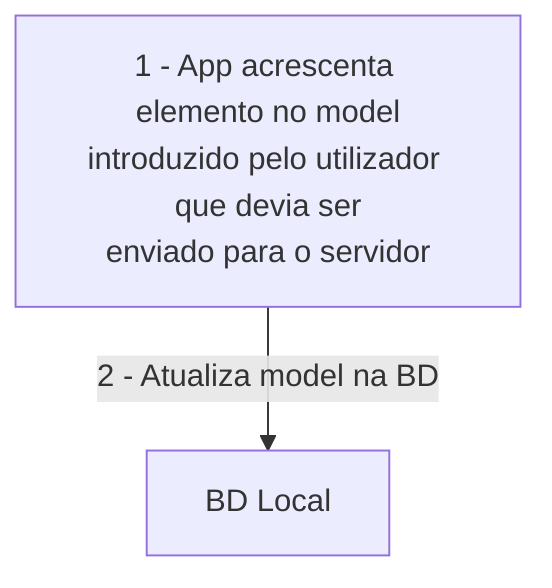


---
# Cenário de utilização (escrita)

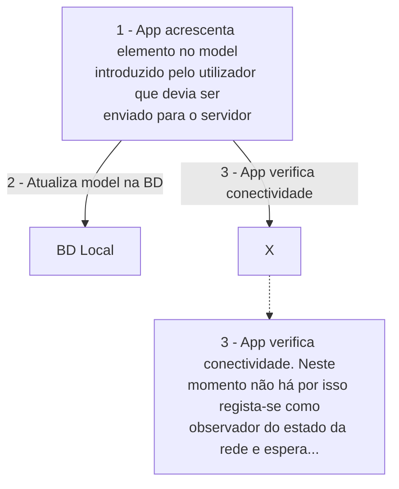


---
# Cenário de utilização (escrita)

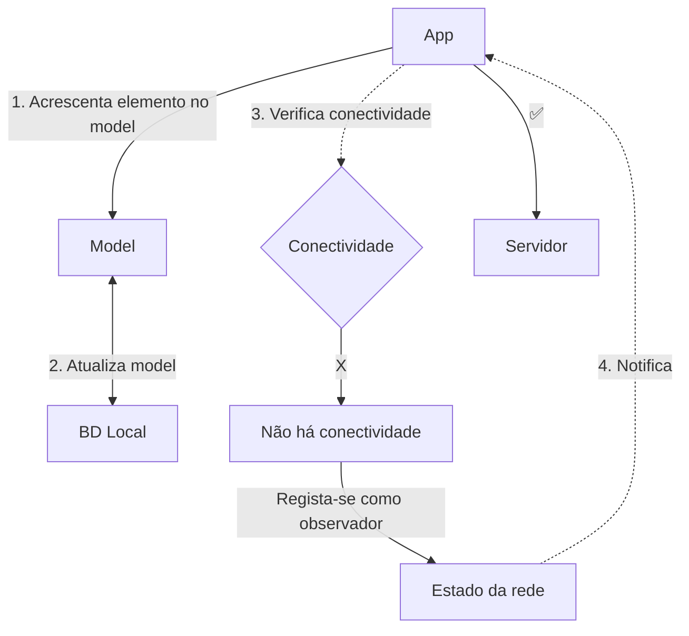

1. App acrescenta elemento no model introduzido pelo utilizador que devia ser enviado para o servidor

2. Atualiza model na BD

3. App verifica conectividade. Neste momento não há por isso regista-se como observador do estado da rede e espera...

4. App é notificado que há conectividade


---
# Cenário de utilização (escrita)

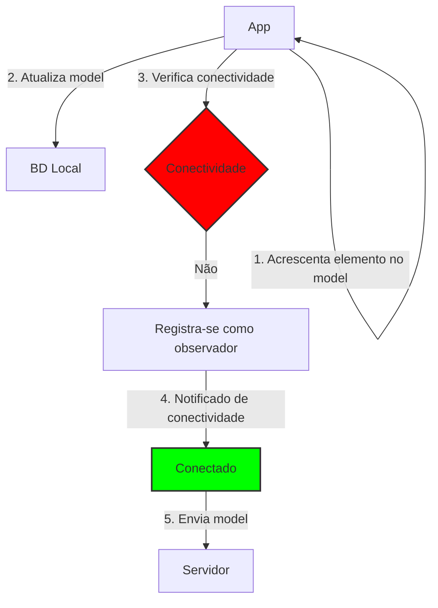

1. App acrescenta elemento no model introduzido pelo utilizador que devia ser enviado para o servidor

2. Atualiza model na BD Local

3. App verifica conectividade. Neste momento não há por isso regista-se como observador do estado da rede e espera...

4. App é notificado que há conectividade

5. Envia o model para o servidor (total ou parcial)


---
# Sincronização da réplica

1. O servidor envia alterações aos dispositivos - **push model**
2. Os dispositivos perguntam ao servidor que alterações houve - **pull model**

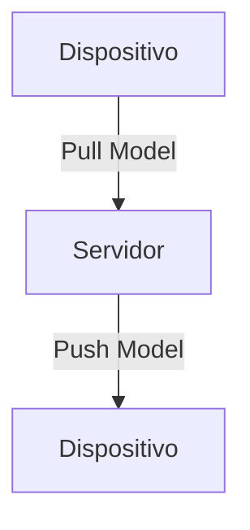

O diagrama mostra:
- Um servidor central
- Dois dispositivos (representados por ícones de smartphones)
- Uma seta do servidor para um dispositivo, indicando o "Push Model"
- Três setas de um dispositivo para o servidor, indicando o "Pull Model"


---
# Replicação

## Sincronização da réplica

### Push model

- Atualização é imediata se o dispositivo está online, mas e se estiver offline?
- O servidor tem que inicia/manter a ligação com todos os dispositivos (podem ser milhões!)


---
# Replicação

## Sincronização da réplica

### Push model

- Atualização é imediata se o dispositivo está online, mas e se estiver offline?
- O servidor tem que iniciar/manter a ligação com todos os dispositivos (podem ser milhões!)

### Pull model

- Tem que periodicamente interrogar o servidor. Se for muito frequente pode conduzir a desperdício de recursos, se for pouco frequente pode haver um grande desfasamento temporal na sincronização.
- Mas lida bem com o offline! Quando passar a online, pergunta ao servidor o que mudou!


---
# Exercício

Explica a diferença entre push model e pull model de forma que uma criança de 5 anos entenda

(Dica: Usa analogias. Ex: "Imagina que tens várias gomas de diferentes côres...")

