# Computação Móvel

2024/2025

Prof. Pedro Alves (teóricas)
Prof. Miguel Tavares (práticas)

---
# Informações

- Já há aula prática "a sério" esta semana (10 a 14 de Fevereiro)

- Quem tem portátil, deve levá-lo já com este software instalado:
  - Intellij
  - Android Studio
  - git (duh!)

Não vai haver tempo para instalarem isto durante a aula prática...

---
# Objetivos

- Compreender os conceitos fundamentais da computação móvel

- Aprender a tirar o máximo partido das vantagens da computação móvel (localização, sensores, contextual), quando aplicados à resolução de problema concretos

- Sensibilizar para os constrangimentos típicos de uma aplicação móvel (autonomia, conectividade, usabilidade) e conhecer os mecanismos que permitem ultrapassar esses constrangimentos

- Aprender os vários modelos de desenvolvimento de aplicações móveis e saber aplicar os conceitos utilizando pelo menos 2 destes modelos (Android Nativo/Kotlin e Flutter)

- Aprofundar conhecimentos de programação, nomeadamente nos padrões de desenho (Observer/Observable), injeção de dependências (DI) e programação assíncrona

---
# Horário

## Teóricas
- Segunda-feira 20h00-21h30
- Terça-feira 10h00-11h30

## Práticas
- Terça-feira 12h00-14h00
- Terça-feira 18h30-20h30
- Sexta-feira 8h00-10h00
- Sexta-feira 10h00-12h00
- Sexta-feira 12h00-14h00

---
# Programa

## Faceta "conceptual"

- Computação Móvel / Sistemas Ubíquos
- Arquitetura e desenvolvimento de aplicações móveis
  - Web
  - Híbrida-Web, Híbrida-Nativa
  - Nativa
- Usabilidade e Interação
- Conectividade
- Geo-localização
- Autonomia
- Sensores
- Integração com serviços externos
- Modelos de negócio

## Faceta "prática"

- Arquitetura de aplicações móveis
- Separação UI/Lógica de Negócio
- Programação de widgets
- Gestão de estado
- Testes unitários / integração
- Injeção de dependências
- Programação assíncrona
- Padrão repositório

---
# Avaliação

| Componente teórica | Componente prática |
|---------------------|---------------------|
| min: 9,5            | min: 9,5            |

| Critério             | Percentagem |
| -------------------- | ----------- |
| Projeto              | 52%         |
| Freq. final          | 28%         |
| Apresentação app     | 10%         |
| 2 mini-apps          | 8%          |
| Participação teórica | 2%          |

---
# Avaliação contínua
## (componente teórica)

### Participação - 5%
- quizzes feitos após a aula no Moodle
- A nota final é calculada a partir do número de exercícios submetidos dentro do prazo
  (não interessa se acertam ou não)

### Apresentação individual - 25%
- Análise de uma aplicação móvel
- Pequena apresentação dos resultados (5 min) gravada em vídeo

### Frequência completa presencial (toda a matéria) - 70%
(nota mínima: 8)

Nota: Estas percentagens assumem 100% da componente teórica

---
# Quizzes

Após algumas aulas teóricas, serão publicados quizzes no Moodle sobre a matéria.

Estes quizzes têm tentativas ilimitadas e contam para a componente de participação desde que preenchidos dentro do prazo

Em geral, os quizzes ficam disponíveis até Domingo às 23h30

| Preencha o seguinte texto com os valores correctos:             | Preencha o seguinte texto com os valores correctos: | Preencha o seguinte texto com os valores correctos: | Preencha o seguinte texto com os valores correctos: | Preencha o seguinte texto com os valores correctos: | Preencha o seguinte texto com os valores correctos: | Preencha o seguinte texto com os valores correctos: | Preencha o seguinte texto com os valores correctos: |
| --------------------------------------------------------------- | --------------------------------------------------- | --------------------------------------------------- | --------------------------------------------------- | --------------------------------------------------- | --------------------------------------------------- | --------------------------------------------------- | --------------------------------------------------- |
| A opção 1 é                                                     | Mais lenta                                          | ❌                                                   | que a opção 2 pois demora                           | 4                                                   | ❌                                                   | minutos                                             |                                                     |
| (arredondado, sem casas decimais) enquanto que a opção 2 demora |                                                     |                                                     |                                                     |                                                     |                                                     |                                                     |                                                     |
| 4                                                               |                                                     | ❌                                                   |                                                     |                                                     |                                                     |                                                     |                                                     |
| minutos. Por outro lado, a opção 1 ocupa                        |                                                     |                                                     | Menos espaço                                        | ❌                                                   | em memória, pois                                    |                                                     |                                                     |
| precisará de                                                    | 4                                                   | ❌                                                   | Mb enquanto a opção 2 precisará apenas de           | 4                                                   | ❌                                                   | Mb.                                                 |                                                     |

  <button style="background-color: #c41e3a; color: white; padding: 5px 10px; border: none;">Responder a esta pergunta novamente</button>

Podem repetir tentativas

<button style="background-color: #c41e3a; color: white; padding: 5px 10px; border: none; float: right;">Terminar tentativa</button>

---
# Avaliação contínua
## (componente prática)

### Android Nativo (Kotlin)

- Mini-aplicação desenvolvida durante 3 aula práticas
  - Android Nativo (Kotlin)
  - Sem avaliação

### Flutter (Dart)

- 2 mini-aplicações (7,5% cada)
  - Individual
  - Opcional (sem nota mínima)
  - Para fazer na aula prática (embora possa ser feito em casa)
  - Validado automaticamente (github classroom)

- Projeto em grupo (85%)

---
# Avaliação contínua
## (componente prática)

- Projeto (85%, min: 9,5)
  - App desenvolvida em Flutter, entregue através do github
  - Grupos de 2 alunos
  - 2 entregas (obrigatórias - a falha de uma das entregas implica reprovação)
  - Feedback do professor será dado através dos issues do github
  - Defesa presencial individual - Entre 0% e 100%, aplicada à nota do projeto
    - O aluno terá que conseguir implementar metade das alterações pedidas para ter aprovação na componente prática

Alguns "desafios" opcionais ao longo do semestre poderão dar pontos extra no projeto

---
# Planeamento

```mermaid
gantt
    title Planeamento
    dateFormat W
    axisFormat %d
    
    section Desenvolvimento
    Android Nativo    :a1, 0, 4w
    Flutter           :a2, after a1, 1w
    tecweb            :a3, after a2, 1w
    Flutter           :a4, after a3, 2w
    Férias Páscoa     :a5, after a4, 1w
    Flutter           :a6, after a5, 1w
    Flutter           :a7, after a6, 4w

    section Marcos
    enunciado do projeto (parte 1) :milestone, m1, after a4, 0d
    entrega do projeto (parte 1)   :milestone, m2, after a6, 0d
    enunciado do projeto (parte 2) :milestone, m3, after a6, 0d
    entrega (parte 2)              :milestone, m4, after a7, 0d

    section Mini-apps
    awesome quotes    :m5, after a4, 0d
    LOTR              :m6, after a6, 0d
```

Legenda:
- mini-app: awesome quotes (após 2 semanas de Flutter)
- mini-app: LOTR (após 1 semana de Flutter na segunda parte)

---
# Avaliação

## Época de recurso / época especial

- Exame teórico - 40% da nota final, nota mínima 9,5
- Projeto com defesa presencial - 60% da nota final, nota mínima 9,5
- As regras para a defesa presencial são as mesmas da avaliação contínua

## Notas adicionais:

- O aluno tem que estar inscrito em época de recurso / época especial até 48 horas antes do exame, caso contrário não poderá fazer o exame nem entregar o projeto.
- A data de entrega do projeto assim como as respetivas defesas poderão não coincidir com a data do exame. Serão sempre anunciadas com antecedência mínima de 2 semanas.
- Se tiver reprovado numa das componentes (teórica ou prática) apenas tem que repetir a componente que reprovou. Não é possível fazer melhoria na outra componente.

---
# FAQ

1 - Não entreguei a primeira parte do projecto. Posso entregar a segunda parte?
Não. Quem não entrega a primeira parte está automaticamente reprovado em avaliação contínua - tem que entregar projecto em época de recurso.

2 - Tive 17 na componente prática e 7 na frequência. Estou reprovado?
Sim, pois a nota mínima na frequência é 8. Terá que fazer exame de época de recurso. A nota do projecto é automaticamente transitada para época de recurso.

3 - Que situações levam a que tenha que fazer exame de recurso?
- Ter menos de 8 na frequência
- Ter menos de 9,5 na componente teórica (participação + vídeo + frequência)

4 - Que situações levam a que tenha que fazer projecto de época de recurso?
- Ter menos de 9,5 na nota final do projecto
- Reprovar na defesa presencial
- Ter menos de 9,5 na componente prática (por ex., por não ter entregue as mini-apps)

---
# Calendário

| Evento                               | Data        |
| ------------------------------------ | ----------- |
| Entrega da mini-app "awesome quotes" | 6 Abril     |
| Entrega do Projecto (parte 1)        | 4 Maio      |
| Entrega da mini-app "LOTR"           | 11 Maio     |
| Apresentação Individual (video)      | 25 Maio     |
| Entrega do Projecto (parte 2)        | 8 Junho     |
| Defesas                              | 11-12 Junho |
| Frequência completa                  | 17 Junho    |
| Exame de recurso                     | 1 Julho     |
| Entrega do Projeto (recurso)         | 6 Julho     |
| Defesas de recurso                   | 8-9 Julho   |

---
# Modo de funcionamento
(aulas teóricas)

## Aula teórica

- Alguns vídeos pré-aula (quando existirem serão publicados na sexta-feira anterior)
- Slides publicados na 3ª feira às 12h00
- Alguns vídeos pós-aula
- Todas as semanas haverá quiz ou quizzes no Moodle para responder até Domingo

---
# Modo de funcionamento
(aulas práticas)

## Android Nativo
- Vão desenvolver uma aplicação simples ("deisidrata-te") durante 3 aulas práticas
- Vídeo a explicar a implementação de parte da aplicação
- Demonstração/live coding no início da aula prática do que se pretende
- Resto da aula cada aluno a tentar implementar 🙂 (com o apoio do professor e LLMs)

## Flutter
- Serão publicados vídeos antes da aula prática (devem vê-los, caso contrário não vão aproveitar a aula para desenvolver e tirar dúvidas)
- Por vezes introdução de conceitos no início da aula
- Na maioria das aulas, alunos aplicam os conceitos logo na implementação do projeto
- Para praticarem melhor certos conceitos, haverão 2 mini-aplicações independentes que serão desenvolvidas durante a aula

---
# Bibliografia

## Teórica

- Slides da cadeira - vão sendo disponibilizados no Moodle. A matéria para a frequência está toda nos slides.

- Stefan Poslad, *Ubiquitous Computing: Smart devices, Environments and Interactions*, Wiley, 2009.
- Brian Fling, *Mobile Design and Development*, O'Reilly Media, Inc., 2009.
- Maximiliano Firtman, *Programming the Mobile Web*, O'Reilly Media, Inc., 2nd ed., 2013.

## Prática

- Dawn Griffiths and David Griffiths, *Head First Android Development*, Third edition. O'Reilly Media, Inc., 2021.
- Eric Windmill. *Flutter in Action*. Manning, 2020.

- Android Training Program (curso online) - https://www.youtube.com/channel/UCIEBWb2nz2huEllUHhH4Lfg
- Flutter Tutorial for beginners - https://www.youtube.com/playlist?list=PL4cUxeGkcC9jLYyp2Aoh6hcWuxFDX6PBJ
- Flutter Masterclass (curso online) - https://netninja.dev/p/flutter-masterclass ($5 com o cupão "flutterninja50")

---
# Dúvidas

Iremos utilizar o zulip
(uma espécie de discord mas mais simples)

---
# Dúvidas

Teóricas - pedro.alves@ulusofona.pt

Práticas - hmiguel.tavares@ulusofona.pt

Os mails serão respondidos mais rapidamente se indicarem a disciplina e o número de aluno

---
# Utilização de LLMs

- A utilização de ferramentas de IA generativa como o ChatGPT, Copilot ou Claude é permitida e até incentivada durante as aulas e em casa
- Usem-nas para aprenderem e não para vos substituir!

- Durante as defesas de projeto, não é permitida a sua utilização
- Sempre que possível, os enunciados das fichas e do projeto serão apresentados de forma visual, de forma a evitar o "copy&prompting" cego, pouco interessante para a vossa aprendizagem

---
# Disciplina nova

Desenvolvimento de software suportado por IA Generativa

Novidades em breve

