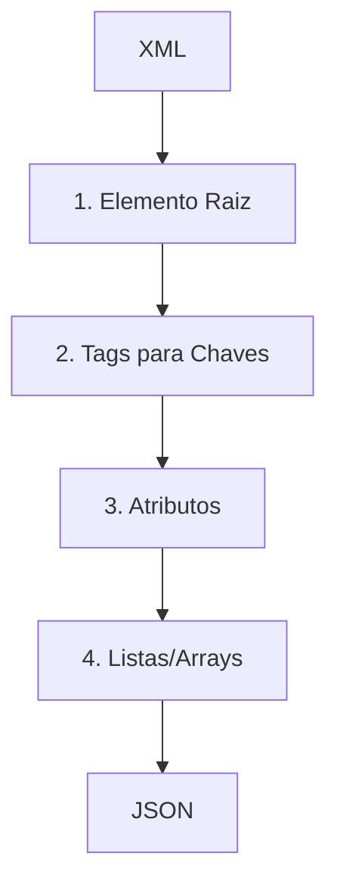
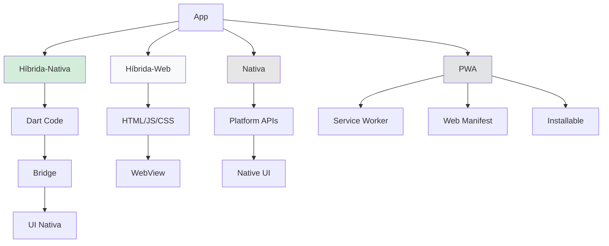
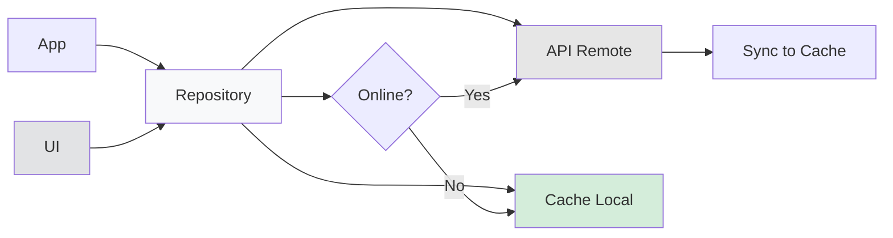
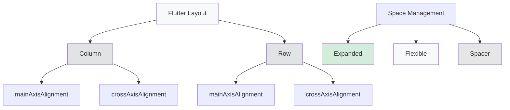

# CÁBULA DEFINITIVA - EXAME COMPUTAÇÃO MÓVEL

**Otimizada para transcrição manual em folha A4 (frente e verso)**

---

## **PARTE 1: CONVERSÃO XML → JSON (2 valores)**

### **Processo Mental em 4 Passos:**
```
XML → 1.Raiz → 2.Tags → 3.Atributos → 4.Arrays → JSON
```

**1. Elemento Raiz:** `<response>` → `{"response": {...}}`
**2. Tags→Chaves:** `<code>Success</code> → `"code": "Success"`
**3. Atributos:** `<movie name="X" year="2000">` → `{"name": "X", "year": 2000}`
**4. Tags Repetidas:** `<actor/><actor/>` → `"actors": [{...}, {...}]`

### **Exemplo Prático (Aula 13):**
```
<response><body><movies>
  <movie name="Gladiador" year="2000">
    <actor name="Russell Crowe"/>
  </movie>
</movies></body></response>

↓ TORNA-SE ↓

{"response": {"body": {"movies": [
  {"name": "Gladiador", "year": 2000, 
   "actors": [{"name": "Russell Crowe"}]}
]}}}
```

### **Diagrama Mental XML→JSON:**
```
[XML Tree] → [Objeto JSON Root]
     ↓           ↓
  Branches → Nested Objects {}
     ↓           ↓
  Repeated → Arrays []
     ↓           ↓
  Attributes → Key:Value pairs
```

---

## **PARTE 2: CALLBACKS & PADRÕES (2 valores)**

### **Padrão: Injeção Dependências + Observer**
- **Contadores** recebe callbacks via construtor → **desacoplamento**
- Estado muda → chama callbacks → notifica observadores
- **Benefício:** Testável (pode injetar mocks)

### **Rastreamento Estado (Exemplo Aula 13):**

| Linha | Ação | Callback | `_x` | `_y` | Output |
|:------|:-----|:---------|:-----|:-----|:-------|
| 1 | `contadores1.a=3` | `onX(3)` | `0+3=3` | `0` | - |
| 2 | `contadores1.b=4` | `onY(4)` | `3` | `3+4=7` | - |
| 3 | `contadores2.a=10` | `onX(10)` | `3+10=13` | `7` | - |
| 4 | `contadores2.b=5` | `print(5)` | `13` | `7` | `5` |
| 5 | `print(_x),print(_y)` | - | `13` | `7` | `13,7` |

**OUTPUT FINAL:** `5`, `13`, `7`

### **Diagrama Observer/Observable:**
```
[Observable] --notify--> [Observer1: UI Update]
     |                   [Observer2: Log/Debug]  
     |                   [Observer3: Persistence]
[State Change]
```

---

## **PARTE 3: FLUTTER CONCEITOS & CÓDIGO (4 valores)**

### **A) Conceitos (Máx. 50 palavras cada)**

**StatelessWidget vs StatefulWidget:**
- **Stateless:** UI estática, imutável (ícones, texto fixo)
- **Stateful:** UI dinâmica, usa `setState()` para rebuild
- **DICA EXAME:** UI muda com interação → StatefulWidget

**Injeção Dependências (DI):**
- Fornecer dependências via construtor (não criar internamente)
- **Benefício:** Desacoplamento + testabilidade (mocks)
- **DICA:** "Trocar implementações p/ testes" → DI

**Async/Await:**
- Evita bloquear UI em operações I/O (rede, BD, ficheiros)
- `await` pausa função async, liberta thread principal
- **DICA:** Qualquer menção rede/BD → async/await

**Testes Widget vs Integração:**
- **Widget:** Isola componente, rápido, `testWidgets()`
- **Integração:** Fluxo completo, lento, precisa emulador
- **DICA:** "Testar formulário"→Widget; "login+navegação"→Integração

### **B) Widgets Fundamentais:**

**Scaffold:** Estrutura base app
```
Scaffold(
  appBar: AppBar(title: Text("...")),
  body: ...,
  bottomNavigationBar: ...,
  floatingActionButton: FAB(...)
)
```

**Layout (Column/Row):**
- **mainAxisAlignment:** Espaçamento eixo principal
- **crossAxisAlignment:** Alinhamento eixo secundário
- **Expanded:** FORÇA preenchimento espaço
- **Flexible:** PERMITE preenchimento espaço

### **C) Programação (Preencher Espaços):**
**Template Aula 13:**
```dart
class MyHomePage extends StatefulWidget {     // 1
  final String title;                         // 2
  
  void _incrementCounter() {
    setState(() { _counter++; });             // 3
  }
  
  Text('$_counter'),                          // 4
  onPressed: _incrementCounter,               // 5
```

### **D) Padrões Avançados:**

**Observer/Observable (ChangeNotifier):**
```
[ChangeNotifier] → notifyListeners() → [Consumer/watch]
       ↓                                      ↓
   Estado muda                        UI rebuild automático
```
- Remove necessidade `setState()`
- **Flutter:** `ChangeNotifierProvider` + `context.watch<T>()`

**Repository Pattern:**
```
[UI] → [Repository] → {Online? API : Cache}
```
- Mediador entre UI e dados (API/cache local)
- **DICA:** "Obter dados transparentemente" → Repository

**Navegação:**
- **Push:** `Navigator.push(context, MaterialPageRoute(...))`
- **Pop:** `Navigator.pop(context, resultado)`
- **Passar dados:** Via construtor widget destino
- **Padrões:** BottomNav (persistente), Drawer (transiente)

---

## **PARTE 4: COMPUTAÇÃO MÓVEL (12 valores)**

### **A) Arquiteturas & Trade-offs:**

| Tipo | ✓ Vantagens | ✗ Desvantagens | Uso |
|:-----|:------------|:---------------|:----|
| **Nativa** | Performance máxima, APIs completas | 2 codebases, custo alto | Games, apps críticas |
| **Híbrida-Nativa** | 1 codebase, quase-nativa | APIs via plugins | **Melhor geral** |
| **Híbrida-Web** | Barata, web skills | Performance fraca, WebView | Protótipos |
| **PWA** | Sem stores, install direto | Limitado iOS, menos features | Web-to-mobile |

### **Diagrama Híbrida-Nativa:**
```
[Dart Code] ↔ [Bridge/Channel] ↔ [Native UI]
     ↓              ↓                 ↓
  Business       Translation       Platform
   Logic           Layer           Widgets
```

### **B) Usabilidade Mobile:**

**Thumb Zone & Fat Finger:**
- **Thumb Zone:** Ações principais na base ecrã (alcance polegar)
- **Fat Finger:** Alvos toque mín. **48dp (9mm)**
- **Widgets Zona:** BottomNavigationBar, TabBar, FAB

**Leis Fundamentais:**
- **Lei Fitts:** Alvos grandes+próximos = mais rápidos
- **Lei Hick:** Mais escolhas = mais tempo decisão

### **C) Conectividade & Estratégias:**

**Desafios:** Latência, perda conexão, bateria
**Offline-First Strategy:**
```
App Load → Check Cache → Display Data → Background Sync
```

**Network Batching:**
```
Multiple Requests → Batch → Single Call → Radio Sleep
```

### **D) Geolocalização & Precisão:**

| Tecnologia | Precisão | Bateria | Uso |
|:-----------|:---------|:--------|:----|
| **GPS** | Alta (3-5m) | Alta | Navegação |
| **Rede** | Média (100m) | Baixa | Check-ins |
| **Wi-Fi** | Baixa (50m) | Muito baixa | Indoor |

**DICA OTIMIZAÇÃO:** Menor precisão necessária + desligar após obter

### **E) Autonomia & Otimizações:**

**Principais Consumidores:**
1. **Ecrã:** Modo escuro em OLED
2. **Rede:** Batching pedidos
3. **GPS:** Desligar quando não precisa
4. **CPU:** WorkManager para tarefas background

**Modo Doze (Android):**
- Sistema agenda tarefas não urgentes
- Executa em janelas otimizadas
- Apps devem usar WorkManager

### **F) Sensores & Fusion:**

**Tipos:**
- **Físicos:** Acelerómetro, Giroscópio, Magnetómetro
- **Lógicos:** Detector passos, Orientação, Gravidade
- **Biométricos:** Ritmo cardíaco, SpO2

**Sensor Fusion:** Combinar múltiplos sensores → dados precisos+fiáveis

### **G) APIs & Autenticação:**

**REST Pattern:**
```
App → HTTP (GET/POST/PUT/DELETE) → API Endpoint → Server
```

**JWT (JSON Web Tokens):**
- Obtidos no login
- Enviados em Header: `Authorization: Bearer <token>`
- Contêm claims sobre utilizador

### **H) Modelos Negócio:**

**Custos Stores:**
- **App Store:** $99/ano + 15-30% comissão
- **Google Play:** $25 único + 15-30% comissão

**Estratégias Monetização:**
1. **Premium:** Difícil sem reputação
2. **Freemium:** Grátis + extras pagos (comum)
3. **Anúncios:** Precisa volume grande
4. **Subscrição:** Receita recorrente

### **I) MVC & Arquitetura:**

```
[Model] ↔ [Controller] ↔ [View]
   ↓           ↓           ↓
 Dados      Lógica      Interface
Business    Events     Apresentação
```

**Benefícios:** Separação responsabilidades, testabilidade, manutenção

---

## **ANEXO: DART ESSENCIAL**

### **Sintaxe Crítica:**
```dart
// Variáveis
final int x = 10;        // Imutável
String? nome;            // Nullable
var lista = ["a", "b"];  // Lista

// Null Safety
nome ?? "Default"        // Se null, usar default
nome?.length            // Safe call

// String Interpolation
"Nome: $nome, Idade: ${idade + 1}"

// Constructors Named
Pessoa({required this.nome, this.idade});

// Lambdas
(a, b) => a + b;        // Função arrow
list.map((x) => x * 2)  // Transformação
list.where((x) => x > 5) // Filtro

// Async
Future<Data> fetch() async {
  return await api.getData();
}
```

### **Hot Reload vs Restart:**
- **Hot Reload:** JIT, alterações imediatas, preserva estado
- **Hot Restart:** Reinicia app, perde estado
- **Release:** AOT compilation, performance produção

---

## **DIAGRAMAS RÁPIDOS PARA DESENHAR:**

### **Repository Offline-First:**
```
UI → Repository → {Online? → API Remote
                  Offline? → Cache Local}
```

### **Flutter Layout:**
```
Column/Row + {mainAxis, crossAxis} + {Expanded, Flexible}
```

### **Observer Chain:**
```
Observable → notifyListeners() → Observer1,2,3... → Actions
```

### **Mobile Architecture:**
```
[App Layer] → [Business Logic] → [Data Layer] → [External APIs]
```

---

## **FÓRMULAS EXAME:**

### **Callback Tracking:**
1. Identificar objetos callbacks partilhados
2. Seguir ordem execução setters
3. Calcular estado após cada operação
4. Registar outputs de print statements

### **Architecture Decision:**
1. Performance needs → Native vs Hybrid
2. Budget constraints → Hybrid vs Native
3. Time to market → Hybrid Web vs Native
4. Platform coverage → Cross-platform priority

### **Usability Check:**
1. Thumb zone? (Bottom navigation)
2. Touch targets? (48dp minimum)
3. Offline support? (Cache strategy)
4. Battery optimization? (Background tasks)

---

**LEMBRETE FINAL:** Sem código Dart ou JSON na folha manuscrita!

---

# Mermaids

## **Diagrama 1: Processo XML → JSON (Parte 1)**
*Visualização do processo mental de conversão XML para JSON em 4 passos*



## **Diagrama 2: Arquiteturas de Aplicações Móveis (Parte 4-A)**
*Comparação visual entre diferentes arquiteturas de desenvolvimento móvel*



## **Diagrama 3: Padrão Repository & Estratégia Offline-First (Parte 3-D & 4-C)**
*Fluxo de decisão para obtenção de dados: API remota vs cache local*



## **Diagrama 4: Sistema de Layout Flutter (Parte 3-B)**
*Estrutura hierárquica dos widgets de layout e gestão de espaço*



